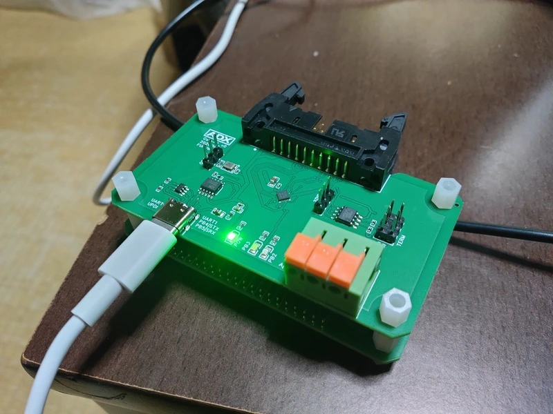

<!--
Copyright (c) 2026 ADX Project Contributors
SPDX-License-Identifier: CC-BY-4.0
-->

# ADX Core-D Hardware Verification & Test Suite

このディレクトリには、**ADX Core-D**（MCU: ATtiny1616）のハードウェア初期疎通確認（Bring-up）、単体機能テスト、出荷検査向けファームウェアおよびその実行検証結果をまとめています。

  
   
  <em>▲ 実機通電および動作確認の様子（ADX Core-D 初版基板）</em>

---

## 1. テスト一覧

| テスト名 | 対象機能 | 概要 |
| :--- | :--- | :--- |
| [`led_softserial_test`](./led_softserial_test/) | GPIO (PB2, PB3), SoftwareSerial (PB4, PB5) | シリアルコマンドによるLED点灯制御と双方向通信テスト |
| [`osc_test`](./osc_test/) | EXTCLK (PA3), RTC, 12MHz オシレータ (TFOM12M4RHKCNT2T) | 12MHz外部アクティブ水晶発振器のクロック検出およびRTCパルスカウント検証 |
| [`RS-485_test`](./RS-485_test/) | RS-485 (SP485EEN), USART0 (`PA1`/`PA2`), DE/RE (`PA4`/`PA7`) | 半二重 RS-485 トランシーバーを用いたノード間双方向通信テスト（GPIO手動方向制御） |

---

## 2. ハードウェア検証レポート (Verification Report)

### 2.1 テスト環境
- **対象ボード**: ADX Core-D (初版基板)
- **搭載MCU**: Microchip ATtiny1616
- **ホスト環境**: Windows 11
- **開発環境**: Arduino IDE 1.8.x
- **BSP / Core**: [megaTinyCore](https://github.com/SpenceKonde/megaTinyCore)
- **書き込み方式**: SerialUPDI (専用COMポート)
- **通信方式**: SoftwareSerial (9600 bps / 専用COMポート), RS-485 (9600 bps / SP485EEN)

---

### 2.2 検証結果サマリー

| 項目 | 結果 | 判定 | 備考 |
| :--- | :---: | :---: | :--- |
| **UPDIプログラム書き込み** | 成功 | **PASS** | megaTinyCore経由でのSerialUPDI書き込みが正常動作 |
| **SoftwareSerial通信** | 成功 | **PASS** | 9600 bpsでのコマンド受信・応答送信が正常動作 |
| **GPIO制御 (PB2, PB3)** | 成功 | **PASS** | LEDの個別/同時点灯・消灯をコマンド制御可能 |
| **外部オシレーター発振確認 (PA3)** | 成功 | **PASS** | 12MHz発振器のEXTSステータス検出およびRTCパルスカウントが正常動作 |
| **RS-485 半二重通信 (SP485EEN)** | 成功 | **PASS** | `Serial.swap(1)` + DE/RE 制御による Master/Slave ノード間通信が正常動作（終端抵抗無効・配線長約20cm） |
| **誤書き込みフェールセーフ** | 成功 | **PASS** | ソフトウェアシリアル用COMポートへのUPDI書き込み試行時、安全にエラー停止 |
| **UPDIポート通信フェールセーフ** | 成功 | **PASS** | UPDI用COMポートへシリアルモニターで接続しても無反応（ポート分離が確認） |

---

### 2.3 詳細検証内容

#### 1. 機能動作の確認
- Arduino IDEのシリアルモニター（9600 bps）からコマンド `0` 〜 `6` を送信し、各機能が意図通り動作することを確認。
  - `0`: ヘルプメニューの表示
  - `1` / `2`: PB2 LED ON / OFF
  - `3` / `4`: PB3 LED ON / OFF
  - `5` / `6`: PB2 & PB3 同時 ON / OFF
  - 未定義コマンドに対する `[ERR]` 応答

#### 2. ポート切り替えとプログラミング/通信の分離
- Windows 11環境において、UPDI用とSoftwareSerial用の2つのCOMポートを切り替えることで、プログラム書き込みと対話通信の両立を確認。

#### 3. フェールセーフ動作の確認
- **シリアルポートへの誤書き込み防止**:
  SoftwareSerial側のCOMポートを選択した状態でUPDI書き込みを実行した場合、マイコンやツールチェーンが不正なシーケンスを検知し、適切にエラーで中断・停止することを確認。
- **UPDIポートの通信分離**:
  UPDI側のCOMポートに対してシリアルモニターを開いて通信を試みた場合、マイコン側からの応答はなく、通信ラインの独立性と安全性を確認。

#### 4. 外部オシレーター (12MHz) 発振確認 ([osc_test](./osc_test/))
- **検証手順**:
  1. ジャンパピン（H3）を `osc` 側にショートし、12MHzアクティブ水晶発振器（TFOM12M4RHKCNT2T）の出力を PA3 (EXTCLK) に供給。
  2. メインCPUクロック（MCLK）を直接外部クロックに切り替えるリスクを避け、RTCのクロックソースを `EXTCLK (PA3)`（`RTC.CLKSEL = 0x03`）に一時設定して検証を実施。
  3. `CLKCTRL.MCLKSTATUS` の `EXTS` ビット（外部クロック検出ステータス）および `RTC.CNT` のパルスカウント遷移を確認。
  4. 検証完了後、RTCレジスタを元の設定へ復元。
- **検証結果**:
  - `EXTS` ステータス: `検出成功 (STABLE)`
  - RTCカウンタ値: 10ms間隔で約9,300カウント差分の連続計数動作を確認
  - 判定: **PASS（正常動作）**（詳細は [`osc_test/result.md`](./osc_test/result.md) を参照）

#### 5. RS-485 半二重通信確認 ([RS-485_test](./RS-485_test/))
- **検証手順**:
  1. 2台の ADX Core-D 基板の端子台（A, B, GND）を接続し、終端抵抗（H4: 100Ω）は無効のままテスト。配線長は20cm程度。
  2. 1台目をマスター（`#define ROLE_MASTER` 有効）、2台目をスレーブ（同マクロ無効）として [`rs-485_no_xdir.ino`](./RS-485_test/rs-485_no_xdir.ino) を書き込み。
  3. PCからマスターの SoftwareSerial（9600 bps）経由でメッセージを送信し、RS-485経由でスレーブが受信・稼働時間を付加してエコーバック応答を返信することを確認。
- **検証結果**:
  - `Hello`、`hello world`、`hiyoko kawaii` 各コマンドに対するスレーブからの応答受信を確認。
  - 判定: **PASS（正常動作）**（詳細は [`RS-485_test/README.md`](./RS-485_test/README.md) を参照）

