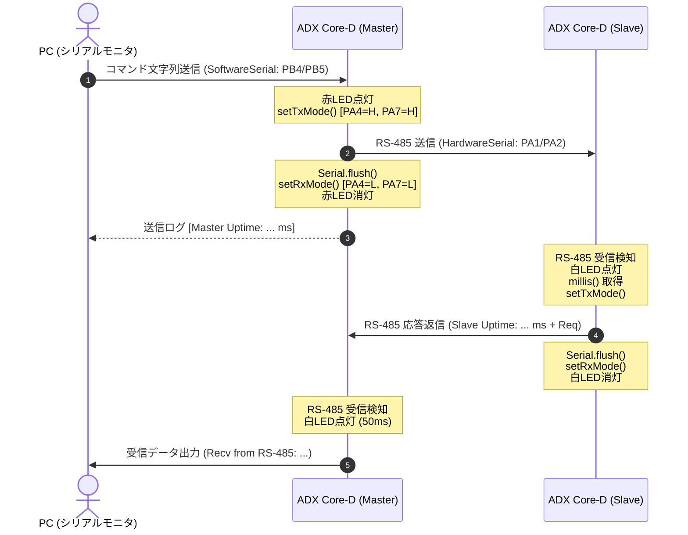
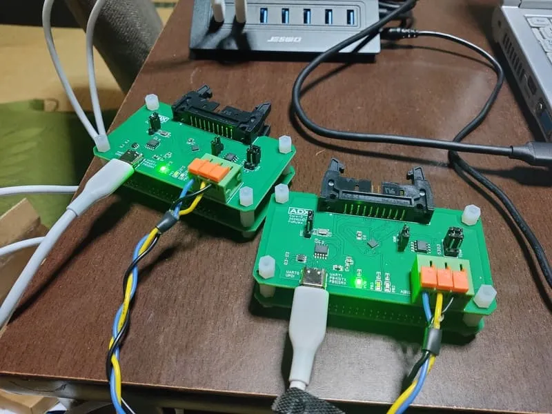

<!--
Copyright (c) 2026 ADX Project Contributors
SPDX-License-Identifier: CC-BY-4.0
-->

# ADX Core-D RS-485 通信テスト (RS-485_test)

本ディレクトリには、**ADX Core-D**（MCU: ATtiny1616）に搭載された RS-485 トランシーバー（MaxLinear SP485EEN-L/TR）を用いた、半二重 RS-485 通信の疎通確認テスト用サンプルコードおよび実機検証結果をまとめています。

---

## 1. 概要 (Overview)

本テストプログラム（[`rs-485_no_xdir.ino`](./rs-485_no_xdir.ino)）は、マイコンのハードウェア自動方向制御（XDIR）機能を使用せず、汎用 GPIO（PA4: DE, PA7: RE）をソフトウェアで制御して半二重送受信（TX/RX）の切り替えを行う方式（`no_xdir` 方式）を採用しています。

1つのソースコードでマクロ定義（`#define ROLE_MASTER`）を切り替えることにより、**マスター（PC中継ノード）** と **スレーブ（応答ノード）** の両方のファームウェアとしてビルド・書き込みが可能です。



---

## 2. ハードウェア構成とピンアサイン (Hardware & Pinout)

### 2.1 使用ピン一覧

| 信号名 | ピン番号 | 方向 | 説明 |
| :--- | :---: | :---: | :--- |
| **RS-485 TXD** | `PA1` | OUTPUT | ハードウェアシリアル USART0 TX（`Serial.swap(1)` で割り当て） |
| **RS-485 RXD** | `PA2` | INPUT | ハードウェアシリアル USART0 RX（`Serial.swap(1)` で割り当て） |
| **DE (Driver Enable)** | `PA4` | OUTPUT | RS-485 送信イネーブル（`HIGH` で送信有効） |
| **RE (Receiver Enable)** | `PA7` | OUTPUT | RS-485 受信イネーブル（`LOW` で受信有効） |
| **LED_R (赤色)** | `PB2` | OUTPUT | **マスター:** RS-485 送信中インジケータ |
| **LED_W (白色)** | `PB3` | OUTPUT | **マスター:** RS-485 受信通知 / **スレーブ:** 応答送信中インジケータ |
| **PC_TX (SoftwareSerial)** | `PB4` | OUTPUT | *(マスター専用)* PCデバッグ用シリアル送信 |
| **PC_RX (SoftwareSerial)** | `PB5` | INPUT | *(マスター専用)* PCデバッグ用シリアル受信（内蔵プルアップ） |

### 2.2 基板間接続・ジャンパ設定

<p align="center">
  
  <br>
  <em>▲ ADX Core-D 2台の実機接続（3P端子台 A/B/GND ストレート接続による半二重通信検証）</em>
</p>

1. **RS-485 バス配線**:
   - 2台の ADX Core-D の 3P 端子台（KF142R-5.08-3P）を配線長 20cm 程度のケーブルでストレート接続します。
     - **A 端子** ⇔ **A 端子**
     - **B 端子** ⇔ **B 端子**
     - **GND 端子** ⇔ **GND 端子**
2. **終端抵抗ジャンパ（H4）**:
   - 今回の実機テストでは、配線長 20cm 程度の近距離テスト環境のため、**終端抵抗ジャンパ（H4: 100Ω）は無効（オープン）のまま**テストを実施し、正常動作を確認しています。（※長距離伝送時やノイズ環境下では、バス両端で 100Ω 終端を有効化してください）
3. **DE / RE_ 制御ジャンパ（H2）**:
   - DE と RE_ を個別にマイコン制御（PA4, PA7）できるようにジャンパを設定します。

---

## 3. 利用リファレンス (Usage Reference)

### 3.1 開発環境設定

- **開発環境**: Arduino IDE 1.8.x / 2.x
- **Core / BSP**: [megaTinyCore](https://github.com/SpenceKonde/megaTinyCore)
- **Board**: ATtiny1616
- **Chip**: ATtiny1616
- **Clock**: 20MHz (Internal) / 16MHz (Internal)
- **Programmer**: SerialUPDI (CH342K経由)
- **Baud Rate**: 9600 bps

### 3.2 ビルドと書き込み手順

#### 【Step 1】 スレーブ機の書き込み
1. [`rs-485_no_xdir.ino`](./rs-485_no_xdir.ino) の 6 行目をコメントアウトします。
   ```cpp
   // #define ROLE_MASTER    // スレーブ機用（コメントアウト）
   ```
2. スレーブ用 ADX Core-D に SerialUPDI 経由で書き込みます。

#### 【Step 2】 マスター機の書き込み
1. [`rs-485_no_xdir.ino`](./rs-485_no_xdir.ino) の 6 行目を有効化します。
   ```cpp
   #define ROLE_MASTER       // マスター機用（有効化）
   ```
2. マスター用 ADX Core-D に SerialUPDI 経由で書き込みます。

### 3.3 動作確認手順

1. マスター機の SoftwareSerial 側 COM ポート（CH342K UART ポート）を Arduino IDE のシリアルモニター（**9600 bps / 改行コード: LF または CR+LF**）で開きます。
2. 起動時に `--- Master Ready ---` が表示されます。
3. シリアルモニターの送信欄から任意のテキスト（例: `Hello`）を送信します。
4. マスターがメッセージを RS-485 へ送信し、スレーブからの応答を受信して表示することを確認します。

---

## 4. テスト結果 (Test Results)
詳細な検証レポートは [`result.md`](./result.md) を参照してください。

### 4.1 実行ログ ([`result.txt`](./result.txt))

```txt
[Master Uptime: 32891 ms] Sent to RS-485: Hello
Recv from RS-485: Slave Uptime: 9502 ms (Req: Hello)

[Master Uptime: 40487 ms] Sent to RS-485: hello world
Recv from RS-485: Slave Uptime: 17182 ms (Req: hello world)

[Master Uptime: 49125 ms] Sent to RS-485: hiyoko kawaii
Recv from RS-485: Slave Uptime: 25908 ms (Req: hiyoko kawaii)
```

### 4.2 検証結果サマリー

| 検証項目 | 期待される動作 | 実際の結果 | 判定 |
| :--- | :--- | :--- | :---: |
| **半二重方向制御 (DE/RE)** | GPIO制御による送信・受信モードの排他切り替えが衝突なく行われること | スレーブ応答を欠落なく受信完了 | **PASS** |
| **USART0 Pin Swap** | `Serial.swap(1)` により PA1/PA2 でのハードウェアシリアル送受信が機能すること | 9600 bps での完全なデータ疎通を確認 | **PASS** |
| **PCデバッグ中継** | SoftwareSerial (PB4/PB5) と RS-485 間の相互中継が正常に動作すること | PCシリアルモニタ上での送受信ログ出力を確認 | **PASS** |
| **稼働時間・データ整合性** | マスター/スレーブ双方の `millis()` 稼働時間および送信文字列が正しくエコーバックされること | 送信文字列およびスレーブ稼働時間の整合性を確認 | **PASS** |
| **ステータス LED 連動** | 送信時に赤LED、受信/応答時に白LEDが正しく点灯・消灯すること | 各通信イベントに連動して正常点灯を確認 | **PASS** |

**総合判定: PASS (合格)**

---

## 5. 技術的ポイント (Technical Notes)

1. **Pin Swap の活用 (`Serial.swap(1)`)**:
   ATtiny1616 の USART0 デフォルトピン（PB2: TX, PB3: RX）は LED 出力ピン等と重複するため、`Serial.swap(1)` を呼び出してピン割り当てを PA1（TXD）/ PA2（RXD）へリマップしています。
2. **トランシーバー切り替え待ち (`delay(2)`) & バッファフラッシュ (`Serial.flush()`)**:
   - `Serial.flush()` により、ハードウェアの送信シフトレジスタが完全に空になるまで待機してから `setRxMode()`（受信モード）へ戻します。これにより、送信データの末尾欠落を防止します。
   - `delay(2)` を挟むことで、SP485EEN のドライバ／レシーバイネーブル遅延（イネーブル／ディスエーブル時間）に対して十分なマージンを確保しています。
