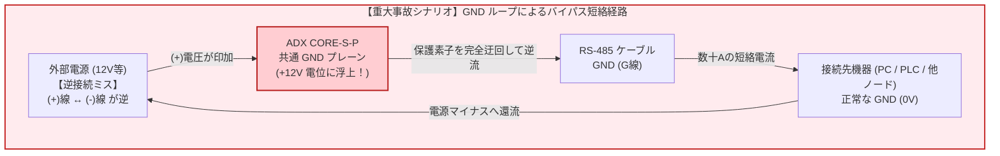
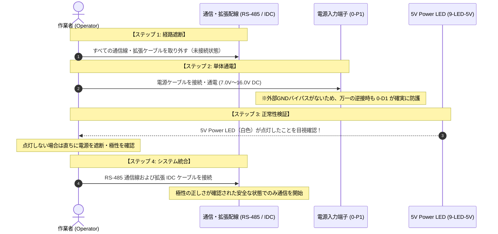
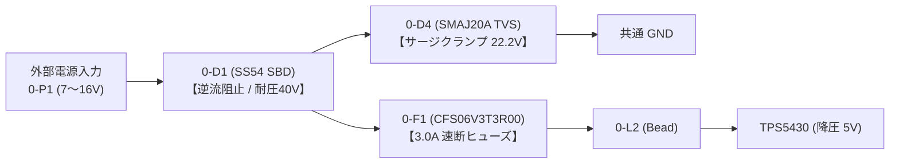

<!--
Copyright (c) 2026 ADX Project Contributors
SPDX-License-Identifier: CERN-OHL-P-2.0
-->

# ADX CORE-S-P (CORE-STANDARD / for Professional)

**ADX CORE-S-P** は、次世代オープンハードウェアエコシステム「ADX」における **プロ・熟練開発者専用の超低コストマイコンボード（Standard Footprint / for Professional & DIY Edition）** です。

ADX標準の8748フォームファクタおよび基本回路構成（Standard）を採用しつつ、小ロット製造コストの極限追求（$5〜7/台）のために共通GND・非絶縁構造を選択したプロフェッショナル専用モデルです。

メイン MCU（Microchip ATtiny1616）、基板管理 BMC（ATtiny412）、オンボード降圧 DC-DC、ロードスイッチによる電源ゲーティング、および堅牢な RS-485（LN-485）通信機能を、超コンパクトな「ADX 8748 フォームファクタ」に統合しています。

本基板は **100% OSHW（オープンソースハードウェア）** として回路図、PCB レイアウト、BOM、およびファームウェアを完全公開しており、誤配線リスクを自ら設計・管理できるエンジニアが JLCPCB 等を利用して小ロットから安価に自作（DIY / PCBA発注）することを前提に設計されています。

> ※ 一般用途や外部機器（PLC・PC・異電源系）との安全な自由接続には、両絶縁仕様の **[`ADX CORE-I`](../CORE-I/)** の利用を推奨します。命名規則の詳細は [ハードウェア命名規則仕様書](../../docs/ja/hardware_naming_rules.md) を参照してください。

---

## ⚠️ 【極めて重要】電気的制約および連鎖破壊リスクに関する警告

> [!CAUTION]
> ### 共通 GND プレーン（非絶縁設計）による接続機器の「連鎖破壊」リスクについて
> **本ボードは、フィールドネットワークおよび電気回路の知識を十分に備えたエンジニア・研究開発者を対象とした「非絶縁リファレンスボード」です。**
> 
> コスト最適化と小型化を最優先した結果、本ボードの **「電源入力 GND」「RS-485 通信 GND」「および IDC 拡張コネクタ GND」はすべて単一の共通プレーンで直結** されています。フィールドネットワークの原理を理解せずに誤った配線を行うと、**本ボードのみならず、接続された PC、PLC、センサー、他ノード等のシステム全体を巻き込んで連鎖破壊（Cascading Destruction）に至る重大なリスク** があります。



### 1. なぜ保護素子を入れても連鎖破壊が起きるのか？
通常、基板の電源入力保護素子（直列ダイオード `0-D1` やヒューズ `0-F1`）は電源のプラス（`+`）ラインに配置されます。
しかし、外部機器と RS-485 の GND（G線）を共有した状態で電源極性を誤って逆接続した場合、以下の物理現象が発生します：

1. **GND プレーンの浮上**: バッテリー等のプラス電圧が基板の「GND 端子」に印加され、基板内部の GND プレーン全体が電源電圧（+12V 等）まで持ち上がります。
2. **バイパス短絡の形成**: プラスライン上の保護素子（ダイオードやヒューズ）を**完全に迂回（バイパス）** し、`電源(+) → 基板GND → RS-485 GND線 → 相手先機器の内部回路 → 相手先GND(0V) → 電源(-)` という巨大な短絡ループが形成されます。
3. **機器の連鎖焼損**: 数十アンペアに達する短絡電流が通信ケーブルの GND 線やトランシーバー IC に集中し、通信ケーブルの焼損、基板パターンの蒸発、および**接続された相手先機器のポートや電源回路の物理的破壊**を引き起こします。

### 2. グラウンドループとコモンモード電位差
別系統の電源（商用 AC100V 由来のスイッチング電源とバッテリー駆動機器など）から給電されている機器同士を非絶縁で長距離接続した場合、接地点間の電位差によって GND 線に定常的な還流電流が流れます。
RS-485 規格の同相入力許容範囲（$-7\,\mathrm{V} \sim +12\,\mathrm{V}$）を超えた瞬間、パケットロス、通信途絶、あるいはトランシーバーの熱破壊が発生します。

---

## 🔌 正当な使用方法・必須配線手順 (Standard Wiring Procedure)

> [!IMPORTANT]
> ### 電源投入・切断時の【厳守配線シーケンス】
> 単一 GND 基板において逆接による連鎖破壊を確実に防ぎ、安全に運用するためには、**基板を一時的に「GND の孤島」とする配線シーケンス** の遵守が必須です。
> **電源の挿抜を行う際は、必ず以下の手順を怠らずに実施してください。**



### 配線手順の詳細

1. **【ステップ 1: 外部通信・拡張配線の完全切断】**
   - 電源を接続・投入する前に、**RS-485 通信ケーブル（A, B, GND）および IDC 2×10P 拡張ケーブルをすべて取り外し、未接続の状態** にしてください。
   - *※目的: 外部機器との GND バイパス経路を物理的に消滅させ、基板を電気的に孤立させるためです。*
2. **【ステップ 2: 電源ケーブルの単体接続】**
   - 端子台 `0-P1`（Pin 1: `+7_16V`, Pin 2: `G`）に電源ケーブルを接続し、通電します。
   - *※外部への短絡経路が存在しないため、万一電源極性を逆接続した場合でも、入力段の逆流阻止ダイオード `0-D1` が 100% 機能し、基板および素子は安全に保護されます。*
3. **【ステップ 3: 5V Power LED の点灯確認】**
   - 基板上の **5V Power LED (`9-LED-5V`, 白色)** が正常に点灯したことを目視で確認します。
   - **点灯しない場合は直ちに電源を切断（取り外し）してください。** 電源極性の誤り、配線ミス、またはショートがないか確認します。
4. **【ステップ 4: 通信線・拡張配線の接続】**
   - 電源が正しく投入され、正常動作（5V LED 点灯）が確認された状態においてのみ、RS-485 ケーブルおよび IDC 拡張ケーブルを接続してください。
   - 正常通電状態であれば、RS-485 端子台の信号誤配線があってもトランシーバー内部の保護機能（同相許容範囲）により物理的破壊には至りません。
5. **【電源切断・配線変更時（逆順の徹底）】**
   - 電源を切断する、または配線を変更する際も、**必ず「通信・拡張ケーブルを先に取り外してから、電源を取り外す」** という逆の手順を徹底してください。

---

## 🔒 オンボード保護回路の仕様 (rev3)

CORE-S-P は非絶縁構造ですが、**「基板単体での通電時」および「下流回路の異常時」** において最大限の安全性を確保するため、rev3 において保護回路が強化されています。



1. **逆流阻止ショットキーダイオード (`0-D1`: SS54, 40V/5A)**:
   - TVS ダイオードの**前段**に配置。万一電源端子に逆極性の電圧（-12V 等）が印加されても、ダイオードが完全に逆流を遮断し、TVS の順方向短絡や基板内部への逆電圧印加を阻止します。
2. **TVS サージ保護ダイオード (`0-D4`: SMAJ20A)**:
   - 正方向の過電圧サージ（リバースサージ、ロードダンプ等）を安全にクランプします。
3. **速断型チップヒューズ (`0-F1`: CFS06V3T3R00, 3.0A 0603)**:
   - DC-DC コンバータや IDC 拡張カード側で過電流や短絡が発生した場合、迅速に回路を遮断して発火や焼損を防止します。

---

## 🎯 本ボード（CORE-S-P）の推奨運用・活用用途

本ボードは、以下の制約を遵守できる環境において強力かつ超低コストな開発プラットフォームとして機能します。

### 推奨される運用環境
- **同一電源系統での運用**: 全ノードが同一のバッテリーまたは同一の DC 電源から給電されているシステム。
- **機器内・ラック内配線**: 配線長が短く（数メートル以内）、大地接地電位差が発生しない環境。
- **OTW (Over-The-Wire) ソフトウェア開発**: RS-485 経由での自律ブートローダー、BMC 連携電源制御、アップローダーツールの実機デバッグ。
  - *※CORE-S-P で開発したファームウェア・ブートローダー・アップローダーは、ADX 標準のピン配置および制御論理に基づくため、将来の派生ボードや上位機種（CORE-I等）にもそのまま継承可能です。*

---

## 📋 主要スペック・ハードウェア構成

| カテゴリ | 項目 | 仕様・搭載デバイス |
| :--- | :--- | :--- |
| **メイン MCU** | プロセッサ | **Microchip ATtiny1616-MNR** (QFN-20, 20MHz 内部クロック, 16KB Flash, 2KB SRAM) |
| **基板管理 (BMC)** | コントローラ | **Microchip ATtiny412-SSNR** (SOIC-8, 常時 5V 給電、バス監視＆電源制御) |
| **通信** | トランシーバー | **MaxLinear SP485EEN** (半二重 RS-485 / LN-485 規格準拠) |
| | 通信制御 | メイン MCU `PA4` 端子によるハードウェア自動方向制御 (`XDIR`) 連動 |
| **電源入力** | 入力定格 | **`DC 7.0V 〜 16.0V`** (推奨: 12.0V, 3S LiPo / 12V 鉛蓄電池対応) |
| **電源変換** | 降圧 DC-DC | **TI TPS5430** (5.0V 出力 / 最大連続 2.0A 給電能力) |
| **電源制御** | ロードスイッチ | **TI TPS22965** (スルーレート制御コンデンサ `2-C1` による 10ms 緩やか投入) |
| **拡張 I/O** | コネクタ規格 | **ADX Pinout v2 準拠 2×10P IDC** (MIL 互換ボックスヘッダ) |
| | 引き出し信号 | SPI (4線), I2C (2線), UART Alt (2線), DAC, ADC, クロック入力, 5V/2A 電源 |
| **フォームファクタ** | 外形寸法 | **ADX 8748** (87mm × 48mm, レール・ケース固定用 U字ノッチ付) |

---

## 🛠️ 自作ガイド (Self-Fabrication)

本ボードは [JLCPCB](https://jlcpcb.com/) の PCBA（基板製造＋表面実装）サービスを利用することで、極めて安価に製作できます。

- **製造データ一式**:
  - 回路図・ネットリスト: [`review/rev3/`](./review/rev3/)
  - 基板製造用 Gerber / BOM / CPL ファイル: *(準備中 / リリース予定)*
- **製造コストの目安 (JLCPCB PCBA / 送料別・概算)**:
  - 5pcs 発注時: 約 $20.0 / 台（送料込総費用 約$99.99）
  - 30pcs 発注時: 約 $7.69 / 台（送料込総費用 約$230.63）
  - 300pcs 発注時: 約 $5.03 / 台（送料込総費用 約$1,510.20）
  - *※詳細は [`review/rev3/REPORT/manufacturing_estimate.md`](review/rev3/REPORT/manufacturing_estimate.md) を参照。*

---

## 📄 ライセンスと免責事項 (License & Disclaimer)

### ライセンス
- ハードウェア設計データ（回路図、PCBレイアウト、製造用データ等）:  
  **CERN Open Hardware Licence Version 2 - Permissive ([CERN-OHL-P-2.0](https://spdx.org/licenses/CERN-OHL-P-2.0.html))**
- ドキュメント・画像類:  
  **クリエイティブ・コモンズ 表示 4.0 国際 ([CC-BY-4.0](https://creativecommons.org/licenses/by/4.0/deed.ja))**

### 免責事項 (Disclaimer)
```text
本設計、回路図、製造データおよびドキュメントは「現状有姿（AS-IS）」で提供され、
商品性、特定目的への適合性、権利の非侵害を含め、明示・黙示を問わずいかなる保証も伴いません。

本設計データを用いて製造された基板の使用、誤配線、電源逆接続、グラウンドループ、
または過電圧等に起因して発生した直接的・間接的損害（機器の破損、火災、データ消失、
逸失利益、業務の中断を含むがこれらに限定されない）について、著作権者、設計者、
およびコントリビューターは一切の法的責任および損害賠償責任を負いません。
使用者の自己責任原則の下で実験・評価を行ってください。
```
