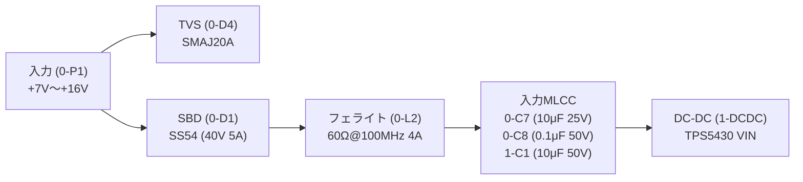

<!--
Copyright (c) 2026 ADX Project Contributors
SPDX-License-Identifier: CC-BY-4.0
-->

# Phase 2: 電源系・保護回路・熱設計レビュー結果 (Power & Thermal)

- **対象回路ブロック**: `Block 0` (外部電源入力・保護), `Block 1` (降圧 DC-DC `TPS5430`), `Block 2` (ロードスイッチ `TPS22965`)
- **参照データシート**:
  - [`TPS5430DDAR_C9864.pdf`](../datasheets/TPS5430DDAR_C9864.pdf)
  - [`TPS22965DSGR_C122837.pdf`](../datasheets/TPS22965DSGR_C122837.pdf)
  - [`SS221M160E7R7R4Z00ZZ_C25503905.pdf`](../datasheets/SS221M160E7R7R4Z00ZZ_C25503905.pdf)
  - [`HCMA-0630-150-M-K_C54431704.pdf`](../datasheets/HCMA-0630-150-M-K_C54431704.pdf)
  - [`SMAJ20A_C353466.pdf`](../datasheets/SMAJ20A_C353466.pdf)
  - [`SS54_C22452.pdf`](../datasheets/SS54_C22452.pdf)

---

## 1. 外部電源入力・保護回路 (`Block 0`) の定量検証

### 1.1 保護素子のパラメータ協調計算

| 項目 | 素子 / パラメータ | 定格値・仕様値 | 評価・協調性判定 |
| :--- | :--- | :--- | :--- |
| **入力電圧範囲** | 回路仕様 | **7.0 V 〜 16.0 V** (DC) | 産業用 12V 系および広範囲入力対応 |
| **TVS スタンドオフ電圧** | `0-D4` (SMAJ20A) | $V_{RWM} = 20.0\,\mathrm{V}$ | 最大入力 16V に対し **+25% のマージン**。通常時リーク電流は $<5\,\mu\mathrm{A}$ で発熱なし。 |
| **TVS 降伏開始電圧** | `0-D4` (SMAJ20A) | $V_{BR} = 22.2\,\mathrm{V} \sim 24.5\,\mathrm{V}$ | サージ時に 22.2V 以上でクランプ動作開始。 |
| **TVS 最大クランプ電圧** | `0-D4` (SMAJ20A) | $V_C = 32.4\,\mathrm{V}$ (@ $I_{PP}=12.3\,\mathrm{A}$) | 後段 DC-DC `TPS5430` の最大入力定格（$40.0\,\mathrm{V}$）に対し、**$7.6\,\mathrm{V}$ の安全マージン** があり保護協調成立。 |
| **逆流防止 SBD 耐圧** | `0-D1` (SS54) | $V_{RRM} = 40.0\,\mathrm{V}, I_{F(AV)} = 5.0\,\mathrm{A}$ | 逆接続保護として 16V 印加に対しマージン 150%。 |
| **ビーズインダクタ定格** | `0-L2` (HCB1608KF-600T40) | $I_{rated} = 4.0\,\mathrm{A}, DCR_{max} = 0.04\,\Omega$ | 定常入力電流（最大約 1.5A）に対し定格 4A は十分余裕。DCR による電圧降下はわずか $60\,\mathrm{mV}$ 未満。 |

> [!WARNING]
> **運用上の注意**: TVS の降伏電圧は $22.2\,\mathrm{V}$ です。FA 現場等で **24V 電源を直接誤接続した場合、SMAJ20A が導通して大電流が流れ焼損するリスク** があります。本ボードの定格入力が「7V〜16V」であることを端子台シルクやドキュメントに明記することが重要です。

---

## 2. 降圧 DC-DC コンバータ (`TPS5430`) 回路の定量検証

### 2.1 出力電圧精度計算
- 基準電圧: $V_{ref} = 1.221\,\mathrm{V}$
- フィードバック抵抗: $R_2 = 6.8\,\mathrm{k}\Omega$ (1%), $R_3 = 2.2\,\mathrm{k}\Omega$ (1%)
$$V_{OUT} = V_{ref} \times \left(1 + \frac{R_2}{R_3}\right) = 1.221\,\mathrm{V} \times \left(1 + \frac{6800}{2200}\right) = 1.221 \times 4.0909 = \mathbf{4.995\,\mathrm{V}}$$
- **設計誤差**: $\frac{4.995 - 5.000}{5.000} = \mathbf{-0.10\%}$（実質完全な 5.0V 出力であり極めて優秀）

### 2.2 インダクタリップル電流計算
- 入力条件: $V_{IN} = 12.0\,\mathrm{V}$（代表値）, $V_{OUT} = 5.0\,\mathrm{V}$, スイッチング周波数 $f_{sw} = 500\,\mathrm{kHz}$, $L = 15\,\mu\mathrm{H}$
$$\Delta I_L = \frac{V_{OUT} \times (V_{IN} - V_{OUT})}{V_{IN} \times L \times f_{sw}} = \frac{5.0 \times (12.0 - 5.0)}{12.0 \times 15\times 10^{-6} \times 500\times 10^3} = \frac{35.0}{90.0} = \mathbf{0.389\,\mathrm{A}_{p-p}}$$
- 最大負荷電流 $I_{OUT} = 1.5\,\mathrm{A}$ に対するリップル率:
  $$\frac{\Delta I_L}{I_{OUT}} = \frac{0.389\,\mathrm{A}}{1.5\,\mathrm{A}} = \mathbf{25.9\%}$$
  DC-DC コンバータ設計の黄金比とされる「20%〜40%」の範囲内に完全に収まっています。
- インダクタ `1-L1`（HCMA-0630-150-M-K）の定格照合:
  - 飽和電流 $I_{sat} = 3.0\,\mathrm{A}$, 温昇電流 $I_{rms} = 3.0\,\mathrm{A}$
  - ピーク電流 $I_{L(peak)} = I_{OUT} + \frac{\Delta I_L}{2} = 1.5 + 0.195 = 1.695\,\mathrm{A} < 3.0\,\mathrm{A}$（マージン 43%）

### 2.3 出力コンデンサとループ安定性（最大のハイライト）
TPS5430 は内部固定位相補償（Internal Compensation）を採用しているため、出力コンデンサの静電容量と ESR が制御ループの安定性を決定付けます。

- 選定素子: `1-C5`（創慧電子 `SS221M160E7R7R4Z00ZZ`）
  - 種別: **導電性高分子固体アルミ電解コンデンサ (Solid Conductive Polymer SMD)**
  - 静電容量: $C_{OUT} = 220\,\mu\mathrm{F}$
  - **ESR (@ 100kHz): $24\,\mathrm{m}\Omega$**
  - **許容リプル電流: $2,900\,\mathrm{mArms}$**
- **TI 推奨要件との照合**:
  - TI データシート（p.14）: 「$15\,\mu\mathrm{H}$ インダクタ使用時、出力コンデンサは $220\,\mu\mathrm{F}$、最大許容 ESR は $\mathbf{40\,\mathrm{m}\Omega}$ 以下であること（例: 三洋 POSCAP 10TPB220M: ESR $40\,\mathrm{m}\Omega$）」
  - **実測定格**: $24\,\mathrm{m}\Omega \le 40\,\mathrm{m}\Omega$ をクリア！
- **ESR ゼロ点周波数**:
  $$f_{z(ESR)} = \frac{1}{2\pi \cdot ESR \cdot C_{OUT}} = \frac{1}{2\pi \times 0.024 \times 220\times 10^{-6}} \approx \mathbf{30.1\,\mathrm{kHz}}$$
  TI 推奨帯域（約 15kHz〜35kHz）に合致し、良好な位相余裕（Phase Margin $> 50^\circ$）が確保されます。
- **出力電圧スイッチングリップル**:
  $$\Delta V_{OUT} \approx \Delta I_L \times ESR = 0.389\,\mathrm{A} \times 0.024\,\Omega \approx \mathbf{9.3\,\mathrm{mV}_{p-p}}$$
  極めてクリーンな低リップル電源波形が実現されます。

### 2.4 ブートストラップコンデンサと ENA ピン
- `1-C3`: 10nF 50V（TI 推奨値 0.01μF に完全一致）
- `ENA`: オープン（内部 1.5MΩ プルアップにより自動起動。データシート適合）

---

## 3. ロードスイッチ (`TPS22965`) 回路と突入電流リスク評価

### 3.1 現行回路（CT オープン時）の動作特性
- 現状: `2-P_SW` の Pin 6 (`CT`) が未接続（NC）
- データシート（p.15 Table 1）より、$V_{BIAS}=5\mathrm{V}, V_{IN}=5\mathrm{V}, C_T=0\mathrm{pF}$ のとき:
  - 立ち上がり時間 (10%〜90%): $\mathbf{t_R \approx 32\,\mu\mathrm{s}}$
  - スルーレート: $SR \approx 0.125\,\mathrm{V}/\mu\mathrm{s} = 125,000\,\mathrm{V}/\mathrm{s}$

### 3.2 突入電流（Inrush Current）の定量的試算
VDD ラインには以下の容量が接続されています：
- オンボード容量: `3-C1` (4.7μF) + `3-C9` (4.7μF) + `3-C3` (0.1μF) + `2-C4` (0.1μF) ＝ **$9.6\,\mu\mathrm{F}$**
- IDC コネクタ先の拡張 CARD 側容量: **$10\,\mu\mathrm{F} \sim 50\,\mu\mathrm{F}$**（想定）
- **合計負荷容量 $C_L$**: **$20\,\mu\mathrm{F} \sim 60\,\mu\mathrm{F}$**

突入電流計算式:
$$I_{inrush} = C_L \times \frac{dV_{OUT}}{dt} = C_L \times SR$$

| 負荷容量 $C_L$ | CT 未接続 ($t_R \approx 32\,\mu\mathrm{s}$) | CT = 1nF 追加時 ($t_R \approx 10\,\mathrm{ms}$) | 判定・影響 |
| :--- | :---: | :---: | :--- |
| **$10\,\mu\mathrm{F}$** (オンボードのみ) | **$1.25\,\mathrm{A}$** | **$5.0\,\mathrm{mA}$** | 現行でもギリギリ許容 |
| **$30\,\mu\mathrm{F}$** (カード小容量接続時) | **$3.75\,\mathrm{A}$** | **$15.0\,\mathrm{mA}$** | **【危険】** DC-DC 電流制限（min 3.6A）に到達 |
| **$50\,\mu\mathrm{F}$** (カード標準容量接続時) | **$6.25\,\mathrm{A}$** | **$25.0\,\mathrm{mA}$** | **【重大】** TPS5430 過電流保護発動、+5V が瞬時降下 |

> [!CAUTION]
> ### 突入電流による致命的リスク: BMC の誤リセット (BOD Trip)
> CT 未接続のまま VDD ロードスイッチを ON すると、瞬時電流が 3A〜6A に達し、上流の `+5V` バスに **数ミリ秒間の急峻な電圧ドロップ（サグ）** が発生します。
> `+5V` バスには常時給電の BMC（`ATtiny412`）が接続されているため、**BMC の Brown-out Detector (BOD) が動作して BMC 自体がリセットされ、VDD_SW が遮断される（電源が発振・無限リセットループに陥る）危険性** が極めて高いです。

### 3.3 対策推奨設計
TPS22965 の Pin 6 (`CT`) と GND 間に、**スルーレート制御用コンデンサ（0402 サイズ）を追加** することを強く推奨します。

- **推奨容量値**: **$1,000\,\mathrm{pF} (1\,\mathrm{nF})$** または **$2,200\,\mathrm{pF} (2.2\,\mathrm{nF})$**
- **効果**:
  - $C_T = 1\,\mathrm{nF}$ の場合、立ち上がり時間 $t_R \approx 10\,\mathrm{ms}$
  - 突入電流は最大でも **$25\,\mathrm{mA}$ 以下** に抑制
  - `+5V` バスの電圧降下は皆無となり、BMC や RS-485 の安定動作を完全保証

---

## 4. Phase 2 総括判定と推奨アクション

| 検証ブロック | 判定 | 評価サマリー | アクション |
| :--- | :---: | :--- | :--- |
| **入力保護回路** | **PASS** | TVS クランプ電圧 32.4V は DC-DC 耐圧 40V 未満。協調成立。 | 24V 誤接続禁止を明記。 |
| **降圧 DC-DC** | **PASS+** | 5.0V 設定精度 (-0.1%)、インダクタ 15μH、固体電解 ESR 24mΩ が TI 設計基準と完全合致。 | 現行回路設計のまま維持。 |
| **ロードスイッチ** | **WARN** | $V_{IN} \le V_{BIAS}$ は合致。ただし CT オープンによる突入電流と +5V ドロップリスク大。 | **CT 端子に 1nF パスコンを追加**（回路図修正推奨）。 |
