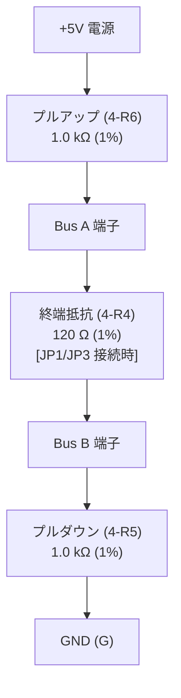

<!--
Copyright (c) 2026 ADX Project Contributors
SPDX-License-Identifier: CC-BY-4.0
-->

# Phase 3: 通信・ノイズ・過渡特性レビュー結果 (Communication & Noise)

- **対象回路ブロック**: `Block 4` (RS-485 トランシーバ `SP485EEN`), `GPIO-IDC` (拡張 2×10P コネクタ)
- **参照仕様・データシート**:
  - [`SP485EEN-L_TR_C6855.pdf`](../datasheets/SP485EEN-L_TR_C6855.pdf)
  - [`ADX_pinout.md`](../../../docs/ja/ADX_pinout.md) (ADX Pinout 仕様書 v2)
  - [`Z-230011020209_C221002.pdf`](../datasheets/Z-230011020209_C221002.pdf)

---

## 1. RS-485 / LN-485 トランシーバ回路 (`Block 4`) の詳細検証

### 1.1 マイコン制御ラインの接続性
- `DI` (Driver Input: Pin 4) $\to$ `PA1/D`（`3-MCU.PA1`: USART0 TxD）
- `RO` (Receiver Output: Pin 1) $\to$ `PA2/R`（`3-MCU.PA2`: USART0 RxD）
- `DE` (Driver Enable: Pin 3) $\to$ `PA4/DE`（`3-MCU.PA4`: USART0 ハードウェア自動方向制御 `XDIR`）
- `RE#` (Receiver Enable: Pin 2) $\to$ `PA7/RE`（`3-MCU.PA7`: GPIO 制御）

> **機能整合性**: ATtiny1616 の `USART0` は `PA4` に `XDIR` 信号を出力でき、送信フレームに同期してハードウェアが自動で `DE` を HIGH/LOW ドライブします。本配線により、ファームウェアでの DE 手動制御オーバーヘッドなしに完全な半二重自動制御が可能です。

### 1.2 フェイルセーフバイアス回路の定量検証

- **定数**:
  - プルアップ抵抗: `4-R6` = $1.0\,\mathrm{k}\Omega$ (1%)
  - プルダウン抵抗: `4-R5` = $1.0\,\mathrm{k}\Omega$ (1%)
  - 終端抵抗: `4-R4` = $120\,\Omega$ (1%)（ソルダージャンパ `3-JP1`, `3-JP3` 経由）
- **無信号（バスアイドル）時の差動電位差計算**:
  全直列抵抗: $R_{loop} = 1000 + 120 + 1000 = 2,120\,\Omega$
  $$V_{AB(idle)} = 5.0\,\mathrm{V} \times \frac{120\,\Omega}{2,120\,\Omega} = \mathbf{+283.0\,\mathrm{mV}}$$
- **レシーバ閾値との照合**:
  - `SP485EEN` の差動入力閾値: $V_{TH} = -200\,\mathrm{mV} \sim +200\,\mathrm{mV}$
  - $V_{AB(idle)} = +283\,\mathrm{mV} > +200\,\mathrm{mV}$ となっており、**規定の HIGH 受信閾値（+200mV）を確実に上回っています**。
  - バス開放、短絡、ドライバ全停止（無通信）状態でも、`RO` 出力は確実に HIGH（UART Mark レベル）を維持し、ゴーストブレークやノイズによる誤受信を完全に防止します。

### 1.3 バス直列抵抗の機能と耐量
- `4-R7`, `4-R8`: 各 $10\,\Omega$ (0402 5%)
- **効果**: 伝送線路の特性インピーダンス不整合による高周波リンギングの抑制、および軽微な過電流の制限。
- **注意点**: 0402 サイズのため許容損失は $62.5\,\mathrm{mW}$ です。外部配線作業ミス等で 24V 電源が A/B 端子に誤接触した場合、瞬時に焼損（ヒューズ断）します。

### 1.4 【重要指摘】RS-485 バスラインの過渡保護素子 (TVS) の欠落

| 項目 | ADX Core-D (検証基板) | ADX CORE-S (本ボード) | 評価・リスク |
| :--- | :--- | :--- | :--- |
| **バス保護 TVS** | **`PSM712-LF-T7` 搭載** | **未搭載 (なし)** | **【高リスク】** 工場現場や長距離配線での静電気 (ESD) や誘導雷・誘導ノイズサージに対する防御手段がありません。 |

- **背景とリスク**:
  - SP485EEN 内部には HBM / 接触放電の基本保護はあるものの、外部コネクタに直結された産業用バス（数十〜数百メートルのツイストペア配線）では、コモンモードサージ（接地電位差サージ）が容易に数十〜数百ボルトに達します。
  - TVS がない場合、SP485EEN のトランシーバ入力ステージが恒久的に静電破壊（短絡または高インピーダンス化）するリスクがあります。
- **修正推奨案**:
  - 端子台 `0-P1` の Pin 4 (A), Pin 5 (B), Pin 2 (GND) の直近に、RS-485 専用 TVS ダイオードアレイ **`PSM712` (SOT-23)** を追加配置することを強く推奨します。
  - `PSM712` は非対称クランプ（Pin 1: -7V/+12V, Pin 2: -7V/+12V）を備えており、RS-485 の同相入力規格（$-7\mathrm{V} \sim +12\mathrm{V}$）に完全適合します。

---

## 2. IDC 2×10 拡張コネクタ (`GPIO-IDC`) の完全検証

ADX 規格書 [`docs/ja/ADX_pinout.md`](../../../docs/ja/ADX_pinout.md) (v2) と回路図ネットリストの全 20 ピン結線を 1:1 で突き合わせ検証しました。

| IDC Pin | ADX Pinout v2 規定ネット | CORE-S ネットリスト接続 | マイコン端子 / 機能 | 規格合致判定 |
| :---: | :--- | :--- | :--- | :---: |
| **1** | **VDD** | `VDD` (2-P_SW.VOUT) | 電源 (5V/2A 給電) | **PASS** |
| **2** | **VDD** | `VDD` (2-P_SW.VOUT) | 電源 (5V/2A 給電) | **PASS** |
| **3** | **VDD** | `VDD` (2-P_SW.VOUT) | 電源 (5V/2A 給電) | **PASS** |
| **4** | **VDD** | `VDD` (2-P_SW.VOUT) | 電源 (5V/2A 給電) | **PASS** |
| **5** | **N.C.** (短絡保護緩衝帯) | *(未接続)* | 電源短絡防止アイソレーション | **PASS** |
| **6** | **PA6/DAC0** | `PA6/DAC0` | `3-MCU.PA6` (DAC0 出力 / AIN6) | **PASS** |
| **7** | **PA5/AIN5** | `PA5/AIN5` | `3-MCU.PA5` (VREFA / AIN5) | **PASS** |
| **8** | **GND** (EXTCLK ガード①) | `G` (共通 GND) | 高周波シールド GND | **PASS** |
| **9** | **PA3/EXTCLK** | `PA3/EXC` | `3-MCU.PA3` (EXTCLK 信号線) | **PASS** |
| **10** | **GND** (EXTCLK ガード②) | `G` (共通 GND) | 通信分離シールド GND | **PASS** |
| **11** | **PB2/TXD_EXT** | `PB2/TXD_EXT` | `3-MCU.PB2` (UART Alternate TxD) | **PASS** |
| **12** | **PB3/RXD_EXT** | `PB3/RXD_EXT` | `3-MCU.PB3` (UART Alternate RxD) | **PASS** |
| **13** | **PB0/SCL** | `PB0/SCL` | `3-MCU.PB0` (I2C SCL) | **PASS** |
| **14** | **PB1/SDA** | `PB1/SDA` | `3-MCU.PB1` (I2C SDA) | **PASS** |
| **15** | **GND** (中継シールド) | `G` (共通 GND) | 中継シールド GND | **PASS** |
| **16** | **PC3/SS** | `PC3/SS` | `3-MCU.PC3` (SPI SS) | **PASS** |
| **17** | **PC2/MOSI** | `PC2/MOSI` | `3-MCU.PC2` (SPI MOSI) | **PASS** |
| **18** | **PC1/MISO** | `PC1/MISO` | `3-MCU.PC1` (SPI MISO) | **PASS** |
| **19** | **PC0/SCK** | `PC0/SCK` | `3-MCU.PC0` (SPI SCK) | **PASS** |
| **20** | **GND** (終端シールド) | `G` (共通 GND) | 終端シールド GND | **PASS** |

### 2.1 照合結果総括
- **適合率**: **100% (20 ピン中 20 ピン完全一致)**
- **構造的特徴**:
  - 電源 2×2 ブロック（Pins 1〜4）とアイソレーション緩衝帯（Pin 5 NC）が完全に再現されている。
  - 高周波クロック（Pin 9: PA3）が Pin 8 および Pin 10 の GND で完全に挟み込まれ（サンドイッチシールド）、EMI 対策構造が成立している。
  - UART/I2C/SPI の各ペア・グループ配置が規格仕様と完全一致している。

---

## 3. Phase 3 総括判定と推奨アクション

| 検証項目 | 判定 | 評価サマリー | アクション |
| :--- | :---: | :--- | :--- |
| **RS-485 ロジック制御** | **PASS** | `XDIR` 自動方向制御および GPIO 制御配線が正常。 | 現行回路を維持。 |
| **フェイルセーフバイアス** | **PASS+** | $V_{AB(idle)} = +283\,\mathrm{mV}$（閾値 $+200\,\mathrm{mV}$ に対し十分なマージン）。 | 優れた耐ノイズ性を確認。 |
| **RS-485 サージ保護** | **WARN** | 外部端子台直結であり、サージ/ESD 保護用 TVS が未実装。 | **`PSM712` (SOT-23) TVS の追加を推奨**。 |
| **IDC 2x10 コネクタ** | **PASS+** | ADX Pinout 仕様書 (v2) に対し 20 ピン全数が完全準拠。 | 設計変更不要。 |
