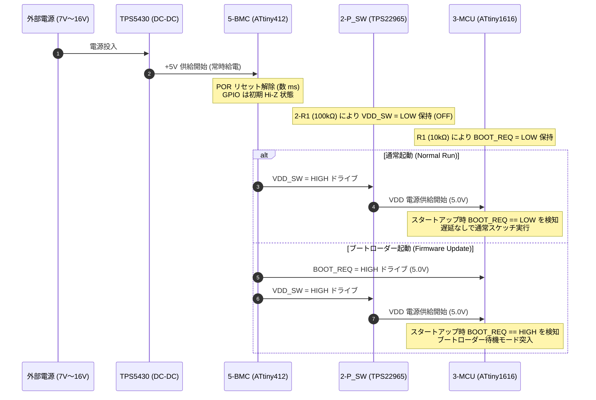
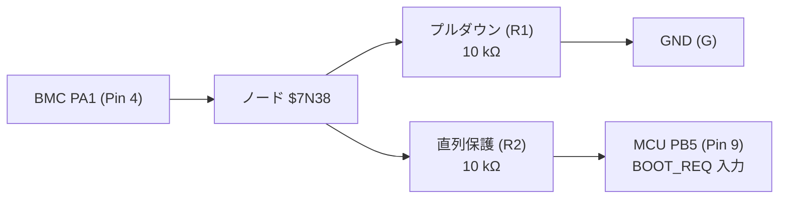

<!--
Copyright (c) 2026 ADX Project Contributors
SPDX-License-Identifier: CC-BY-4.0
-->

# Phase 4: MCU・BMC・起動制御シーケンスレビュー結果 (MCU, BMC & Boot Sequence)

- **対象回路ブロック**: `Block 3` (メイン MCU `ATtiny1616`), `Block 5` (BMC `ATtiny412`), 各種インターフェース抵抗・LED
- **参照仕様・データシート**:
  - [`adx_bootloader_requirements.md`](../../../docs/memo/adx_bootloader_requirements.md)
  - [`ATTINY412-SSNR_C1337190.pdf`](../datasheets/ATTINY412-SSNR_C1337190.pdf)
  - [`ATTINY1616-MNR_C507118.pdf`](../datasheets/ATTINY1616-MNR_C507118.pdf)

---

## 1. BMC と メイン MCU の連携アーキテクチャ

---

## 2. 制御信号回路の電気的検証

### 2.1 `VDD_SW` 制御ライン（MCU 電源パワーゲーティング）
- 接続: `5-BMC.PA6` (Pin 2) $\to$ ネット `VDD_SW` $\to$ `2-P_SW.ON` (Pin 3)
- プルダウン抵抗: `2-R1` ($100\,\mathrm{k}\Omega$ to GND)
- **動作評価**:
  1. **リセット中（未初期化時）**: BMC の GPIO は Hi-Z（高インピーダンス）入力となります。$100\,\mathrm{k}\Omega$ のプルダウンにより、ON ピン電圧は確実に $0\,\mathrm{V}$（$< V_{IL(max)} 0.55\,\mathrm{V}$）に固定され、意図しない MCU 電源投入やチャタリングを完全防止。
  2. **BMC ドライブ時**: HIGH 出力時 約 $4.8\,\mathrm{V}$（$> V_{IH(min)} 1.0\,\mathrm{V}$）、LOW 出力時 約 $0.1\,\mathrm{V}$。ロードスイッチを確実に ON/OFF 制御可能。

### 2.2 `BOOT_REQ` 信号回路（ブートリクエスト制御）
- 接続構造:
  - `5-BMC.PA1` (Pin 4) $\to$ ネット `$7N38`
  - ネット `$7N38` $\to$ `R1` ($10\,\mathrm{k}\Omega$) $\to$ GND (`G`)
  - ネット `$7N38` $\to$ `R2` ($10\,\mathrm{k}\Omega$) $\to$ ネット `BOOT_REQ` $\to$ `3-MCU.PB5` (Pin 9)

- **電気的レベル・動作検証**:
  1. **BMC 未初期化 / LOW 出力時**:
     - ノード `$7N38` は R1 ($10\,\mathrm{k}\Omega$) により GND レベル（$0\,\mathrm{V}$）。
     - MCU PB5 も R2 経由で GND レベル（$0\,\mathrm{V}$）。
     - MCU 入力閾値 $V_{IL(max)} = 0.3 \times V_{DD} = 1.5\,\mathrm{V}$ に対し $0\,\mathrm{V}$ であり、**通常起動モード（`BOOT_REQ = LOW`）が確実に保証** されます。
  2. **BMC HIGH (5V) ドライブ時**:
     - BMC PA1 が 5.0V を出力。R1 ($10\,\mathrm{k}\Omega$) に流れるプルダウン電流は $I = \frac{5.0\,\mathrm{V}}{10\,\mathrm{k}\Omega} = 0.5\,\mathrm{mA}$（BMC のドライブ能力 15mA に対し十分小）。
     - ノード `$7N38` の電位はほぼ $5.0\,\mathrm{V}$。
     - MCU PB5 は CMOS 高インピーダンス入力（漏れ電流 $< 1\,\mu\mathrm{A}$）のため、直列抵抗 R2 ($10\,\mathrm{k}\Omega$) での電圧降下は $< 10\,\mathrm{mV}$。
     - したがって、**MCU PB5 端子電圧は実質 $5.0\,\mathrm{V}$（完全な HIGH）** となります（$V_{IH(min)} = 0.7 \times 5.0 = 3.5\,\mathrm{V}$ を大幅にクリア）。
  3. **保護機能**:
     - 万一ファームウェアの不具合で MCU PB5 と BMC PA1 が双方出力かつ対向レベル（HIGH と LOW）を出力した場合でも、R2 ($10\,\mathrm{k}\Omega$) により短絡電流は $0.5\,\mathrm{mA}$ に制限され、**MCU/BMC ポートの電気的焼損が物理的に防止** されます。

> **判定**: **極めて安全で理にかなった回路設計** です。

### 2.3 `BMC_RO` 信号配線の修正（次回 CAD 反映案）
- 現状: `5-BMC.PA2` $\to$ `5-R1` (1kΩ) $\to$ `BMC_RO` (孤立)
- **修正後接続案**:
  - `5-R1` の Pin 1 を RS-485 受信ライン `PA2/R`（`4-RS485.RO`）に直結する。
- **効果**:
  - メイン MCU が VDD OFF（低消費電力スリープまたは電源断）の状態であっても、BMC が RS-485 バス上の Wake-up コマンドやファームウェア更新要求フレームを受信可能となります。
  - `5-R1` (1kΩ) が直列に介在しているため、BMC ピンの容量性負荷が RS-485 RO 信号の波形立ち上がりに与える影響を抑制できます。

---

## 3. MCU 周辺・デバッグ・インジケータ回路の検証

### 3.1 デカップリングコンデンサ構成
- `3-MCU`: `3-C1` (4.7μF 1206), `3-C9` (4.7μF 1206), `3-C3` (0.1μF 0402)
- 合計容量: 約 $9.5\,\mu\mathrm{F}$
- 評価: QFN-20 パッケージの VDD (Pin 4) / GND (Pin 3, EP) に対し、高周波用 0.1μF と低周波デカップリング用 4.7μF×2 が適切に配置されており十分。

### 3.2 UPDI プログラミングヘッダ
- `H2` (2541WV-01P): `5-BMC` の PA0 (BMC_UPDI)
- `H3` (2541WV-01P): `3-MCU` の PA0 (PA0/UPDI)
- 評価: 独立した 1P ピンヘッダとして引き出されており、製造ラインや治具での SerialUPDI ポゴピン接触書き込みが容易。

### 3.3 オンボード LED ドライブ回路
- `LED-PB4` (赤色): MCU `PB4` $\to$ `R14` (330Ω) $\to$ LED $\to$ GND
  - 赤色 LED 順方向電圧: $V_F \approx 2.0\,\mathrm{V}$
  - ドライブ電流: $I_{LED} = \frac{5.0\,\mathrm{V} - 2.0\,\mathrm{V}}{330\,\Omega} \approx \mathbf{9.1\,\mathrm{mA}}$
  - ATtiny1616 の GPIO 最大定格（40mA）に対し十分安全で、良好な視認性を確保。
- `LED-5V` (白色): `+5V` $\to$ `R12` (1kΩ) $\to$ LED $\to$ GND
  - 白色 LED 順方向電圧: $V_F \approx 3.0\,\mathrm{V}$
  - 通電電流: $I = \frac{5.0 - 3.0}{1000} \approx \mathbf{2.0\,\mathrm{mA}}$（省電力かつ眩しすぎない表示）
- `LED-VDD` (白色): `VDD` $\to$ `R13` (1kΩ) $\to$ LED $\to$ GND
  - MCU 給電中（VDD ON）を明瞭にインジケート可能。

---

## 4. Phase 4 総括判定

| 検証項目 | 判定 | 評価サマリー |
| :--- | :---: | :--- |
| **VDD_SW パワーゲーティング** | **PASS** | 100kΩ プルダウンにより起動時 Hi-Z での誤投入を完全防止。 |
| **BOOT_REQ 制御回路** | **PASS+** | 10kΩ プルダウン＋10kΩ 直列保護により、通常時 LOW・要求時 HIGH・短絡保護を完全両立。 |
| **BMC_RO 配線** | **FAIL $\to$ 合意** | 配線ミス確認済み。次回 CAD で `PA2/R` への接続反映を待機。 |
| **パスコン・LED・UPDI** | **PASS** | 定数選定・ドライブ電流・ピンヘッダ構成すべて良好。 |
