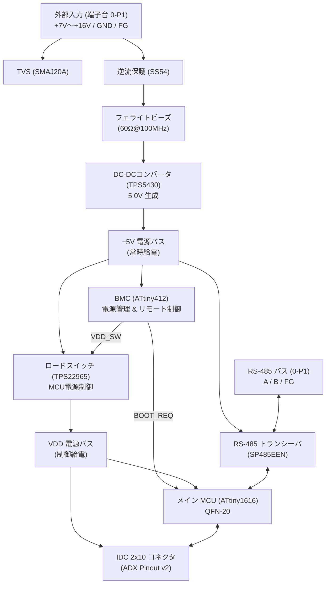
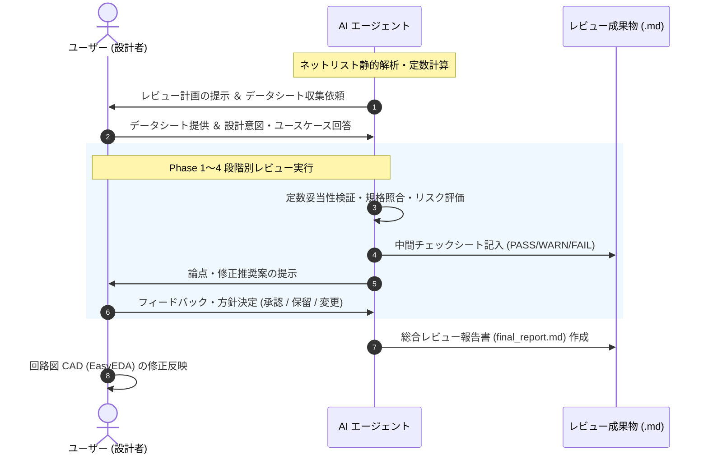

<!--
Copyright (c) 2026 ADX Project Contributors
SPDX-License-Identifier: CC-BY-4.0
-->

# ADX CORE-S ネットリスト レビュー計画書 (Review Plan)

## 1. 概要とレビュー目的

本ドキュメントは、現在開発中のマイコンボード **「ADX CORE-S」** のネットリスト（[`Netlist_Schematic1_2026-09-16.enet`](../Netlist_Schematic1_2026-09-16.enet)）を対象としたハードウェア設計レビューの全体計画書です。

### 1.1 背景と CORE-S の位置づけ
ADX プロジェクトにおいて、プロトタイプ検証用ボード「ADX Core-D」（USB-UART、SerialUPDI、外部12MHzオシレータ搭載）の実機検証が完了し、本番・量産向けスレーブ/標準ボードである **「ADX CORE-S」** の回路設計が進められています。
CORE-S では、Core-D から以下の大きな設計変更・機能追加が行われています：
1. **広範囲外部電源入力 (7V〜16V)** に対応するオンボード降圧 DC-DC コンバータ（TI TPS5430）の搭載
2. **基板管理コントローラ (BMC: Microchip ATtiny412)** の新設による、メイン MCU（ATtiny1616）の電源制御および自律ブート制御（LN-485 経由の遠隔リセット/ブートローダー制御）
3. **ロードスイッチ（TI TPS22965）** によるメイン系電源（`VDD`）の動的パワーゲーティング
4. **産業用通信インターフェース (RS-485 / LN-485)** のオンボード統合および ADX Pinout 仕様（v2）準拠の 2×10 IDC 拡張コネクタ

### 1.2 レビューの目的
基板パターン設計（PCB Layout）および試作発注へ進む前に、回路図・ネットリスト段階で以下を徹底的に検証し、手戻りや試作基板の改修リスクを未然に排除します：
- **電気的定格・保護性能の妥当性**（最大定格、許容損失、過渡サージ耐性）
- **接続性およびピンアサインの整合性**（未接続ピン、ピン機能重複、規格準拠性）
- **BMC 連携ブートシーケンスおよび電源制御の成立性**（パワーオンリセット挙動、突入電流、レベル整合）
- **通信・ノイズ対策のロバスト性**（RS-485 フェイルセーフ、終端、EMI/ESD）

---

## 2. ネットリスト静的解析サマリー

ネットリストファイル（EasyEDA Pro JSON 形式）をスクリプトにより事前解析した結果、以下のシステム構成となっています。



### 構成部品の規模
- **総コンポーネント数**: 46 点
- **ユニーク部品種別数**: 31 種類
- **総ネット数**: 42 ネット
- **主要ブロック分割**:
  - `Block 0`: 外部入力端子台・入力保護回路（6 部品）
  - `Block 1`: 降圧 DC-DC コンバータ回路（8 部品）
  - `Block 2`: VDD ロードスイッチ回路（4 部品）
  - `Block 3`: メイン MCU（ATtiny1616）＆パスコン＆終端ジャンパ（6 部品）
  - `Block 4`: RS-485 トランシーバ回路（7 部品）
  - `Block 5`: BMC（ATtiny412）回路（3 部品）
  - `GPIO-IDC`: 2×10P 拡張コネクタ（1 部品）
  - `LED / OTHER`: ステータス LED 3 系統、分圧・プルアップ抵抗、UPDI ヘッダ（11 部品）

---

## 3. 事前抽出された重要検証論点 (Early Findings / Red Flags)

ネットリストの構文・接続解析により、すでに**設計上特に着目すべき重要論点・懸念点**が 6 点抽出されています。本レビューではこれらを最重点項目として扱います。

> [!WARNING]
> ### 1. `BMC_RO` ネットの未接続（オープンネット）の疑い
> - **現状**: `5-BMC` の Pin 5 (`PA2`) は 1kΩ 抵抗（`5-R1`）を介してネット `BMC_RO` に接続されていますが、この `BMC_RO` には他の素子が一切接続されていません（1 端子のみの孤立ネット）。
> - **推測される設計意図**: BMC が RS-485 バス上のトラフィック（ブート指示コマンド等）を直接傍受（Sniffing）するため、RS-485 トランシーバー（`4-RS485`）の `RO` 出力（ネット `PA2/R`）に接続する計画だった可能性があります。
> - **アクション**: 設計意図を確認し、`PA2/R` との接続漏れであるかを判定します。

> [!CAUTION]
> ### 2. RS-485 バスライン（A/B）のサージ/ESD保護素子の有無
> - **現状**: 外部コネクタ `0-P1` の Pin 4 (A), Pin 5 (B) から直接、10Ω 抵抗（`4-R7`, `4-R8`）を介して `SP485EEN` の Pin 6, 7 に接続されています。
> - **懸念**: 電源ライン（`+7_16V`）には TVS ダイオード（`0-D4: SMAJ20A`）が入っていますが、**RS-485 通信ライン側には TVS ダイオード（Core-D で使われていた `PSM712` 等）がネットリスト上見当たりません**。
> - **アクション**: 長距離配線や FA 環境でのコモンモード過電圧・ESD 破壊リスクに対する保護要件を評価します。

> [!IMPORTANT]
> ### 3. ロードスイッチ `TPS22965` の CT 端子オープンによる突入電流リスク
> - **現状**: `2-P_SW` (TPS22965) の Pin 6 (`CT`) が未接続（NC）となっています。
> - **懸念**: データシート上、CT オープン時は出力スルーレート制御が無効化され、最短立ち上がり時間（$t_R \approx 32\,\mu\mathrm{s}$）で高速ターンオンします。このとき、後段の VDD パスコン群（4.7μF×2 + 0.1μF×2 ＝ 9.6μF）および IDC コネクタ先の拡張 CARD 側容量へ急峻な突入電流が流れ、上流の `+5V` バスに瞬間的な電圧ドロップが発生して **BMC (ATtiny412) や RS-485 が BOD リセットを起こすリスク** があります。
> - **アクション**: CT 端子にソフトスタート用コンデンサを追加すべきか定量計算します。

> [!IMPORTANT]
> ### 4. 降圧 DC-DC `TPS5430` の位相補償ループ安定性と出力コンデンサ特性
> - **現状**: インダクタに 15μH（`1-L1`）、出力コンデンサに 220μF 16V 電解コンデンサ（`1-C5`）が選定されています。
> - **懸念**: TPS5430 は位相補償回路が IC 内部に固定（Internal Compensation）されており、安定動作には出力コンデンサの容量値だけでなく **ESR ゼロ点周波数（$f_z = \frac{1}{2\pi \cdot R_{ESR} \cdot C_{OUT}}$）が適切な帯域内にあること** が絶対条件となります。
> - **アクション**: C5（創慧電子 `SS221M160E7R7R4Z00ZZ`）の ESR 特性をデータシートで確認し、TI 設計基準式と照合します。

> [!NOTE]
> ### 5. BMC 電源投入時（Power-On Reset 中）の初期 GPIO 状態と分圧回路
> - **現状**: メイン MCU の `BOOT_REQ`（`3-MCU.PB5`）に対し、BMC からの信号が R2 (10kΩ) と R1 (10kΩ to GND) の回路を経由して接続されています。
> - **懸念**: 
>   1. BMC がリセット解除されるまでの数ミリ秒間、GPIO は Hi-Z になります。外付けプルダウンにより `BOOT_REQ` が確実に LOW（通常起動モード）に固定されるか。
>   2. BMC が HIGH (5V) を出力した際、R1 と R2 の接続形態によっては分圧されて 2.5V に低下していないか（MCU の $V_{IH}$ 閾値を満たせるか）。
> - **アクション**: ネットリストの接続ノード（`$7N38`）とピン番号を詳細精査し、分圧回路かプルダウン＋直列保護回路かを確認します。

> [!NOTE]
> ### 6. 電源入力保護回路の協調（TVS / ダイオード / DC-DC 耐圧）
> - **現状**: TVS に `SMAJ20A`（Vrwm=20V, Vbr_min=22.2V, Vc_max=32.4V）、逆流防止ダイオードに `SS54`（耐圧 40V）、DC-DC に `TPS5430`（最大入力定格 36V, 動作推奨 5.5〜36V）が使用されています。
> - **アクション**: TVS の最大クランプ電圧（32.4V）が TPS5430 の耐圧（36V）未満に収まっているかのマージン評価、および 16V 連続印加時の熱・ディレーティングを検証します。

---

## 4. データシート収集状況とカタログ (Datasheet Status)

ネットリスト内のリンク情報を抽出し、全コンポーネントのデータシート PDF（全 30 ファイル、約 77MB）を自動収集してリポジトリ内に格納・整理しました。

- **データシート格納先**: [`hardware/CORE-S/review/datasheets/`](datasheets/)
- **詳細カタログ・精査速報**: [`hardware/CORE-S/review/datasheets/README.md`](datasheets/README.md)

### 4.1 主要部品の収集状況と初期所見

| 部品番号 / 型番 | メーカー | 用途 / 回路ブロック | ローカル PDF | データシート精査結果・確認パラメータ |
| :--- | :--- | :--- | :--- | :--- |
| **TPS5430DDAR** | TI | 降圧 DC-DC (Block 1) | [`TPS5430DDAR_C9864.pdf`](datasheets/TPS5430DDAR_C9864.pdf) | **【合格】** ENA 端子は内部 1.5MΩ プルアップ内蔵のためオープンで正常起動。推奨定数（15μH / 220μF ESR<40mΩ）と完全合致。 |
| **TPS22965DSGR** | TI | ロードスイッチ (Block 2) | [`TPS22965DSGR_C122837.pdf`](datasheets/TPS22965DSGR_C122837.pdf) | **【要検討】** $V_{IN} \le V_{BIAS}$ はクリア。ただし CT 端子オープン（0pF）のため立ち上がり $32\mu\mathrm{s}$ による突入電流対策（外付け CT 容量）を推奨。 |
| **SP485EEN-L/TR** | MaxLinear | RS-485 (Block 4) | [`SP485EEN-L_TR_C6855.pdf`](datasheets/SP485EEN-L_TR_C6855.pdf) | **【要検討】** IEC61000-4-2 接触放電定格あり。ただし高エネルギーサージ・雷サージ保護のため外付け TVS（PSM712 等）の追加要否を検討。 |
| **SS221M160E7R7R4Z00ZZ** | 創慧電子 | DC-DC 出力電解 220μF 16V (`1-C5`) | [`SS221M160E7R7R4Z00ZZ_C25503905.pdf`](datasheets/SS221M160E7R7R4Z00ZZ_C25503905.pdf) | **【合格】** 導電性高分子固体電解。ESR は **24mΩ**（TI 推奨上限 40mΩ 以下を満たす）。許容リプル電流は **2.9A** と極めて高耐久。 |
| **ATTINY412-SSNR** | Microchip | BMC (Block 5) | [`ATTINY412-SSNR_C1337190.pdf`](datasheets/ATTINY412-SSNR_C1337190.pdf) | **【要修正】** Pin 5 (PA2) からの `BMC_RO` 浮き配線問題の修正配線が必要。 |
| **ATTINY1616-MNR** | Microchip | メイン MCU (Block 3) | [`ATTINY1616-MNR_C507118.pdf`](datasheets/ATTINY1616-MNR_C507118.pdf) | **【合格】** （[`docs/datasheet/ATTINY1616_3216.pdf`](../../../docs/datasheet/ATTINY1616_3216.pdf) にも配置済み） |

---

## 5. 役割分担と協力体制 (Collaboration Framework)

ユーザーと AI エージェント（私）の強みを活かした効率的な協調レビュー体制を以下のように定めます。



| 担当 | 主な役割・具体的タスク |
| :--- | :--- |
| **ユーザー<br/>（設計者・レビュアー）** | 1. **データシート・設計資料の提供**: 上記リストに基づき PDF やスペック値を共有<br/>2. **設計意図 (Design Intent) の開示**: 疑問点（例: BMC_RO の目的、RS-485 保護素子の有無等）に対する意図・背景の説明<br/>3. **システム要件・運用条件の決定**: 入力電源品質、通信距離、環境温度、許容コスト等の要件決定<br/>4. **最終判断と CAD 修正**: レビュー指摘事項に対する修正可否の判断および回路図データの更新 |
| **AI エージェント<br/>（テクニカルパートナー）** | 1. **ネットリストの自動構文解析**: 未接続ピン、孤立ネット、重複ピン等のスクリプト機械検出<br/>2. **回路定数・電気特性の数式計算**: 分圧比、DC-DC 出力電圧、時定数、リプル電圧、消費電流・損失計算<br/>3. **規格・ドキュメント間のクロスチェック**: ADX Pinout 仕様書（v2）やブート要求仕様書との厳密な突き合わせ<br/>4. **データシート仕様との適合性評価**: 推奨動作条件、絶対最大定格、タイミング要件の照合<br/>5. **チェックリスト作成・記録**: `hardware/CORE-S/review/` 配下へのレビュー結果 Markdown の作成・維持 |

---

## 6. レビュー実施フェーズ（5段階アプローチ）

レビューは以下の 5 つのフェーズに分けて段階的・体系的に実施します。


### 【Phase 1】ネット完全性・接続性レビュー (Netlist Integrity)
- **目的**: CAD 出力におけるヒューマンエラー（配線漏れ、誤接続、孤立ネット）の撲滅。
- **検証項目**:
  - 全 46 部品の全ピン接続状態の確認（未接続ピンの正当性チェック）
  - 孤立ネット（接続先が 1 つしかないネット: 例 `BMC_RO`）の洗い出しと原因究明
  - 電源ネット（`+7_16V`, `+6V_16V`, `+5V`, `VDD`, `G`）の短絡経路・不整合がないか確認
  - 2 極素子（ダイオード、電解コンデンサ等）のアノード・カソード極性検証

### 【Phase 2】電源系・保護・熱設計レビュー (Power & Thermal)
- **目的**: 外部電源入力からマイコン給電に至るまでの安定性、効率、保護協調、熱定格の検証。
- **検証項目**:
  - **入力保護**: `0-D4` (SMAJ20A), `0-D1` (SS54), `0-L2` のサージ耐量、最大クランプ電圧と DC-DC 耐圧の協調
  - **降圧 DC-DC (`TPS5430`)**:
    - 出力電圧設定（$R_2=6.8\mathrm{k}\Omega, R_3=2.2\mathrm{k}\Omega \to 4.995\mathrm{V}$）の精度
    - インダクタ（15μH 3A）の直流重畳特性とインダクタンス値の妥当性
    - 出力コンデンサ（`1-C5` 220μF）の ESR ゼロ点周波数とループ安定性
    - ブートストラップ容量（`1-C3` 10nF）の適正
    - ENA ピンの動作仕様
  - **ロードスイッチ (`TPS22965`)**:
    - CT 端子オープン時の突入電流（Inrush Current）計算と `+5V` 電圧ドロップ量評価
    - $V_{BIAS}$ および $V_{IN}$ 接続仕様の適合性
    - プルダウン抵抗（`2-R1` 100kΩ）による誤ターンオン防止の確実性

### 【Phase 3】通信・ノイズ・過渡特性レビュー (Communication & Noise)
- **目的**: 工場・産業環境下における RS-485 / LN-485 通信の耐ノイズ性と信頼性確保。
- **検証項目**:
  - **RS-485 トランシーバ (`SP485EEN`)**:
    - DE / RE_ 制御ラインの接続（`PA4/DE`, `PA7/RE`）と USART0 ハードウェア自動方向制御（XDIR）の整合性
    - 直列抵抗（`4-R7`, `4-R8` 10Ω）のダンピング効果と過電流耐量
    - フェイルセーフバイアス抵抗（`4-R6` 1kΩ プルアップ / `4-R5` 1kΩ プルダウン）による無信号時電位差（$>200\mathrm{mV}$）の計算
    - 終端抵抗（`4-R4` 120Ω）およびソルダージャンパ（`3-JP1`, `3-JP3`）の切り替え構造
    - RS-485 バスラインのサージ/ESD 保護対策の追加要否検討
  - **IDC 拡張コネクタ (`GPIO-IDC`)**:
    - [`ADX_pinout.md`](../../../docs/ja/ADX_pinout.md) (v2) 仕様とのピン配置 1:1 完全一致確認
    - Pin 5 (NC アイソレーション)、Pin 8/10 (EXTCLK シールド GND) の整合性

### 【Phase 4】MCU・BMC・起動制御シーケンスレビュー (MCU, BMC & Boot Sequence)
- **目的**: [`adx_bootloader_requirements.md`](../../../docs/memo/adx_bootloader_requirements.md) に基づく起動シーケンス・遠隔書き込み制御の成立性検証。
- **検証項目**:
  - **BMC (`ATtiny412`)**:
    - 電源（常時 5V 給電）とパスコン（0.1μF）の配置
    - 電源投入時のリセット期間における GPIO Hi-Z 状態と各プルダウン抵抗の協調
    - `BOOT_REQ` 駆動回路（R1, R2 各 10kΩ）の論理レベル・分圧比の検証
    - BMC による RS-485 通信傍受（Sniffing）配線（`BMC_RO`）の結線是正案
    - UPDI 書き込みヘッダ（`H2`）のアクセス性
  - **メイン MCU (`ATtiny1616`)**:
    - 電源ピン（VDD, GND, EP）のパスコン構成（4.7μF×2 + 0.1μF）
    - UPDI ピン（`PA0`）の保護および書き込みヘッダ（`H3`）の妥当性
    - オンボード LED（`PB4`）のドライブ電流（330Ω 直列、5V 駆動で約 8〜10mA）
    - PORTMUX 切り替え仕様（USART0 Default/Alternate）とピン結線の整合性

### 【Phase 5】総合報告書作成と修正アクションプラン (Final Report & Action Items)
- **目的**: 発見されたすべての懸念事項・改善提案を重要度順に整理し、回路図修正用チェックリストとして提出。
- **成果物**: `hardware/CORE-S/review/review_report.md` の作成。

---

## 7. レビュー成果物とディレクトリ構成

レビューの過程および最終結果は、以下のディレクトリ構成で管理します。

```text
hardware/CORE-S/review/
├── review_plan.md               # 本計画書（全体ロードマップ・役割分担・事前抽出論点）
├── checklists/                  # フェーズ別詳細チェックリスト
│   ├── phase1_integrity.md      # Phase 1: ネット完全性・未接続ピン検証シート
│   ├── phase2_power.md          # Phase 2: 電源系・DC-DC・ロードスイッチ計算シート
│   ├── phase3_communication.md  # Phase 3: RS-485・バス保護・IDC コネクタ検証シート
│   └── phase4_mcu_bmc.md        # Phase 4: MCU・BMC・ブートシーケンス検証シート
└── review_report.md             # 総合レビュー判定報告書 ＆ 回路図修正推奨事項 (RFC)
```

---

## 8. 次のアクション（レビュー開始に向けて）

本計画書に基づきレビューを円滑に進めるため、まず以下のステップから着手することを提案します。

1. **ユーザー確認・方針合意**:
   - 本計画書（検証範囲、役割分担、優先度）に不足や追加要望がないかの確認。
2. **設計意図の確認（クイックヒアリング）**:
   - 【論点1】`BMC_RO` ネットは、RS-485 の RO（`PA2/R`）に接続して BMC 側でもパケットを受信させる意図でしょうか？
   - 【論点2】RS-485 の外部端子台 A/B には、基板外での保護を前提としているか、それともオンボードで TVS（PSM712 等）を追加したいでしょうか？
3. **データシートの入手・提供**:
   - セクション 4.1 の優先度【高】データシート（特に TPS5430, TPS22965, 出力電解コンデンサ等）について、手元のファイルまたは確認状況の共有。
4. **Phase 1 & Phase 2 の実行開始**:
   - 上記の回答・準備と並行して、エージェント側でスクリプトを用いた全ピン接続マトリクス照合および DC-DC / ロードスイッチの定数計算を先行着手。
