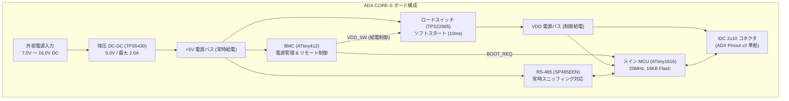
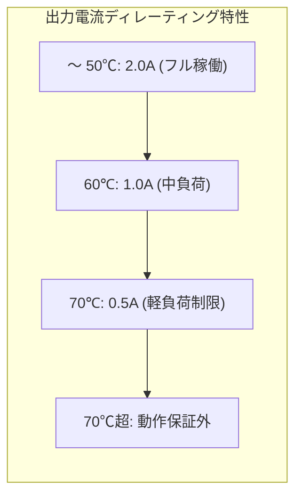
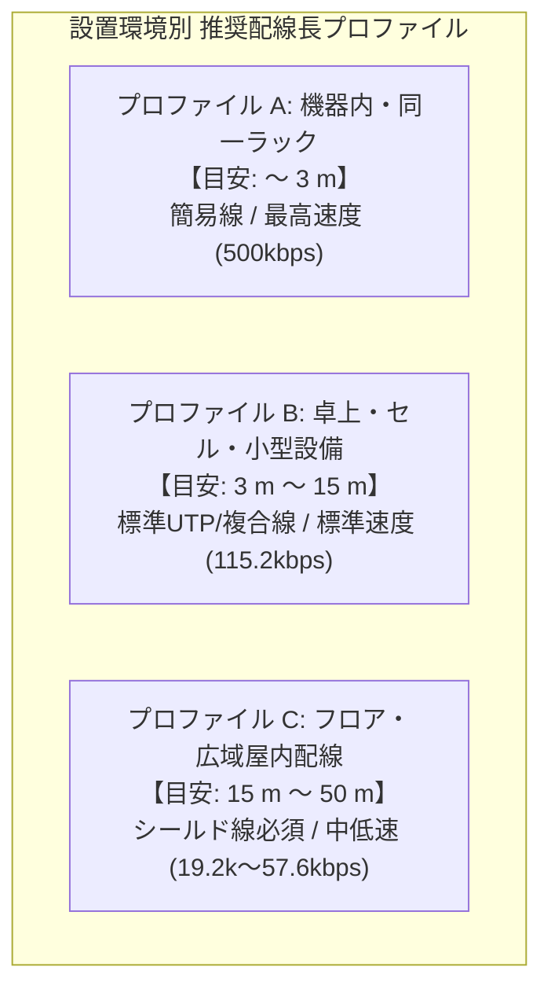

<!--
Copyright (c) 2026 ADX Project Contributors
SPDX-License-Identifier: CC-BY-4.0
-->

# ADX CORE-S ハードウェア仕様書 (Hardware Specification)

| 項目 | 仕様・管理情報 |
| :--- | :--- |
| **製品名称 / 型番** | **ADX CORE-S** (型番: `ADX-CORE-S`, CORE-STANDARD) |
| **対象回路リビジョン** | **rev2**（[`Netlist_Schematic1_2026-09-16_rev2.enet`](./Netlist_Schematic1_2026-09-16_rev2.enet) 準拠） |
| **ドキュメント番号** | `SPEC-ADX-CORE-S-20260916` |
| **制定日 / 版数** | 2026-09-16 / Rev 1.0 (Draft Proposal) |
| **準拠規格** | [ADX Pinout 仕様書 v2](../../../../docs/ja/ADX_pinout.md) / [ADX 8748 フォームファクタ](../../../../docs/ja/8748_formfactor.md) |
| **ライセンス** | クリエイティブ・コモンズ 表示 4.0 国際 (CC-BY-4.0) |

---

## 第1章 目次 (Table of Contents)

1. [第1章 目次 (Table of Contents)](#第1章-目次-table-of-contents)
2. [第2章 主な仕様・スペック早見表 (Key Specifications Summary)](#第2章-主な仕様スペック早見表-key-specifications-summary)
3. [第3章 製品概要とシステム構成 (Product Overview & Architecture)](#第3章-製品概要とシステム構成-product-overview--architecture)
   - 3.1 [製品ポジショニング](#31-製品ポジショニング)
   - 3.2 [システムブロック図](#32-システムブロック図)
   - 3.3 [主要機能・特長](#33-主要機能特長)
4. [第4章 絶対最大定格 (Absolute Maximum Ratings)](#第4章-絶対最大定格-absolute-maximum-ratings)
5. [第5章 推奨動作条件 (Recommended Operating Conditions)](#第5章-推奨動作条件-recommended-operating-conditions)
6. [第6章 電気的特性 (Electrical Characteristics)](#第6章-電気的特性-electrical-characteristics)
   - 6.1 [電源および DC-DC コンバータ部](#61-電源および-dc-dc-コンバータ部)
   - 6.2 [RS-485 通信部](#62-rs-485-通信部)
7. [第7章 熱設計およびディレーティング規定 (Thermal & De-rating Guidelines)](#第7章-熱設計およびディレーティング規定-thermal--de-rating-guidelines)
   - 7.1 [温度制約のボトルネック素子 (Thermal Bottlenecks)](#71-温度制約のボトルネック素子-thermal-bottlenecks)
   - 7.2 [周囲温度 vs 負荷電流ディレーティングテーブル](#72-周囲温度-vs-負荷電流ディレーティングテーブル)
   - 7.3 [エンクロージャー組み込み時の設計要件](#73-エンクロージャー組み込み時の設計要件)
8. [第8章 インターフェース・ピン配置仕様 (Pinout & Interfaces)](#第8章-インターフェースピン配置仕様-pinout--interfaces)
   - 8.1 [外部電源・通信端子台 (0-P1: 7.62mm ピッチ 6P)](#81-外部電源通信端子台-0-p1-762mm-ピッチ-6p)
   - 8.2 [拡張コネクタ (GPIO-IDC: 2.54mm 2×10P IDC)](#82-拡張コネクタ-gpio-idc-254mm-210p-idc)
   - 8.3 [デバッグ・プログラミングヘッダ](#83-デバッグプログラミングヘッダ)
   - 8.4 [オンボード LED 定義](#84-オンボード-led-定義)
9. [第9章 フィールドネットワーク＆電源配線長ガイドライン (Wiring Distance & Guidelines)](#第9章-フィールドネットワーク電源配線長ガイドライン-wiring-distance--guidelines)
   - 9.1 [配線長を決定する 2 大物理要因](#91-配線長を決定する-2-大物理要因)
   - 9.2 [設置環境ごとの推奨配線長プロファイル (Application Profiles)](#92-設置環境ごとの推奨配線長プロファイル-application-profiles)
   - 9.3 [運用上の制約およびトポロジ設計規則](#93-運用上の制約およびトポロジ設計規則)
10. [第10章 BMC 連携ブート制御仕様 (Boot Architecture)](#第10章-bmc-連携ブート制御仕様-boot-architecture)
    - 10.1 [スタートアップ判定ロジック](#101-スタートアップ判定ロジック)
    - 10.2 [遠隔ファームウェア書き込みシーケンス](#102-遠隔ファームウェア書き込みシーケンス)
11. [第11章 改版履歴 (Revision History)](#第11章-改版履歴-revision-history)

---

## 第2章 主な仕様・スペック早見表 (Key Specifications Summary)

本ボードの主要仕様、推奨動作条件、および限界定格（絶対最大定格）の一覧です。

| カテゴリ | 項目 | 推奨動作値 (Recommended / Typ) | 限界定格値 (Absolute Max / Limits) | 備考・仕様詳細 |
| :--- | :--- | :---: | :---: | :--- |
| **電源入力** *(Power Input)* | **電源入力電圧 ($V_{IN}$)** | **`7.0V 〜 16.0V DC`** (代表: 12.0V) | **`-0.3V 〜 +20.0V DC`** | ・12V 鉛蓄電池 / 3S LiPo 完全対応。 ・**20V 超（FA 24V 等）は絶対接続禁止**。 ・※逆接続時：単方向 TVS (0-D4) が順方向短絡するため定常的な逆接続は非対応（外部ヒューズ必須）。 |
| | **電源投入時スルーレート** | $0.1\,\mathrm{ms} \sim 100\,\mathrm{ms}$ | - | 急峻な過電圧サージを避けるため。 |
| **電源出力** *(Power Output)* | **+5V / VDD 出力電圧** | **$4.95\,\mathrm{V} \sim 5.05\,\mathrm{V}$** (代表: 4.995V) | $5.5\,\mathrm{V}$ max | DC-DC TPS5430 出力 (公称誤差 -0.10%)。 |
| | **最大 5V 出力連続電流** | **$2.0\,\mathrm{A}$** ($T_A \le 50^\circ\mathrm{C}$) $1.0\,\mathrm{A}$ ($T_A = 60^\circ\mathrm{C}$) | $2.5\,\mathrm{A}$ (熱・素子許容限界) | オンボード MCU ＋ IDC 拡張給電の合計。 温度ディレーティング規定あり (※DC-DC OCP は Typ 4.0A)。 |
| | **出力リップル電圧** | 代表 **$9.3\,\mathrm{mV}_{p-p}$** | $15.0\,\mathrm{mV}_{p-p}$ max | 導電性高分子固体電解 220μF (ESR 24mΩ)。 |
| | **VDD 立ち上がり時間** | 代表 **$10.8\,\mathrm{ms}$** | $8.0\,\mathrm{ms} \sim 14.0\,\mathrm{ms}$ | ロードスイッチ CT 容量 (1nF) による制御。 |
| | **VDD 投入時突入電流** | 代表 **$18.6\,\mathrm{mA}$** | $25.0\,\mathrm{mA}$ max | $C_L = 50\,\mu\mathrm{F}$ 接続時。+5V ドロップ皆無。 |
| | **待機時暗電流** | 代表 **$1.8\,\mathrm{mA}$** | $3.5\,\mathrm{mA}$ max | VDD OFF (MCU停止), BMC スリープ時。 |
| **マイコン部** *(MCU / BMC)* | **メイン MCU** | **ATtiny1616-MNR** (QFN-20) | - | 20MHz 内部RC, 16KB Flash, 2KB SRAM, 128B EEPROM。VDD 制御給電。 |
| | **基板管理 BMC** | **ATtiny412-SSNR** (SOIC-8) | - | 20MHz, 4KB Flash。常時 5V 給電。 電源ゲーティング・遠隔ブート制御担当。 |
| **通信機能** *(Network)* | **通信インターフェース** | **半二重 RS-485 / LN-485** | - | トランシーバ: MaxLinear SP485EEN。 |
| | **自動方向制御** | **XDIR ハードウェア自動制御** | - | ATtiny1616 PA4 端子連動。 |
| | **通信速度 (ボーレート)** | **$115.2\,\mathrm{kbps}$** (標準) | $500\,\mathrm{kbps}$ max | LN-485 規格準拠。 |
| | **フェイルセーフ電位差** | 代表 **$+283\,\mathrm{mV}$** | - | 120Ω 終端時 (受信閾値 $\pm 200\mathrm{mV}$ をクリア)。 |
| | **静電気耐量 (ESD)** | **$\pm 15\,\mathrm{kV}$** (HBM) | - | SP485EEN 内部保護 (外付け TVS はオミット)。 |
| | **終端抵抗** | **$120\,\Omega$** (1/16W 1%) | - | ソルダージャンパ (`4-JP1`, `4-JP3`) で切替。 |
| **拡張 I/O** *(Expansion)* | **拡張コネクタ規格** | **ADX Pinout 仕様書 (v2)** | - | **2.54mm 2×10P IDC** (MIL 互換)。 |
| | **引き出しインターフェース** | SPI, I2C, UART, アナログ | - | ・SPI (4線), I2C (2線), UART Alt (2線) ・DAC×1, ADC×2, EXTCLK×1 ・VDD×4 (2A給電), GND×4, アイソレーションNC×1 |
| **環境・耐熱** *(Environmental)* | **動作周囲温度 (推奨)** | **`-20℃ 〜 +60℃`** | - | 静止空気オープンエア環境。 |
| | **動作周囲温度 (許容限界)** | **`-40℃ 〜 +70℃`** | - | 軽負荷ディレーティング適用時。 |
| | **保存周囲温度** | - | **`-40℃ 〜 +125℃`** | 部品保証保存温度。 |
| | **動作湿度** | 10% 〜 90% RH | - | 結露なきこと。 |
| **配線長目安** *(Wiring)* | **機器内 / 同一ラック** | **〜 3 m** (最高 500kbps) | - | フラット線、AWG26 簡易配線対応。 |
| | **卓上・セル・小型設備** | **3 m 〜 15 m** (115.2kbps) | - | UTP 複合ツイストペア線 (メインターゲット)。 |
| | **フロア広域屋内配線** | **15 m 〜 50 m** (19.2k〜57.6k) | **50 m max** | シールド付きツイストペア (STP) 必須。 屋外配線・50m 超配線は禁止。 |
| **機構仕様** *(Mechanical)* | **外形フォームファクタ** | **ADX 8748 フォームファクタ** | - | 筐体スナップフィット用 U字ノッチ対応。 |
| | **外部接続端子台** | **7.62mm ピッチ 6P 端子台** | - | 康奈克斯 WJ25C-B-7.62-6P (ネジ留め式)。 |

---

## 第3章 製品概要とシステム構成 (Product Overview & Architecture)

### 3.1 製品ポジショニング
**ADX CORE-S** は、次世代オープンハードウェアエコシステム「ADX」における **標準・高コストパフォーマンス型マイコンボード（CORE-STANDARD）** です。

プロトタイプ開発用ボード「Core-D」の知見を継承しつつ、Commercial / 12V 系バッテリー駆動環境に特化して不要な過剰装備をオミットし、低コスト・小型・高信頼性を実現しています。オンボード降圧 DC-DC、基板管理コントローラ（BMC）、ロードスイッチによる電源制御、および堅牢な RS-485 / LN-485 通信機能を統合しています。

### 3.2 システムブロック図

### 3.3 主要機能・特長
1. **広範囲 12V 級電源対応**: 7.0V〜16.0V DC の広範囲入力に対応し、12V 鉛蓄電池や 3S LiPo バッテリーから直接駆動可能。
2. **BMC 連携パワーマネジメント**: サブ MCU（BMC: ATtiny412）がメイン MCU への給電（VDD）およびブートモード（`BOOT_REQ`）を完全自律制御。
3. **無衝撃ターンオン**: ロードスイッチにスルーレート制御コンデンサ（`2-C1`: 1nF）を搭載し、突入電流を 25mA 以下に抑制（BMC の誤リセットを完全防止）。
4. **常時監視 RS-485 通信**: メイン MCU 停止時でも BMC がバス通信を常時スニッフィングし、LN-485 経由の遠隔ウェイクアップ・ファームウェア更新が可能。
5. **ADX Pinout v2 完全準拠**: 2×10P IDC コネクタにより、電源短絡防止アイソレーションおよびクロックシールドを備えた拡張カード接続に対応。

---

## 第4章 絶対最大定格 (Absolute Maximum Ratings)

本定格を超えるストレスを印加した場合、製品に恒久的な破損・焼損を与える恐れがあります。

| 項目 | 記号 | 最小値 | 最大値 | 単位 | 備考・破壊要因 |
| :--- | :---: | :---: | :---: | :---: | :--- |
| **外部電源入力電圧** | $V_{IN(MAX)}$ | -0.3 | **+20.0** | V | ・**+20V 超過で TVS (0-D4) が降伏・焼損** ・**負電圧印加（逆接続）時は TVS が順方向短絡するため印加禁止** |
| **5V 出力バス連続電流** | $I_{OUT(MAX)}$ | - | **2.5** | A | 熱設計・インダクタ飽和マージンに基づくボード連続許容限界 |
| **GPIO 端子入力電圧** | $V_{IO}$ | -0.5 | $V_{DD} + 0.5$ | V | 各マイコンポートの保護ダイオード定格 (VDD OFF 時は 0.5V max) |
| **RS-485 A/B 端子同相電圧** | $V_{RS485(CM)}$ | -7.0 | +12.0 | V | SP485EEN 同相耐圧規格 |
| **保存温度範囲** | $T_{stg}$ | -40 | +125 | ℃ | 部品保証保存温度範囲 |

> [!CAUTION]
> **【警告: FA 24V 電源の直接接続禁止、逆接続注意、および寄生給電防止】**  
> 1. **24V 系過電圧の禁止**: 本ボードは 12V 系専用設計です。**工場等の 24V / 48V 電源ラインを直接接続すると、入力保護 TVS（降伏電圧 22.2V）が導通し、大電流による発煙・焼損事故を引き起こします**。24V 系統で運用する場合は、必ず外付けの 24V $\to$ 12V 降圧レギュレータを前段に設けてください。  
> 2. **逆極性接続の禁止**: 入力端子台直下に単方向 TVS（`0-D4`: SMAJ20A）が GND 間に配置されています。万一電源を逆接続（Pin 1 に負電圧、Pin 2 に正電圧）した場合、SBD（`0-D1`）が内部回路を遮断する一方で、**TVS ダイオードが GND $\to$ 端子間で順方向に導通し大電流短絡状態**となります。外部ヒューズや電源側の過電流制限がない場合、TVS が数秒で過熱・焼損する危険があるため、極性に細心の注意を払ってください。  
> 3. **GPIO 外部印加の禁止 (寄生給電防止)**: ロードスイッチによりメイン MCU の給電（VDD）が OFF（0V）となっている間は、外部 IDC コネクタ接続回路から GPIO 端子へ外部信号（3.3V / 5V）を印加しないでください。マイコン内蔵 ESD 保護ダイオードを経由して VDD バスへ電流が回り込み（寄生給電）、意図しない低電圧動作やポート損傷を招く恐れがあります。

---

## 第5章 推奨動作条件 (Recommended Operating Conditions)

製品の正常な機能・長期信頼性を保証する動作範囲です。

| 項目 | 記号 | 最小値 | 標準値 | 最大値 | 単位 | 備考 |
| :--- | :---: | :---: | :---: | :---: | :---: | :--- |
| **電源入力電圧** | $V_{IN}$ | **7.0** | **12.0** | **16.0** | V | 12V 鉛蓄電池 / 3S LiPo バッテリー対応 |
| **電源投入立ち上がり時間** | $t_{VIN\_RISE}$ | 0.1 | - | 100 | ms | 急峻な過電圧サージを避けるため |
| **動作周囲温度 (推奨)** | $T_{A(REC)}$ | **-20** | **+25** | **+60** | ℃ | 静止空気・オープンエア環境 |
| **動作周囲温度 (許容拡張)** | $T_{A(MAX)}$ | **-40** | - | **+70** | ℃ | 負荷電流ディレーティング適用時 |
| **メイン系給電電圧 (VDD)** | $V_{DD}$ | 4.90 | 5.00 | 5.05 | V | ロードスイッチ ON 時 (内部ドロップ約 30mV 考慮) |
| **RS-485 通信ボーレート** | $Baud$ | 9,600 | 115,200 | 500,000 | bps | LN-485 スタック準拠 |

---

## 第6章 電気的特性 (Electrical Characteristics)

（特記なき限り $V_{IN} = 12.0\,\mathrm{V}, T_A = 25^\circ\mathrm{C}$）

### 6.1 電源および DC-DC コンバータ部
| 項目 | 記号 | 測定条件 / 仕様 | 最小 | 標準 | 最大 | 単位 |
| :--- | :--- | :--- | :---: | :---: | :---: | :---: |
| **+5V バス出力電圧** | $V_{5V}$ | $I_{OUT} = 0.1\mathrm{A} \sim 1.5\mathrm{A}$ | 4.95 | 4.995 | 5.05 | V |
| **DC-DC スイッチング周波数** | $f_{sw}$ | 内部固定発振周波数 | 400 | 500 | 600 | kHz |
| **出力リップル電圧** | $\Delta V_{5V}$ | $I_{OUT} = 1.0\,\mathrm{A}, f_{sw} = 500\,\mathrm{kHz}$ | - | 9.3 | 15.0 | $\mathrm{mV}_{p-p}$ |
| **DC-DC 変換効率** | $\eta$ | $V_{IN}=12\mathrm{V}, I_{OUT}=1.0\,\mathrm{A}$ | 84 | 87 | - | % |
| **ロードスイッチ ON 抵抗** | $R_{ON}$ | $V_{IN}=5\mathrm{V}, I_{OUT}=1.0\mathrm{A}$ | - | 16 | 23 | $\mathrm{m}\Omega$ |
| **VDD 立ち上がり時間** | $t_R$ | $C_T = 1\,\mathrm{nF}, C_L = 50\,\mu\mathrm{F}$ | 8.0 | 10.8 | 14.0 | ms |
| **VDD 投入時突入電流** | $I_{inrush}$ | $C_L = 50\,\mu\mathrm{F}$ (オンボード＋外部) | - | 18.6 | 25.0 | mA |
| **待機時暗電流** | $I_{stby}$ | VDD OFF, BMC スリープ中 | - | 1.8 | 3.5 | mA |

### 6.2 RS-485 通信部
| 項目 | 記号 | 測定条件 / 仕様 | 最小 | 標準 | 最大 | 単位 |
| :--- | :--- | :--- | :---: | :---: | :---: | :---: |
| **無信号時フェイルセーフ電位差** | $V_{AB(idle)}$ | 終端 120Ω 接続時 | +250 | +283 | +310 | mV |
| **受信入力閾値電圧** | $V_{TH}$ | $-7\mathrm{V} \le V_{CM} \le +12\mathrm{V}$ | -200 | - | +200 | mV |
| **内部静電気保護耐量** | $V_{ESD}$ | Human Body Model (HBM) | $\pm 15$ | - | - | kV |

---

## 第7章 熱設計およびディレーティング規定 (Thermal & De-rating Guidelines)

ボード製品として、ユーザーの筐体設計に依存する耐熱限界を安全に管理するためのガイドラインです。

### 7.1 温度制約のボトルネック素子 (Thermal Bottlenecks)

本ボードを構成する全 47 部品のデータシート仕様から抽出した、温度上限および下限のボトルネック要因です。

| 温度制約区分 | 限界温度 | ボトルネック部品 / 素子群 | 物理的制約要因・データシート仕様 |
| :--- | :---: | :--- | :--- |
| **【高温側ボトルネック】** (上限限界) | **$+85^\circ\mathrm{C}$** | ・**`SP485EEN-L/TR`** (RS-485) ・**`TPS22965DSGR`** (ロードスイッチ) ・**`0-C7`, `2-C2`** (X5R MLCC) ・**`9-LED-*`** (各種インジケータ) | ・Commercial/Extended グレード IC の動作周囲温度上限 ($85^\circ\mathrm{C}$) ・X5R 誘電体セラミックの動作上限 ($85^\circ\mathrm{C}$) ※MCU/BMC/DC-DC 単体は 105℃〜125℃ まで耐えますが、通信・電源スイッチ・X5R コンデンサが 85℃ で律速されます。 |
| **【低温側ボトルネック】** (下限限界) | **$-40^\circ\mathrm{C}$** | ・**全半導体 IC 群**   (`TPS5430`, `TPS22965`, `ATtiny1616`,    `ATtiny412`, `SP485EEN`) ・**LED・コネクタ類** | ・主要 IC の電気的動作保証下限が **$-40^\circ\mathrm{C}$**。 ※受動部品（固体電解 `1-C5`、TVS、SBD、インダクタ、抵抗、MLCC）はすべて **$-55^\circ\mathrm{C}$** まで耐性を有しますが、半導体素子の起動・スイッチング特性保証により **$-40^\circ\mathrm{C}$ がボード全体の物理下限** となります。 |

> **【実運用における推奨下限 `-20℃` の根拠】**  
> 物理限界は $-40^\circ\mathrm{C}$ ですが、以下の理由により推奨動作範囲の下限を **`-20℃`** と定めています：
> 1. **バッテリー低温特性**: 12V 鉛蓄電池や LiPo バッテリーは $-20^\circ\mathrm{C}$ 以下で内部抵抗が急増し、放電電圧低下や大電流取り出し不能に陥るため。
> 2. **コンデンサ ESR 上昇**: 低温下での ESR 増加に伴う DC-DC リップル電圧の拡大マージン確保。
> 3. **内部 RC オシレータの周波数ドリフト**: メイン MCU / BMC の内蔵オシレータが低温極値でドリフトし、高速 UART 通信のビットレート誤差が拡大するのを抑えるため。

### 7.2 周囲温度 vs 負荷電流ディレーティングテーブル

5V 電源（オンボード MCU + IDC 拡張コネクタへの給電合計）の最大許容電流です。

| 設置環境 | 周囲温度 ($T_A$) | 最大 5V 出力電流 ($I_{VDD} + I_{5V}$) | 自己発熱による温度上昇 ($\Delta T$) |
| :--- | :---: | :---: | :---: |
| **開放空間 (オープンエア)** | **$\le 50^\circ\mathrm{C}$** | **$2.0\,\mathrm{A}$** | 約 $+20^\circ\mathrm{C} \to$ 素子温度約 $70^\circ\mathrm{C}$ (安全) |
| **通気孔ありケース** | **$50^\circ\mathrm{C} \sim 60^\circ\mathrm{C}$** | **$1.0\,\mathrm{A}$** | 約 $+15^\circ\mathrm{C} \to$ 素子温度約 $75^\circ\mathrm{C}$ (安全) |
| **完全密閉ケース** | **$60^\circ\mathrm{C} \sim 70^\circ\mathrm{C}$** | **$0.5\,\mathrm{A}$** | 約 $+10^\circ\mathrm{C} \to$ 素子温度約 $80^\circ\mathrm{C}$ (限界付近) |

### 7.3 エンクロージャー組み込み時の設計要件
1. **ケース内部温度制限**: どのような密閉筐体に組み込む場合でも、**「ケース内部の空気温度が $+70^\circ\mathrm{C}$ を超えないこと」** を確認してください。
2. **大電流運用時の対策**: 拡張カード等で 1.0A 以上の電流を連続消費する場合は、ケースに通気孔を設けるか、基板底面（DC-DC 放熱ビア付近）から筐体へサーマルパッド等で熱を逃がす構造を推奨します。

---

## 第8章 インターフェース・ピン配置仕様 (Pinout & Interfaces)

### 8.1 外部電源・通信端子台 (0-P1: 7.62mm ピッチ 6P)

| 端子番号 | ピン名 | 信号種別 | 説明 |
| :---: | :--- | :---: | :--- |
| **1** | **+7_16V** | 電源入力 | 外部 DC 電源正極 (7.0V〜16.0V DC) |
| **2** | **GND** | 電源接地 | 信号接地 (Power GND) |
| **3** | **FG** | フレーム接地 | コネクタシェル / 筐体シールド接地（信号 GND と直流分離） |
| **4** | **A** | 通信 | RS-485 差動信号ライン A (Non-inverting / +) |
| **5** | **B** | 通信 | RS-485 差動信号ライン B (Inverting / -) |
| **6** | **GND** | 電源接地 | 信号接地 (Power GND) |

### 8.2 拡張コネクタ (GPIO-IDC: 2.54mm 2×10P IDC)
**ADX Pinout 仕様書 (v2) 完全準拠**

| IDC Pin | ネット名 | マイコン端子 | 主な機能 / ペリフェラル多重化 |
| :---: | :--- | :---: | :--- |
| **1** | **VDD** | - | 制御電源 (5V 給電: 2×2 ブロック) |
| **2** | **VDD** | - | 制御電源 (5V 給電: 2×2 ブロック) |
| **3** | **VDD** | - | 制御電源 (5V 給電: 2×2 ブロック) |
| **4** | **VDD** | - | 制御電源 (5V 給電: 2×2 ブロック) |
| **5** | *N.C.* | - | **アイソレーション緩衝帯 (電源短絡物理防止)** |
| **6** | **PA6/DAC0** | PA6 | DAC0 出力 / ADC0 AIN6 |
| **7** | **PA5/AIN5** | PA5 | VREFA (外部基準電圧) / ADC0 AIN5 / PWM |
| **8** | **GND** | - | **GND シールド① (EXTCLK ノイズ遮蔽)** |
| **9** | **PA3/EXC** | PA3 | **EXTCLK (外部クロック入力)** / PWM |
| **10** | **GND** | - | **GND シールド② (クロック・通信分離)** |
| **11** | **PB2/TXD_EXT** | PB2 | UART TxD (PORTMUX Alternate) / PWM |
| **12** | **PB3/RXD_EXT** | PB3 | UART RxD (PORTMUX Alternate) / PWM |
| **13** | **PB0/SCL** | PB0 | I2C SCL / PWM |
| **14** | **PB1/SDA** | PB1 | I2C SDA / PWM |
| **15** | **GND** | - | 中継シールド GND |
| **16** | **PC3/SS** | PC3 | SPI SS / PWM |
| **17** | **PC2/MOSI** | PC2 | SPI MOSI |
| **18** | **PC1/MISO** | PC1 | SPI MISO / 高周波 PWM |
| **19** | **PC0/SCK** | PC0 | SPI SCK / 高周波 PWM |
| **20** | **GND** | - | 終端シールド GND |

### 8.3 デバッグ・プログラミングヘッダ
- **`H2` (BMC_UPDI)**: `5-BMC` (ATtiny412) プログラミング用 UPDI ピン
- **`H3` (PA0/UPDI)**: `3-MCU` (ATtiny1616) プログラミング用 UPDI ピン
- **`H1` (FG)**: フレームグランド測定 / 外部接続用ピン

### 8.4 オンボード LED 定義
- **`9-LED-5V` (白色)**: 主電源通電インジケータ（+5V バス健全時に点灯）
- **`9-LED-VDD` (白色)**: MCU 給電インジケータ（ロードスイッチ ON 時に点灯）
- **`9-LED-PB4` (赤色)**: ユーザー / ブート動作表示（MCU `PB4` HIGH で点灯）

---

## 第9章 フィールドネットワーク＆電源配線長ガイドライン (Wiring Distance & Guidelines)

電源（DC 12V）および通信（RS-485 / LN-485）を一本の複合ケーブルまたは個別配線で長距離伝送する際の、設置環境別の推奨配線長および設計ガイドラインです。

### 9.1 配線長を決定する 2 大物理要因
1. **電源ライン（DC 12V）の電圧降下 ($IR$ ドロップ)**:
   - オンボード降圧 DC-DC の動作下限は **`7.0V`** です。12V 給電時、許容される往復電圧降下は最大 **$\Delta V = 5.0\,\mathrm{V}$** に達します。
   - 一般的な複合電線（AWG24: 往復 $0.17\,\Omega/\mathrm{m}$、AWG20: 往復 $0.07\,\Omega/\mathrm{m}$）において、中負荷（12V/0.3A）時の電源電圧降下面での理論限界は **50m〜100m** に達し、十分な余裕があります。
2. **RS-485 信号ラインの制約（環境ノイズ・オシレータ精度）**:
   - CORE-S ではコスト・実装面積を優先して外付け TVS ダイオードをオミットしているため、配線が長くなるほど誘導ノイズや大地電位差による過電圧ストレスが増大します。
   - また、MCU の内蔵 RC オシレータ（温度ドリフト ±1〜2%）を使用しているため、長距離伝送による波形鈍りとの組み合わせによるビットエラーを避ける必要があります。

### 9.2 設置環境ごとの推奨配線長プロファイル (Application Profiles)

現場の環境ノイズレベルおよび電源線の太さに応じた、3 つの推奨配線長プロファイルです。

| 設置環境プロファイル | 推奨配線長 | 推奨ケーブル種別 | 推奨ボーレート | 特徴・環境留意事項 |
| :--- | :---: | :--- | :---: | :--- |
| **A. 機器内・同一筐体** (Intra-Chassis / Rack) | **〜 3 m** | フラットリボンケーブル、 AWG26 簡易線 | **500 kbps 115.2 kbps** | ・ノイズ・接地電位差のリスクほぼ皆無。 ・最高通信速度での安定稼働が可能。 |
| **B. 小型設備・卓上ラボ** (Bench-top / Small Cell) | **3 m 〜 15 m** | CAT5e LAN ケーブル (UTP)、 AWG24 複合ツイストペア | **115.2 kbps** | ・**CORE-S のメインターゲット領域**。 ・標準的な屋内環境で外付け TVS なしでも極めて安全・確実に運用可能。 |
| **C. フロア・広域屋内** (Field / Floor-scale) | **15 m 〜 50 m** *(最大推奨)* | シールド付きツイストペア (STP)、 電源線 AWG20〜22 以上 | **19.2 kbps 〜 57.6 kbps** | ・端子台 `FG` にシールド線を必ず接続。 ・電源電圧降下を避けるため太い線を選定。 ・波形鈍り対策のためボーレートを下げて運用。 |

### 9.3 運用上の制約およびトポロジ設計規則
1. **50m 超過または屋外配線の禁止**:
   - 50m を超える長距離配線、建屋間配線、および屋外配線は、落雷・誘導サージ・大きな接地電位差によりトランシーバを破損する恐れがあるため **原則禁止（非推奨）** です。これらが必要な場合は、市販の RS-485 絶縁アイソレータや外付けサージプロテクタを中継に配置してください。
2. **デイジーチェーントポロジの徹底**:
   - バス配線は必ず **一本の数珠つなぎ（デイジーチェーン）** で渡り配線を行い、長い分岐（T型スタブ配線 $> 0.5\,\mathrm{m}$）やスター配線は信号反射の原因となるため禁止します。
3. **終端抵抗の管理**:
   - バス両端に位置する 2 台のボードのみ、ソルダージャンパ（`4-JP1`, `4-JP3`）を半田ブリッジして 120Ω 終端抵抗（`4-R4`）を有効化してください。中間ノードは必ずオープン（未接続）のままとしてください。

---

## 第10章 BMC 連携ブート制御仕様 (Boot Architecture)

### 10.1 スタートアップ判定ロジック
メイン MCU は、電源投入直後のスタートアップルーチンで `PB5 (BOOT_REQ)` を判定します。

| `PB5 (BOOT_REQ)` レベル | 動作モード | 挙動説明 |
| :---: | :---: | :--- |
| **LOW (0.0V)** | **通常起動モード** | タイムアウト待機遅延なし（0ms）で、即座にユーザーアプリケーションを実行。 |
| **HIGH (5.0V)** | **ブートローダーモード** | 外部タイムアウトなし。ファームウェア書込完了または電源遮断まで無期限待機。 |

### 10.2 遠隔ファームウェア書き込みシーケンス
1. メイン MCU 停止中（VDD OFF）でも、BMC は `BMC_RO` から LN-485 パケットを常時監視。
2. ブートコマンド受信時、BMC は `BOOT_REQ` を HIGH にアサートし、`VDD_SW` を ON にして MCU を起動。
3. MCU はブートローダーモードで起動し、RS-485 経由で Flash メモリを更新。
4. 書込完了後、BMC が `BOOT_REQ` を LOW に戻し、`VDD_SW` を OFF $\to$ ON（コールドリセット）することで新スケッチが即時実行される。

---

## 第11章 改版履歴 (Revision History)

| 版数 (Rev) | 改訂日 | 改訂者 | 改訂内容・変更理由 |
| :---: | :---: | :--- | :--- |
| **0.1** | 2026-09-16 | ADX Review Team | 初版ネットリスト（rev1）レビューに基づく仕様草案作成。 |
| **1.0** | 2026-09-16 | ADX Review Team | rev2 ネットリスト反映（CT 容量追加、BMC_RO 配線修正、リファレンス統一）。熱設計（低温/高温ボトルネック）および配線長ガイドライン（3 プロファイル）、主なスペック早見表を追加。 ドキュメント体裁を整理し、第1章を目次として章番号を第1章〜第11章に体系化して仕様書初版策定。 |
