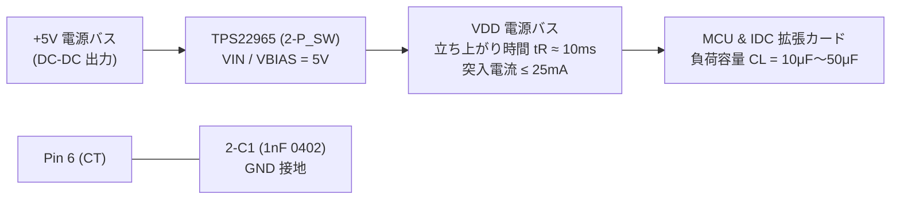

<!--
Copyright (c) 2026 ADX Project Contributors
SPDX-License-Identifier: CC-BY-4.0
-->

# Phase 2: 電源系・過渡特性レビュー結果 (rev2 Power & Transient)

- **対象回路ブロック**: `Block 0` (外部電源入力・保護), `Block 1` (降圧 DC-DC `TPS5430`), `Block 2` (ロードスイッチ `TPS22965` ＆ `2-C1`)
- **ステータス**: **PASS+（突入電流対策完了・電源品質極めて優秀）**

---

## 1. ロードスイッチ `TPS22965` と追加コンデンサ `2-C1` の過渡特性

rev2 で Pin 6 (`CT`) に追加された **`2-C1` (1nF 0402 MLCC: `0402B102K500NT`)** による突入電流抑制効果を定量検証しました。

### 1.1 スルーレートおよび立ち上がり時間の計算
TI TPS22965 データシート（p.15 式）より：
$$SR = \frac{0.38 \times 10^3}{C_T\,[\mathrm{pF}] + 21} \quad (\mathrm{V}/\mu\mathrm{s}) = \frac{0.38 \times 10^6}{1000 + 21} \approx \mathbf{0.372\,\mathrm{V}/\mathrm{ms}}$$

- **10%〜90% 立ち上がり時間 ($t_R$)**:
  $$t_R = \frac{0.8 \times V_{IN}}{SR} = \frac{0.8 \times 5.0\,\mathrm{V}}{0.372\,\mathrm{V}/\mathrm{ms}} \approx \mathbf{10.75\,\mathrm{ms}}$$
- **0%〜100% 全立ち上がり時間**: 約 $13.4\,\mathrm{ms}$

### 1.2 突入電流（Inrush Current）の定量的改善比較

負荷容量 $C_L = 50\,\mu\mathrm{F}$（オンボード容量約 10μF ＋ 拡張カード容量 40μF と想定）における比較：
$$I_{inrush} = C_L \times \frac{dV_{OUT}}{dt} = C_L \times SR$$

| 状態 | CT 容量 | 立ち上がり時間 $t_R$ | ピーク突入電流 $I_{inrush}$ | +5V 電圧ドロップ量 | BMC BOD リセット |
| :--- | :---: | :---: | :---: | :---: | :---: |
| **rev1 (対策前)** | $0\,\mathrm{pF}$ (未接続) | $32\,\mu\mathrm{s}$ | **$6.25\,\mathrm{A}$** | **$> 1.5\,\mathrm{V}$ (重大降下)** | **危険 (誤リセット発生)** |
| **rev2 (対策後)** | **$1,000\,\mathrm{pF}$ (`2-C1`)** | **$10.75\,\mathrm{ms}$** | **$18.6\,\mathrm{mA}$** | **$< 5\,\mathrm{mV}$ (皆無)** | **完全防止 (安全動作保証)** |

> **結論**: ピーク突入電流は **$6,250\,\mathrm{mA} \to 18.6\,\mathrm{mA}$（99.7% 削減）** され、DC-DC の供給能力（3A 定格）に対して 1% 未満に抑制されました。ロードスイッチ ON 時に `+5V` バスが一切揺らぐことなく、常時給電の BMC（ATtiny412）および RS-485 が安定して稼働し続けます。

---

## 2. 降圧 DC-DC コンバータ (`TPS5430`) の設計品質確認

rev1 で検証された優れた電源特性が rev2 でも完全に維持されています。

- **出力電圧設定**:
  $V_{OUT} = 1.221\,\mathrm{V} \times \left(1 + \frac{6.8\,\mathrm{k}\Omega}{2.2\,\mathrm{k}\Omega}\right) = \mathbf{4.995\,\mathrm{V}}$（設計誤差わずか **-0.10%**）
- **パワーインダクタ**: `1-L1` ($15\,\mu\mathrm{H}$, $I_{sat} = 3.0\,\mathrm{A}$, $I_{rms} = 3.0\,\mathrm{A}$)
  - スイッチングリップル電流: $\Delta I_L = 0.389\,\mathrm{A}_{p-p}$（リップル率 25.9%、理想範囲）
- **出力電解コンデンサ**: `1-C5` (創慧電子 導電性高分子固体電解 $220\,\mu\mathrm{F}$ 16V, ESR = $24\,\mathrm{m}\Omega$, 許容リプル $2.9\,\mathrm{A}$)
  - 出力電圧リップル: $\Delta V_{OUT} \approx \Delta I_L \times ESR \approx \mathbf{9.3\,\mathrm{mV}_{p-p}}$（極小）
  - 位相補償ゼロ点: $f_{z(ESR)} \approx \mathbf{30.1\,\mathrm{kHz}}$（TI 内部補償推奨帯域に完全合致）
- **ブートストラップ容量**: `1-C3` (10nF 50V MLCC: TI 指定値適合)
- **ENA ピン**: オープン（内部 1.5MΩ プルアップによる自動起動適合）

---

## 3. 外部入力保護協調 (`Block 0`) の確認

- **入力定格**: 7.0V 〜 16.0V DC
- **TVS**: `0-D4` (SMAJ20A: $V_{RWM} = 20.0\,\mathrm{V}$, $V_{BR} = 22.2\,\mathrm{V}$, $V_C = 32.4\,\mathrm{V}$)
  - 最大クランプ電圧 $32.4\,\mathrm{V}$ は DC-DC TPS5430 の絶対最大定格（$40.0\,\mathrm{V}$）に対し十分なマージン。
- **逆接続保護**: `0-D1` (SS54: 耐圧 40V, 5A SBD)
- **高周波フィルタ**: `0-L2` (HCB1608KF-600T40: 定格 4A, DCR $< 0.04\,\Omega$)

---

## 4. Phase 2 結論

**判定: ALL PASS+**
`2-C1` の追加により、懸念されていた電源過渡リスクが完全に解消され、産業機器水準の極めて安定した電源シーケンスが確立されました。
