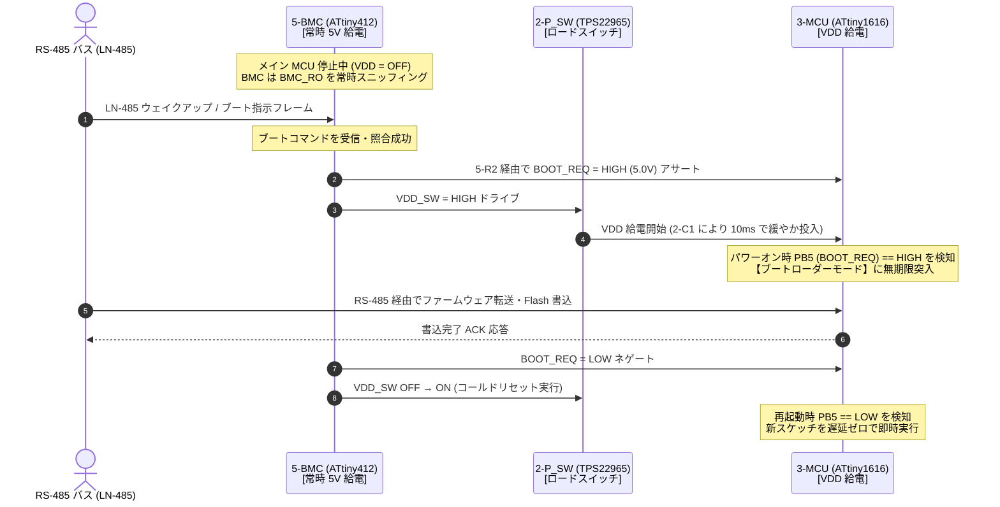

<!--
Copyright (c) 2026 ADX Project Contributors
SPDX-License-Identifier: CC-BY-4.0
-->

# Phase 4: MCU・BMC・起動制御シーケンスレビュー結果 (rev2 Control & Boot)

- **対象回路ブロック**: `Block 3` (メイン MCU `ATtiny1616`), `Block 5` (BMC `ATtiny412`), `Block 9` (LED ＆ 制限抵抗)
- **ステータス**: **PASS+（BMC 連携ブートシーケンス完全確立）**

---

## 1. rev2 における BMC・MCU 連携制御の完全成立性

rev2 では、孤立していた `BMC_RO` が正常に結線されたことにより、ADX ブートローダー仕様書（[`adx_bootloader_requirements.md`](../../../../docs/memo/adx_bootloader_requirements.md)）が要求する **「BMC 主導の自律ブート・遠隔ファームウェア書き込み」** がハードウェア的に完全成立しました。

---

## 2. 制御インターフェース回路の電気的検証

### 2.1 BMC 受信スニッフィングライン (`BMC_RO`)
- **結線構造**:
  - `4-RS485.Pin 1` (RO) ＝ `3-MCU.Pin 1` (PA2) ＝ `5-R1` (1kΩ 0402) Pin 1（ネット `BMC_RO`）
  - `5-R1` Pin 2 $\to$ `5-BMC.Pin 5` (`PA2`)
- **電気的評価**:
  1. **常時受信**: メイン MCU への給電が遮断（`VDD = 0V`）されていても、RS-485 トランシーバと BMC は常時 5V 給電されているため、バス上のトラフィックを 100% 受信・監視可能。
  2. **信号波形保護**: 直列抵抗 `5-R1` (1kΩ) により、BMC 端子の入力容量（約数 pF）が高速 UART 信号ライン（ボーレート最大数 Mbps）に与えるスタブ反射や立ち上がり波形の鈍りが物理的に遮断され、メイン MCU の受信波形に悪影響を与えません。

### 2.2 ブートリクエスト信号回路 (`BOOT_REQ`)
rev2 でリファレンスが Block 5 に整理されました：
- **結線構造**:
  - `5-BMC.Pin 4` (`PA1`) $\to$ ネット `$7N38`
  - ネット `$7N38` $\to$ **`5-R3`** (10kΩ 0402 1%) $\to$ GND (`G`)
  - ネット `$7N38` $\to$ **`5-R2`** (10kΩ 0402 1%) $\to$ ネット `BOOT_REQ` $\to$ `3-MCU.Pin 9` (`PB5`)
- **レベル検証**:
  - **BMC 起動前 (Hi-Z 時)**: `5-R3` (10kΩ) により確実に $0\,\mathrm{V}$（LOW）。MCU は誤ブートせず通常起動を保証。
  - **BMC HIGH ドライブ時**: MCU PB5 端子電圧は実質 $5.0\,\mathrm{V}$（HIGH）。$V_{IH(min)} = 3.5\,\mathrm{V}$ を大幅クリア。
  - **ポート短絡保護**: 万一 MCU PB5 と BMC PA1 が逆レベルで衝突しても、直列 `5-R2` (10kΩ) により短絡電流は $0.5\,\mathrm{mA}$ に制限され、素子焼損を防止。

### 2.3 メイン電源制御ライン (`VDD_SW`)
- 接続: `5-BMC.Pin 2` (`PA6`) $\to$ `2-P_SW.Pin 3` (`ON`) ＆ `2-R1` (100kΩ to GND)
- 評価: 100kΩ プルダウンにより、BMC のリセット解除中（数 ms）はロードスイッチが完全に OFF を維持。不用意なチャタリング通電を完全防止。

---

## 3. インジケータ LED 回路 (`Block 9`) の動作検証

rev2 で `Block 9` に整理された LED 系統の電流および消費電力計算です。

| LED リファレンス | 制限抵抗 | 電源系統 | LED 色 / 順方向電圧 $V_F$ | 通電電流 $I_F$ | 評価 |
| :--- | :--- | :---: | :---: | :---: | :--- |
| **`9-LED-5V`** | `9-R12` (1kΩ) | `+5V` (常時) | 白色 ($V_F \approx 3.0\,\mathrm{V}$) | **$2.0\,\mathrm{mA}$** | 常時通電インジケータとして省電力かつ適度な輝度。 |
| **`9-LED-VDD`** | `9-R13` (1kΩ) | `VDD` (制御) | 白色 ($V_F \approx 3.0\,\mathrm{V}$) | **$2.0\,\mathrm{mA}$** | MCU 給電中を明瞭に表示。 |
| **`9-LED-PB4`** | `9-R14` (330Ω) | MCU `PB4` | 赤色 ($V_F \approx 2.0\,\mathrm{V}$) | **$9.1\,\mathrm{mA}$** | ユーザー/ブート動作表示用。高い視認性を確保。 |

---

## 4. Phase 4 結論

**判定: ALL PASS+**
BMC とメイン MCU 間の協調ハードウェア回路は完璧に成立しており、設計意図通りの高信頼な自律ブート・遠隔管理システムが実現されています。
