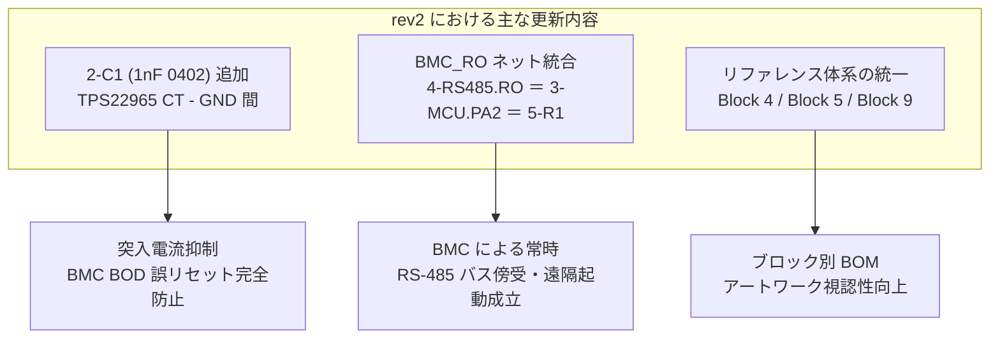

<!--
Copyright (c) 2026 ADX Project Contributors
SPDX-License-Identifier: CC-BY-4.0
-->

# ADX CORE-S rev2 ネットリスト レビュー計画書 (Review Plan for rev2)

- **レビュー対象**: ADX CORE-S rev2 ネットリスト（[`Netlist_Schematic1_2026-09-16_rev2.enet`](Netlist_Schematic1_2026-09-16_rev2.enet)）
- **比較対象 (rev1)**: [`../rev1/Netlist_Schematic1_2026-09-16.enet`](../rev1/Netlist_Schematic1_2026-09-16.enet)
- **策定日**: 2026-09-16
- **ステータス**: レビュー計画立案（Ready for Review Execution）

---

## 1. レビュー目的と背景

初版（rev1）ネットリストのレビューおよび設計ディスカッションを経て、設計者により回路図の改修が実施され、改訂版ネットリスト **`rev2`** が共有されました。

本レビューの主目的は以下の 3 点です：
1. **合意済み改修事項の反映確認**:
   - `BMC_RO` 孤立ネットの解消と RS-485 受信線への接続
   - ロードスイッチ `TPS22965` の CT 端子への突入電流防止コンデンサ追加
   - リファレンス番号体系の論理的ブロック再編（Block 4, Block 5, Block 9）
2. **副次的影響（Regressions）のゼロ確認**:
   - 回路修正に伴う新たな孤立ネット、意図しない未接続ピン、誤配線、電源短絡が発生していないかの全数検証
3. **PCB アートワーク設計（PCB Layout）への移行承認（Final Sign-off）**:
   - 回路図・ネットリストを「凍結（Freeze）」し、次工程である基板パターン設計へ進める品質水準に達しているかを最終判定する。

---

## 2. rev1 $\to$ rev2 差分解析サマリー (Diff Overview)

スクリプトによる構文比較および差分解析の初期結果です。



### 諸元の比較
| 項目 | rev1 (初版) | rev2 (改訂版) | 差分・評価 |
| :--- | :---: | :---: | :--- |
| **総コンポーネント数** | 46 点 | **47 点** | **+1 点** (`2-C1` 1nF コンデンサ追加) |
| **総ネット数** | 42 ネット | **42 ネット** | 増減なし（孤立 `BMC_RO` が `PA2/R` とマージ、CT 端子ネット新設） |
| **孤立ネット数 (Single-node)** | 1 件 (`BMC_RO`) | **0 件 (ゼロ)** | **完全解消** |
| **未接続ピン数 (NC pins)** | 7 ピン | **6 ピン** | `2-P_SW.CT` が接続され 1 ピン減少（残りは全て仕様通り正常な NC） |

---

## 3. レビュー実施フェーズ（段階的検証計画）

本 rev2 レビューは、以下の 5 フェーズで迅速かつ確実に実施します。


### 【Phase 1】改修反映・ネット完全性検証 (Integrity & Regression Check)
- **検証項目**:
  - `5-R1` (1kΩ) が RS-485 の RO 出力および MCU の PA2 端子と確実に同電位ネット（`BMC_RO`）で結線されているか。
  - `2-P_SW` の Pin 6 (CT) が新規追加コンデンサ `2-C1`（1nF）を介して GND に接続されているか。
  - 孤立ネット（Single-node net）が全ネット中ゼロであることの確認。
  - リファレンス番号（`4-JP1`, `4-JP3`, `5-R2`, `5-R3`, `9-LED-*`, `9-R*`）の変更に伴うピン結線の狂いがないこと。

### 【Phase 2】電源系・過渡特性の最終確認 (Power Transient Verification)
- **検証項目**:
  - `2-C1`（1nF 0402 MLCC: `0402B102K500NT`）追加によるスルーレート（$SR \approx 0.37\,\mathrm{V}/\mathrm{ms}$）および立ち上がり時間（$t_R \approx 10\,\mathrm{ms}$）の再照合。
  - 突入電流が最大 $25\,\mathrm{mA}$ 以下に制限され、降圧 DC-DC `TPS5430` の出力 +5V バスが一切ディップしないことの確認。
  - 降圧 DC-DC 定数（$4.995\,\mathrm{V}$、固体電解 ESR $24\,\mathrm{m}\Omega$、インダクタ $15\,\mu\mathrm{H}$）の維持確認。

### 【Phase 3】通信・インターフェース規格整合性確認 (Communication & Connector)
- **検証項目**:
  - RS-485 のフェイルセーフバイアス差動電位（$+283\,\mathrm{mV}$）および終端抵抗切り替え構造の維持確認。
  - 決定事項（DEC-01: 外付け TVS オミット）の整合性確認。
  - `GPIO-IDC`（2×10P コネクタ）の全 20 ピンが ADX Pinout 仕様書 (v2) と完全に合致していることの再確認。

### 【Phase 4】MCU・BMC 制御ロジック・起動シーケンス確認 (Control & Boot Sequence)
- **検証項目**:
  - BMC（ATtiny412）による RS-485 バス常時スニッフィング（`PA2` 受信）の回路成立性。
  - `BOOT_REQ` 信号系（`5-R3`: 10kΩ プルダウン ＆ `5-R2`: 10kΩ 直列保護）の結線・電気的レベルの正常性。
  - `VDD_SW` 信号系（`2-R1`: 100kΩ プルダウン）によるパワーオンリセット時の誤給電防止の確認。

### 【Phase 5】総合判定と PCB アートワーク移行判定 (Final Report & Sign-off)
- **成果物**: `hardware/CORE-S/review/rev2/result/README.md`
- **判定基準**:
  - CRITICAL / HIGH レベルの未解決課題がゼロであること。
  - 回路図・ネットリストを「PCB 設計着手可能（PASS / Ready for PCB Layout）」として承認。

---

## 4. レビュー成果物の構成

成果物は以下のディレクトリ構成で管理します。

```text
hardware/CORE-S/review/
├── rev1/                               # 初版レビューアーカイブ（保存・参照用）
│   ├── Netlist_Schematic1_2026-09-16.enet
│   ├── checklists/
│   ├── result/
│   └── review_plan.md
├── datasheets/                         # 収集済みデータシートアーカイブ（全30点）
│   └── README.md
└── rev2/                               # 今回の改訂版レビュー作業領域
    ├── Netlist_Schematic1_2026-09-16_rev2.enet
    ├── review_plan.md                  # 本計画書
    └── result/                         # rev2 レビュー結果・最終承認書
        ├── phase1_integrity_check.md   # 差分・接続性チェックシート
        └── README.md                   # rev2 総合判定・PCB 移行承認書
```

---

## 5. 次のアクション

本計画書に基づき、直ちに **Phase 1〜4 の実検証** および **rev2 総合判定レポート（`rev2/result/README.md`）の作成** へ進めてよろしいでしょうか？
ご指示をいただき次第、詳細結果を取りまとめます。
