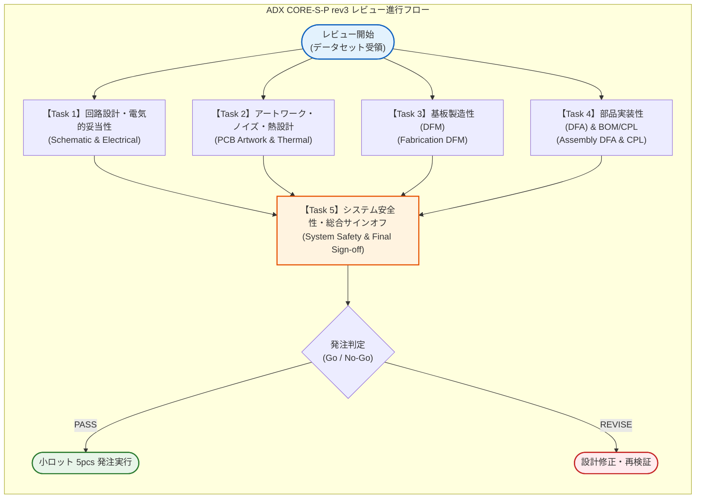

<!--
Copyright (c) 2026 ADX Project Contributors
SPDX-License-Identifier: CC-BY-4.0
-->

# ADX CORE-S-P rev3 ハードウェア詳細レビュー計画書 (Comprehensive Review Master Plan)

- **対象バージョン**: ADX CORE-S-P rev3
- **対象データ格納先**: [`hardware/CORE-S-P/review/rev3/data/`](../data/)
- **策定日**: 2026-09-19
- **ステータス**: 計画承認済み・タスク分解完了 (Ready for Execution)

---

## 1. レビューの背景と全体目的

### 1.1 背景
ADX CORE-S-P は、rev1・rev2 におけるネットリストレビューを経て回路設計がFIXされ、今回 **PCB アートワーク設計（レイアウト設計）および製造用データ（Gerber, BOM, CPL）の出力** が完了しました。

[`../memo/concept.md`](../memo/concept.md) に示されている通り、本 rev3 は両絶縁の製品版（CORE-I）へ進む前段として、またプロ専用の超低コストDIYモデルとして、**「MCU（ATtiny1616）＆ BMC（ATtiny412）による RS-485 OTW（On-The-Wire）ブートローダー／ソフトウェア開発を前進させるための自己責任小ロット試作基板（5台程度）」** の製造を目的としています。

### 1.2 本レビューの目的
基板製造工場（JLCPCB等）への発注および部品実装（PCBA）をトラブルなく成功させ、納品された試作基板が意図通り安全かつ確実に動作することを保証するため、**「回路・電気」「アートワーク・ノイズ」「基板製造性（DFM）」「部品実装性（DFA）」「システム安全性」の全領域にわたって抜け漏れのない徹底的な検証** を行います。

---

## 2. サブタスク分解とレビューフロー (Subtasks Architecture)

本レビューは大規模かつ多角的な検証を伴うため、以下の **5 つの独立したサブタスク** に分解し、段階的かつ並行して検証を実施します。



---

## 3. サブタスク一覧とスコープ概要

各サブタスクの詳細仕様およびチェックリストは、個別ドキュメントに定義されています。

| タスクID | サブタスク名称 | 仕様定義ドキュメント | 主な検証対象・スコープ |
| :---: | :--- | :--- | :--- |
| **Task 1** | **回路設計・電気的妥当性レビュー** | [`task1_schematic_and_electrical.md`](task1_schematic_and_electrical.md) | - rev2改修事項の反映確認（`BMC_RO`、CT端子コンデンサ等）<br>- ネット接続完全性（孤立ネット、未接続ピンNC）<br>- 定格マージン・ディレーティング・過渡特性<br>- RS-485フェイルセーフバイアス・終端抵抗<br>- MCU/BMCリセット・GPIO初期ロジック |
| **Task 2** | **PCBアートワーク・ノイズ・熱設計レビュー** | [`task2_pcb_artwork_and_si.md`](task2_pcb_artwork_and_si.md) | - 電源・GNDパターンの配線幅・許容電流容量<br>- 2層基板におけるBottomベタGNDプレーン連続性<br>- DC-DC（TPS5430）スイッチングループ面積<br>- RS-485差動ペア配線（等長・平行・離隔）<br>- サーマルパッド・放熱ビア配置 |
| **Task 3** | **基板製造性（DFM）レビュー** | [`task3_dfm_fabrication.md`](task3_dfm_fabrication.md) | - 最小パターン幅・最小クリアランス（JLCPCB基準）<br>- ドリル径・アニュラリング・PTH/NPTH区分<br>- 基板外形線（GKO）閉曲線・エッジクリアランス<br>- ソルダーレジストダム・開口ズレ裕度<br>- シルク印刷視認性・パッド被りチェック |
| **Task 4** | **部品実装性（DFA）およびBOM/CPLレビュー** | [`task4_dfa_and_assembly.md`](task4_dfa_and_assembly.md) | - BOM・CPL・回路図のリファレンス完全一致検証<br>- CPL（Pick & Place）回転角・ピン1位置照合<br>- LCSC部品番号（Cxxxx）の型番整合性<br>- フットプリントと実部品寸法の適合性<br>- コネクタ・端子台の手はんだ・リワーク性 |
| **Task 5** | **システム安全性・総合サインオフ** | [`task5_system_safety_and_signoff.md`](task5_system_safety_and_signoff.md) | - 単一GND（非絶縁）運用手順との整合性評価<br>- 逆接続・コモンモード電位差発生時のリスク評価<br>- 指摘事項の重要度格付け（CRITICAL/HIGH/MED/LOW）<br>- 試作発注可否判定（Go / No-Go / Conditional Go）<br>- 修正推奨・発注注意事項の取りまとめ |

---

## 4. 指摘事項の重要度区分と判定基準 (Severity Criteria)

全サブタスクにおいて、検出された課題・懸念点は以下の 4 段階で格付けします。

| 重要度 | 定義 | 発注への影響 |
| :---: | :--- | :--- |
| **CRITICAL** | **致命的欠陥**<br>電源短絡、逆接破壊、IC焼損、回路不動作、製造不能など、基板が機能しない直接的要因。 | **即時発注停止（No-Go）**。<br>設計データの修正が必須。 |
| **HIGH** | **重大リスク**<br>ノイズによる誤動作、特定条件下での通信途絶、実装時の位置ズレ・逆実装リスク、発熱過多など。 | **原則修正を強く推奨**。<br>回避策（運用手順や手修正）が確立できる場合のみ条件付き承認。 |
| **MEDIUM** | **推奨改善事項**<br>定格マージン不足、シルクの軽微な被り、手はんだ作業性の悪さなど。 | **試作段階では許容可能**。<br>次回改訂（製品版）での修正を推奨。 |
| **LOW** | **軽微な指摘 / メモ**<br>ドキュメント表記の揺れ、推奨定数への最適化余地など。 | **発注判定に影響なし**。 |

---

## 5. 検証手法とツール

本レビューでは、目視確認にとどまらず、**プログラム（Pythonスクリプト）を用いた定量的・網羅的な自動解析** を積極的に活用します。

1. **ネットリスト解析**:
   - `Netlist_PCB1_2026-09-19.enet` をパースし、ネット別接続数、未接続ピン、短絡、rev2差分を抽出。
2. **BOM & CPL クロスチェック**:
   - `BOM` と `CPL` の全行を突き合わせ、リファレンスの過不足、レイヤー不一致、回転角の異常値を検出。
3. **ガーバー幾何解析**:
   - ガーバーファイル（RS-274X）およびドリルデータ（Excellon）を解析し、最小配線幅、最小クリアランス、外形寸法、穴あけ座標を検証。
4. **データシート規格照合**:
   - 格納済みデータシート（30点）の絶対最大定格・推奨動作条件と回路定数を比較。

---

## 6. 成果物の構成と保管場所

レビュー成果物は以下のディレクトリ構成で記録・保管します。

```text
hardware/CORE-S/review/rev3/
├── data/                               # 提供された設計データ（Gerber, BOM, CPL, Netlist, epro2）
├── memo/                               # 開発コンセプト・設計メモ
│   └── concept.md
├── review_scope.md                     # レビュー適用範囲・実現可能性評価書
├── PLAN/                               # レビュー計画・サブタスク仕様（本ディレクトリ）
│   ├── README.md                       # レビュー全体計画書（マスター）
│   ├── task1_schematic_and_electrical.md
│   ├── task2_pcb_artwork_and_si.md
│   ├── task3_dfm_fabrication.md
│   ├── task4_dfa_and_assembly.md
│   └── task5_system_safety_and_signoff.md
└── result/                             # レビュー実行結果（サブタスク完了時に順次格納）
    ├── task1_result.md
    ├── task2_result.md
    ├── task3_result.md
    ├── task4_result.md
    └── final_signoff_report.md         # 最終発注可否判定書
```
