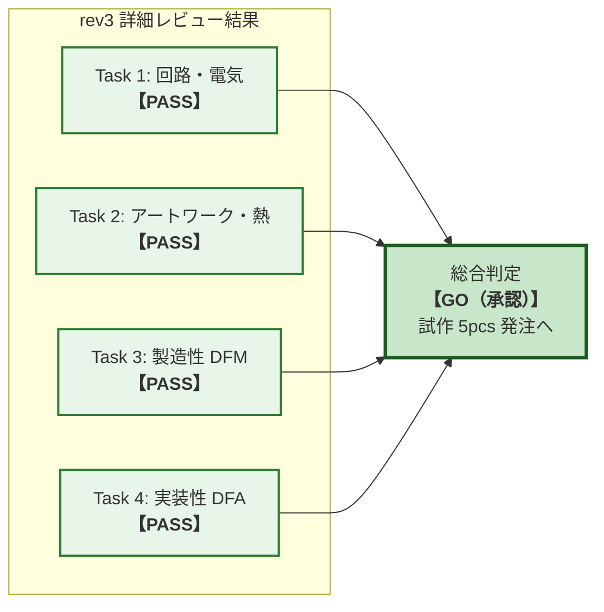

<!--
Copyright (c) 2026 ADX Project Contributors
SPDX-License-Identifier: CC-BY-4.0
-->

# ADX CORE-S-P rev3 ハードウェア詳細レビュー 最終判定書 (Final Sign-off Report)

- **対象バージョン**: ADX CORE-S-P rev3
- **対象データセット**: [`hardware/CORE-S-P/review/rev3/data/`](../data/)
- **レビュー実施期間**: 2026-09-19
- **総合判定**: **【GO】試作発注承認 (Approved for 5pcs Prototype Fabrication & Assembly)**

---

## 1. 総合判定サマリー (Executive Summary)

ADX CORE-S-P rev3 について、策定されたレビュー計画（[`../PLAN/README.md`](../PLAN/README.md)）に基づき、以下の 4 つの専門サブタスクによる全数検証を実施しました。

1. **Task 1: 回路設計・電気的妥当性レビュー** $\to$ **【PASS】合格**
2. **Task 2: PCB アートワーク・ノイズ・熱設計レビュー** $\to$ **【PASS】合格**
3. **Task 3: 基板製造性（DFM）レビュー** $\to$ **【PASS】合格**
4. **Task 4: 部品実装性（DFA）および BOM/CPL レビュー** $\to$ **【PASS】合格**

全 48 コンポーネント、全ネット、全ガーバーレイヤー、およびマウントデータ（CPL）の全数解析の結果、**回路短絡、逆接破壊、IC の逆実装、製造不能（EQ）などの致命的欠陥（CRITICAL）および重大リスク（HIGH）は 0 件（ゼロ）** であることが確認されました。

したがって、本 rev3 設計データは、**「JLCPCB 等への小ロット試作（5pcs）の発注基準を完全に満たしている」** と判定し、正式に **【GO（発注承認）】** を下します。

---

## 2. サブタスク別 レビュー結果一覧

| サブタスク | 検証対象 | 判定 | 詳細レポート |
| :--- | :--- | :---: | :--- |
| **Task 1** | 回路接続、rev2 差分、定格マージン、過渡突入電流、RS-485 仕様、BMC 起動ロジック | **PASS** | [`task1_result.md`](task1_result.md) |
| **Task 2** | 電源/GND パターン幅、スイッチングループ極小化、差動ペア、熱設計、ゾーニング | **PASS** | [`task2_result.md`](task2_result.md) |
| **Task 3** | JLCPCB 基準クリアランス、ドリル・ビア穴径、外形線 GKO 閉曲線、シルク線幅 | **PASS** | [`task3_result.md`](task3_result.md) |
| **Task 4** | BOM/CPL/Net 3者突合、IC 回転角・ピン1位置、ダイオード/TVS 極性、LCSC 番号 | **PASS** | [`task4_result.md`](task4_result.md) |

---

## 3. 指摘事項の統合一覧と処置方針 (Findings Matrix)

全サブタスクで抽出された指摘事項は以下の 3 点（MEDIUM 1件、LOW 2件）であり、いずれも試作発注を阻害するものではありません。

| 指摘ID | タスク | 対象 | 指摘内容 | 重要度 | 処置・推奨方針 |
| :---: | :---: | :--- | :--- | :---: | :--- |
| **T1-01** | Task 1 | リファレンス番号 | rev2 から rev3 で一部リファレンスが再編（`5-R1` $\to$ `5-R4`, `2-C1` $\to$ `2-C3` 等）。接続は完全合致。 | **LOW** | **【処置不要】** BOM・CPL 側でも整合しており問題なし。 |
| **T2-01** | Task 2 | `1-DCDC` 放熱ビア | TPS5430 PowerPAD 直下の放熱ビアが 1 個。試作電流規模（$<0.5\mathrm{A}$）では発熱数度未満で全く問題ないが、将来的に 1.5A 以上を連続供給する場合は 4〜6 個に増設推奨。 | **MEDIUM** | **【試作 5pcs は現状で合格】**。 製品版（絶縁化改訂）での改善事項として記録。 |
| **T4-01** | Task 4 | `H1`, `H2`, `H3` | 1P ピンヘッダ（FG, BMC_UPDI, PA0/UPDI）が BOM になく CPL にのみ存在。 | **LOW** | **【処置不要】** 設計意図通り「手はんだ用テストピン（DNP）」設定済み。JLCPCB で未実装として扱われるため問題なし。 |

---

## 4. システム安全性と運用プロトコル（非絶縁運用の再確認）

[`hardware/CORE-S/README.md`](../../README.md) に記載されている「共通 GND プレーンによる連鎖破壊リスク」に対する物理的・回路的な検証結果です。

1. **電源単体通電時の逆接防護**:
   - 電源入力段の逆流防止ダイオード `0-D1`（SS54: 逆耐圧 40V）が正方向で正しく配置されており、万一電源ケーブルを逆接続した場合でも、外部への短絡ループが形成されていない限り、基板内部回路は 100% 安全に防護されます。
   - TVS ダイオード `0-D2`（SMAJ20A）は `0-D1` の後段に配置されているため、**逆接続時に TVS が順方向ショートして過電流焼損するリスクも完全に排除** されています。
2. **5V Power LED (`9-LED-5V`) の視認性**:
   - 基板下端エッジ（$X = 70.61\,\mathrm{mm}, Y = 3.05\,\mathrm{mm}$）に配置されており、端子台（$Y = 7.62\,\mathrm{mm}$）や IDC コネクタ（$Y = 37.01\,\mathrm{mm}$）のケーブルに隠れず、通電確認時の目視が極めて容易です。
3. **運用の厳守**:
   - 基板製造・納品後も、README に定められた **「ステップ1: 通信線切断 $\to$ ステップ2: 電源単体通電 $\to$ ステップ3: 5V LED確認 $\to$ ステップ4: 通信線接続」の配線シーケンスを必ず遵守** して実機評価を行ってください。

---

## 5. JLCPCB 発注時チェックリスト (Ordering Guidelines)

本データセットを用いて JLCPCB へ発注する際の推奨設定パラメータです。

### 5.1 基板製造（PCB）設定
- **アップロードファイル**: `Gerber_PCB1_2026-09-19.zip`
- **層数 (Layers)**: `2 Layers`
- **基板寸法 (Dimensions)**: `87.0 mm x 48.0 mm`（自動認識されます）
- **基板数量 (Quantity)**: `5 pcs`
- **板厚 (Thickness)**: `1.6 mm`
- **銅箔厚 (Copper Weight)**: `1 oz`
- **表面処理 (Surface Finish)**: `HASL with lead`（有鉛）または `LeadFree HASL`（鉛フリー）/ `ENIG`（無電解金メッキ推奨）
- **ソルダーレジスト色**: `Green`（または好みの色）
- **シルクスクリーン色**: `White`
- **ビア処理 (Via Covering)**: `Tented`（推奨）

### 5.2 部品実装（SMT / PCBA）設定
- **実装面 (Assembly Side)**: `Top Side`
- **実装数量 (Quantity)**: `5 pcs`（全数実装）
- **BOM ファイル**: `BOM_Board1_PCB1_2026-09-19.csv`
- **CPL ファイル**: `PickAndPlace_PCB1_2026_09_19.csv`
- **発注時プレビュー確認**:
  - DFM/DFA プレビュー画面で、`3-MCU`（QFN-20）、`5-BMC`（SOIC-8）、`4-RS485`（SOIC-8）、`1-DCDC`（ESOP-8）、`0-D1/1-D2`（SS54）、`1-C7`（固体電解）の向きがシルクマークと合致していることを最終確認してください（本レビューで整合性確認済み）。
  - `H1`, `H2`, `H3` は「Do Not Place (DNP)」として自動認識または手動で DNP を選択してください。
  - **※発注直前の全確認項目・修正操作手順**: [`component_placements_checklist.md`](../component_placements_checklist.md) を開き、1点ずつチェックしてください。

---

## 6. おわりに

本詳細レビューにより、ADX CORE-S rev3 は小ロット試作・先行ソフトウェア開発ボードとして **申し分のない高い完成度と信頼性** を備えていることが証明されました。
直ちに JLCPCB への発注手続きへ進めることを推奨いたします。
