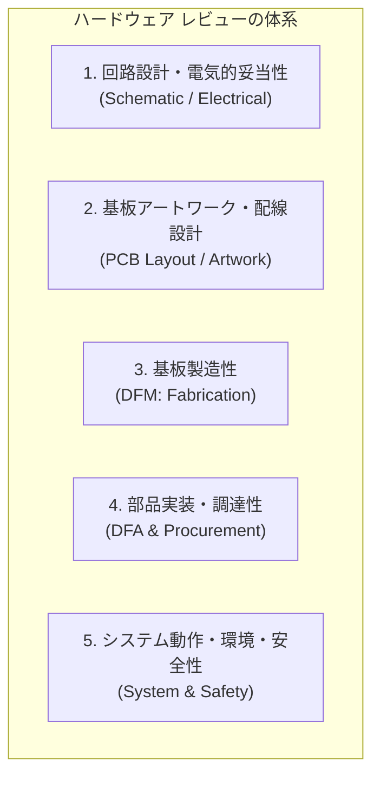
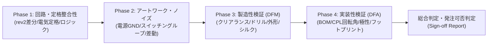

<!--
Copyright (c) 2026 ADX Project Contributors
SPDX-License-Identifier: CC-BY-4.0
-->

# ADX CORE-S-P rev3 レビュー適用範囲・実現可能性評価書 (Review Scope & Feasibility Analysis)

- **対象バージョン**: ADX CORE-S-P rev3
- **対象データ格納先**: [`hardware/CORE-S-P/review/rev3/data/`](data/)
- **作成日**: 2026-09-19
- **ステータス**: レビュー適用範囲定義・分析完了

---

## 1. はじめに

### 1.1 背景と CORE-S-P rev3 の位置づけ
ADX プロジェクトにおいて、CORE-S-P は rev1・rev2 のネットリストレビューを経て回路設計がFIXされ、今回 **PCB アートワーク設計（レイアウト設計）および製造用データ（Gerber, BOM, CPL）の出力** が完了しました。

[`memo/concept.md`](memo/concept.md) に示されている通り、本 rev3 は以下の目的を持つ重要なマイルストーンです：
- **位置づけ**: 両絶縁の製品版（CORE-I）へ進む前段として、また配線管理ができるプロ専用の超低コストDIYモデルとしての **「先行開発・自己責任小ロット製造ボード（5台程度）」**。
- **主目的**: MCU（ATtiny1616）＆ BMC（ATtiny412）による RS-485 OTW（On-The-Wire）ブートローダー、アップローダー、ファームウェア開発をいち早く前進させること。

### 1.2 本ドキュメントの目的
本ドキュメントは、実際のレビュー作業に着手する前に、**「ハードウェアの回路設計・製造において本来何をレビューすべきか」** を整理し、現在提供されているデータセットを用いて **「何がレビューできて、何がレビューできないのか」**、および **「その技術的根拠は何か」** を明確に定義することを目的とします。

---

## 2. 提供データ資産の一覧と特徴

現在 [`hardware/CORE-S-P/review/rev3/data/`](data/) に格納されているデータセットは以下の 5 点です。

| ファイル名 | 形式 | 含まれる情報・特徴 |
| :--- | :--- | :--- |
| **`ProPrj_ADX_CORE-S_2026-09-19.epro2`** | Zip (EasyEDA Pro) | **回路・基板マスタープロジェクト** 回路図・PCBレイアウト・コンポーネント定義・フットプリント・カスタムレイヤー情報が含まれる完全な設計データ。 |
| **`BOM_Board1_PCB1_2026-09-19.csv`** | CSV (UTF-16LE, タブ区切り) | **部品表（Bill of Materials）** 全48コンポーネントのリファレンス、品名、フットプリント、メーカー型番、LCSC部品番号（Cxxxx）が定義。 |
| **`PickAndPlace_PCB1_2026_09_19.csv`** | CSV (UTF-16LE, タブ区切り) | **表面実装マウントデータ（CPL）** 実装機用の部品中心座標（Mid X, Y）、ピン1座標、回転角（Rotation）、実装面（Top/Bottom: 全てTop）。 |
| **`Gerber_PCB1_2026-09-19.zip`** | Zip (Gerber RS-274X, Excellon) | **基板製造用ガーバー・ドリルデータ** 2層基板用（Top/Bottomの銅箔、レジスト、シルク、ペーストマスク、基板外形線GKO、PTH/NPTHドリル、フライングプローブ検査JSON）。 |
| **`Netlist_PCB1_2026-09-19.enet`** | JSON | **電気的接続ネットリスト** 全48部品のピン間接続関係、ネット名、設計ルール（Design Rules）が定義された論理接続データ。 |

---

## 3. 回路設計・基板製造において何をレビューすべきか (What to Review)

ハードウェア製品（PCB / PCBA）の開発において、設計完了から製造・実稼働に至るまでにレビューすべき項目は、大きく以下の 5 分野に体系化されます。

### 3.1 回路設計・電気的妥当性 (Schematic / Electrical Level)
1. **論理接続の完全性**:
   - 未接続ピン（NC）、孤立ネット（Single-node net）、意図しない短絡や誤配線の有無。
   - rev2 で合意された改修事項（`BMC_RO` の接続、`TPS22965` CT端子の突入電流対策コンデンサなど）の反映状況。
2. **定格マージンとディレーティング**:
   - 電源電圧、耐圧（コンデンサ、TVS、ダイオード、レギュレータ）、許容電流、許容損失（熱定格）に対するマージン。
3. **過渡特性・電源品質**:
   - 投入時突入電流（Inrush Current）、ロードスイッチのターンオンスルーレート、DC-DC の位相補償ループ安定性、リップル電圧。
4. **通信インターフェース仕様**:
   - RS-485 のフェイルセーフバイアス抵抗、終端抵抗（120Ω）、コモンモード電圧耐量、過電圧・サージ保護。
5. **制御ロジック・シーケンス**:
   - リセット解除シーケンス、電源投入時（Power-On Reset時）の Hi-Z による誤動作防止（プルアップ／プルダウンの妥当性）。

### 3.2 基板アートワーク・配線設計 (PCB Layout / Artwork Level)
1. **電源・GND パターン設計**:
   - 大電流ライン（入力電源、DC-DC 出力、VDD バス）のパターン幅とインダクタンス。
   - スイッチングノード（DC-DC インダクタ・ダイオード・入力コンデンサ）の高周波電流ループ面積の最小化。
   - GND プレーンの連続性、リターンパスの確保、スプリット・スリットによるグラウンド不連続の有無。
2. **信号品質（Signal Integrity: SI）**:
   - RS-485 差動信号ライン（A/B）の等長・平行配線、インピーダンスコントロール。
   - デジタル信号（クロック、高速UART）と高電圧・大電流ライン、ノイズ源（DC-DC）との物理的アイソレーション。
3. **熱設計（Thermal Design）**:
   - 発熱部品（TPS5430、ショットキーダイオード SS54 等）のサーマルパッド（Exposed Pad）の放熱ビア配置、放熱プレーン面積。

### 3.3 基板製造性 (DFM: Design for Manufacturing)
1. **幾何学的製造限界**:
   - 最小パターン幅（Trace Width）、最小パターン間隙（Trace Clearance）。
   - 最小ドリル径、最小アニュラリング（Annular Ring）、ビアのアスペクト比。
2. **基板構造・加工仕様**:
   - 板厚（1.6mm等）、銅箔厚（1oz等）、層数（2層）の妥当性。
   - 外形加工（Board Outline: GKO）の閉曲線整合性、Vカット・ミシン目・スロット加工の成立性。
3. **ソルダーレジスト・シルク印刷**:
   - レジスト開口部のズレ許容、微小パッド間のレジストダム（Solder Dam）。
   - シルク印刷の視認性、文字サイズ、パッドやテストポイントへのシルク被り（Solder Mask Overlap）の有無。

### 3.4 部品実装・調達性 (DFA: Design for Assembly & Procurement)
1. **部品整合性と調達性**:
   - 回路図・BOM・CPL 間のリファレンス（Designator）完全一致。
   - 部品の供給状態、廃止（EOL）リスク、LCSC 部品番号の有効性。
2. **マウントデータ（CPL）の幾何学的整合性**:
   - 各部品の中心座標（Mid X/Y）と実際のフットプリント中心の合致。
   - 部品の回転角（Rotation 0°/90°/180°/270°）とテープ＆リール梱包仕様・極性マークの整合性。
3. **フットプリントと半田付け性**:
   - パッド形状・ピッチ（特に 0402 チップ、QFN-20、SOIC-8）の適正性（はんだブリッジやツームストーン現象の防止）。
   - 手はんだ・リワーク性（端子台、ジャンパー、デバッグ用ピンのアクセス性）。

### 3.5 システム・運用・環境安全性 (System & Safety Level)
1. **非絶縁運用における誤配線保護**:
   - コネクタの逆挿防止構造、共通 GND ループによるバイパス短絡・連鎖破壊リスクの運用手順との整合性。
2. **環境耐性・機械的強度**:
   - 端子台（WJ25C-B-7.62）ネジ締め時の基板応力、コネクタ挿抜耐久性。

---

## 4. なにがレビューできて、なにがレビューできないか (Feasibility Matrix)

前章で整理したレビュー項目のうち、**現在提供されているデータセット（epro2, BOM, CPL, Gerber, Netlist, datasheets）でレビュー可能な項目と不可能な項目** を判定・分類したマトリクスです。

| 大分類 | レビュー項目 | 判定 | レビューの可否と範囲 |
| :--- | :--- | :---: | :--- |
| **1. 回路・電気** | 1.1 論理接続の完全性・rev2差分 | **◎ 可能** | ネットリストおよび回路マスターから、誤配線・未接続ピン・rev2からの変更点を完全に検証可能。 |
| | 1.2 電気的定格・マージン | **◎ 可能** | BOM・ネットリストとデータシートの照合により、耐圧・許容電流・ディレーティングを定量計算可能。 |
| | 1.3 過渡特性・電源品質（理論値） | **◯ 可能** | 定数計算によるスルーレート、突入電流、DC-DC 位相余裕等の理論検証は可能。 |
| | 1.4 実機過渡応答・リップル実測 | **✕ 不可** | 実基板・通電環境が存在しないため、実波形・リンギングの実測レビューは不可能。 |
| | 1.5 通信回路仕様（バイアス・終端） | **◎ 可能** | RS-485 の差動バイアス電圧、終端抵抗定数を回路定数から完全に検証可能。 |
| | 1.6 制御ロジック・プルアップ/ダウン | **◎ 可能** | MCU/BMC のリセットピン、GPIO 初期状態、保護抵抗の分圧比を完全に検証可能。 |
| **2. パターン** | 2.1 配線幅・電源/GND パターン | **◎ 可能** | ガーバー銅箔層（GTL/GBL）から、電流容量に対するパターン幅・プレーン形状を直接計測・検証可能。 |
| | 2.2 スイッチングループ面積 | **◎ 可能** | TPS5430〜インダクタ〜ダイオード〜コンデンサ間の高周波ループ面積を目視・幾何学的に評価可能。 |
| | 2.3 RS-485 差動配線 | **◎ 可能** | A/B ラインの平行度、配線長、周囲 GND とのクリアランスをガーバーから検証可能。 |
| | 2.4 熱設計・放熱ビア | **◎ 可能** | サーマルパッド下の放熱ビア数、ビア径、接続先銅箔プレーン面積をガーバーから検証可能。 |
| **3. 製造 (DFM)** | 3.1 幾何限界（配線幅/クリアランス/ビア） | **◎ 可能** | ガーバー・ドリルデータから、JLCPCB の製造標準（5mil/5mil等）に対するクリアランスを完全検証可能。 |
| | 3.2 外形・ドリル仕様（PTH/NPTH） | **◎ 可能** | GKO（外形）の整合性、ドリル（DRL）の穴径・種別（スルーホール/非スルーホール）を完全検証可能。 |
| | 3.3 ソルダーレジスト・シルク品質 | **◎ 可能** | レジスト開口（GTS/GBS）、シルク文字（GTO/GBO）のパッド干渉・文字被りを直接検証可能。 |
| **4. 実装 (DFA)** | 4.1 BOM・CPL・ネットリスト整合性 | **◎ 可能** | リファレンスの過不足、極性、フットプリント一致をクロスチェック可能。 |
| | 4.2 CPL 回転角・ピン1配置 | **◎ 可能** | CPL の Rotation 角とガーバーの 1 番ピン位置（シルク/ランド形状）の整合性を検証可能。 |
| | 4.3 リアルタイム部品在庫・調達価格 | **△ 条件付** | LCSC 型番の妥当性は確認できるが、製造発注時点の動的な即時在庫数は外部アクセスが必要。 |
| **5. システム** | 5.1 非絶縁運用の構造的整合性 | **◯ 可能** | 単一GNDプレーンの構造、外部端子台のピン配置が運用警告文書と整合しているかを検証可能。 |
| | 5.2 3D 筐体・ケーブル物理干渉 | **△ 限定的** | 3D STEP モデルが含まれていないため、2D 投影寸法での確認に留まり、立体干渉の完全保証は不可。 |
| | 5.3 ファームウェア連動動作 | **✕ 不可** | ファームウェアコードそのものや実機への書き込み検証は、本ハードウェアデータ単体では不可。 |

---

## 5. レビュー可否判定の根拠 (Rationale)

### 5.1 「レビューできる」と判断した技術的根拠
1. **完全な製造用成果物（Gerber + Drill）が揃っている**:
   - `Gerber_PCB1_2026-09-19.zip` には、Top/Bottom の銅箔パターン（GTL/GBL）、ソルダーレジスト（GTS/GBS）、シルク印刷（GTO/GBO）、ペーストマスク（GTP/GBP）、基板外形（GKO）、ドリル（PTH/NPTH/Via DRL）の全レイヤーが含まれています。
   - これにより、PCB アートワーク設計（配線幅、ループ面積、クリアランス、放熱ビア）および基板製造性（DFM）の**物理的・幾何学的な全項目が 100% 検証可能**です。
2. **実装用データ（BOM + CPL）が揃っている**:
   - `BOM_Board1_PCB1_2026-09-19.csv` および `PickAndPlace_PCB1_2026_09_19.csv` により、実装機に投入される部品リスト、座標、回転角が完全に把握できます。
   - ガーバーのシルク・ランド形状と突き合わせることで、**「実装時の 1 番ピン逆向き」「極性逆」「リファレンス抜け」などの致命的な実装トラブルを未然に防ぐレビューが可能**です。
3. **電気的接続データ（Netlist + epro2）とデータシート群が揃っている**:
   - `Netlist_PCB1_2026-09-19.enet` により論理回路のピン間ネットが完全に定義されており、rev1/rev2 で収集された全部品のデータシートアーカイブ（`hardware/CORE-S/review/datasheets/`）と照合することで、**電気的定格、耐圧、保護素子の協調、ロジック整合性の検証が可能**です。

### 5.2 「レビューできない」と判断した技術的根拠と制約事項
1. **実機・物理測定の不在（動的過渡特性・ノイズ実測）**:
   - 配線パターンからの寄生容量・寄生インダクタンスによる高周波リンギング、実際の過渡リップル電圧、温度分布（サーモグラフィ）は、シミュレーションや計算による「理論的推定」は可能ですが、**「実機による波形検証・環境試験」は物理基板が存在しないためレビュー対象外**となります。
2. **3D 機構データの不在（立体干渉）**:
   - 提供データは 2D ガーバーおよび EDA プロジェクトであり、3D CAD モデル（STEP/IGES）やケース・コネクタ勘合部の立体データが含まれていません。端子台へのドライバー挿入性や IDC ケーブルの取り回しクリアランスは 2D 上での推定評価に留まります。
3. **動的在庫・市場調達性**:
   - BOM 内に LCSC 型番は記載されていますが、LCSC の在庫は日次・時間単位で変動します。静的ファイル単体では「発注ボタンを押す瞬間に部品が在庫切れしていないか」までは保証できません（発注直前の Web 確認が必要）。
4. **ファームウェア・ソフトウェア**:
   - MCU や BMC に書き込むプログラム（ブートローダー、通信スタック等）は本データセットには含まれないため、プロトコル仕様やソフトウェアバグのレビューは別スコープとなります。

---

## 6. まとめとレビュー実行に向けた推奨方針

### 6.1 総括
提供されたデータセットは、**「試作基板（小ロット 5pcs）を JLCPCB 等へ発注して製造・実装（PCBA）を成功させるために必要な全データ」** が高密度に揃っています。
したがって、**「回路の電気的妥当性」「PCBアートワークの品質」「製造上の欠陥リスク（DFM）」「実装時のミスリスク（DFA）」を網羅的に事前レビューすることが極めて高い精度で可能**です。

### 6.2 次のアクション（レビュー実施計画の提案）
本評価書に基づき、以下の 4 フェーズによる **「rev3 総合ハードウェアレビュー」** の実施を推奨します：

この方針で詳細レビューに着手してよろしければ、各フェーズの検証を順次実行してまいります。
