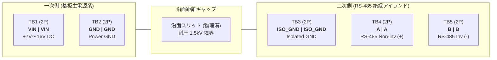

# ADX CORE-S Rev4 外部端子台仕様変更提案書 (Terminal Specification Proposal)

## 1. 背景と目的 (Background & Objective)

ADX CORE-S Rev3 では、外部電源入力および RS-485 通信用インターフェースとして、7.62mm ピッチの 6P ネジ式端子台（`WJ25C-B-7.62-6P`）を採用していました。

しかし、製品版（Rev4）への移行および現場運用実績のフィードバックから、以下の課題が明確になりました：

1. **基板専有面積（フットプリント）の肥大化**:
   - 7.62mm ピッチ 6P は端子台単体で約 46mm〜50mm に達し、基板 I/F 面の大半を占有していました。
2. **FG（フレームグランド）ピンの未活用**:
   - Rev3 の回路図・ネットリスト（`Netlist_PCB1_2026-09-19.enet`）を精査した結果、端子台 Pin 3（`FG`）は手はんだ用テストピン `H1`（DNP: 未実装）にのみ接続されており、基板上の回路プレーンや保護素子には一切接続されていない完全な「浮き端子（フローティング）」でした。
3. **デイジーチェーン渡り配線時の共締めリスク**:
   - 1 信号あたり 1 穴しかない端子台では、次ノードへ数珠つなぎ配線する際に「1 つの端子に 2 本の電線をねじ込んで共締め」する必要があり、接触不良、芯線の噛み込み不良、振動による脱落の主要因となっていました。
4. **ネジの緩みと保守工数**:
   - 装置稼働時の振動によるネジ緩みリスクや、トルク管理の負担が存在していました。

本提案書では、**「FG ピンの正式廃止（5 信号化）」** および **「2P スプリングクランプ端子台 × 5 個（各信号 IN/OUT ペア ＝ 計 10 極）の採用」** による、抜本的な仕様改定案を定義します。

---

## 2. ターミナル変更内容の概要 (Change Summary)

| 項目 | 従来仕様 (Rev3) | 新仕様案 (Rev4) | 変更によるメリット |
| :--- | :--- | :--- | :--- |
| **端子台形式** | ネジ式端子台 (7.62mm ピッチ) | **スプリングクランプ端子台 (2P × 5個)** | 振動耐性向上、ドライバーレス結線 |
| **実装極数** | 6 極 (1 ピース) | **10 極 (2P × 5 ピース)** | デイジーチェーン専用 IN/OUT 構造 |
| **対象信号** | `VIN`, `GND`, `FG`, `A`, `B`, `G` (6種) | **`VIN`, `GND`, `ISO_GND`, `A`, `B` (5種)** | 浮きピン FG 廃止、絶縁 GND 明確化 |
| **渡り配線方式** | 端子穴への 2 本共締め (作業性低) | **各信号独立スルーパス (IN / OUT)** | 接触不良ゼロ、スタブ（分岐）ゼロ |
| **絶縁境界** | 単一コネクタ内で同居 | **物理ギャップ / スリット配置可能** | 1.5kV ガルバニック絶縁の確実な確保 |
| **部品調達性** | 6P 一体型（調達先限定） | **汎用 2P スプリング端子台** | 超安価、世界共通で在庫豊富 |

---

## 3. FG（フレームグランド）廃止の工学的妥当性

### (1) Rev3 基板での電気的実態
Rev3 ネットリストの通り、端子台の `FG` ピンは基板内部のシールド層・GND プレーン・マウント穴・サージ素子のいずれにも繋がっていませんでした。したがって、FG ピンを廃止しても**ボード本体の電気的動作、耐サージ性、ノイズ耐性にマイナスの影響は一切ありません**。

### (2) 5 信号構成の業界標準性
産業用オープンフィールドネットワーク（DeviceNet、CANopen、Modbus RS-485 等）において、電源（2 芯）＋ 通信（3 芯）の「計 5 ピン構成」は世界標準のデファクトスタンダードです。

### (3) シールド線（STP ケーブル）の現場施工ルールとの整合
RS-485 通信でシールド付きツイストペア（STP）ケーブルを使用する場合、グラウンドループ（大地電位差によるシールド循環電流・ノイズ重畳）を避けるため、**「ホスト側（電源元・盤側）での一点接地（片端接地）」が鉄則**です。
子ノード側（CORE-S 側）ではシールドを接続せずオープン（未接続・絶縁処理）とするのが正規施工であるため、端子台に FG が存在しなくても現場運用上全く支障はありません。

> [!TIP]
> **基板側でフレーム/筐体接地を行いたい場合の代替設計**:
> 端子台ピンではなく、**「基板固定用ネジ穴（M3 マウントホール）」の周囲にスズメッキランド（露出銅箔）を設け、金属スペーサー経由で筐体に落とす構造** を採用します。端子台ピンの細いパターンに比べ、ネジ穴直落としの方が高周波インピーダンスが圧倒的に低く、優れたノイズバイパス経路となります。

---

## 4. ピン配置およびブロック構成 (Pinout & Block Configuration)

### 4.1 なぜ「ターミナルごとに同一ピン（VIN | VIN 形式）」なのか？

2P 端子台を 5 個並べるにあたり、「IN 側 5 極 ＋ OUT 側 5 極」で順に並べる方式ではなく、**各端子台ブロックごとに同一信号（IN/OUT ペア）を割り当てる方式** を採用します。

```text
【採用案: ターミナルごとに同一ピン（ペア型）】
┌───────────┐ ┌───────────┐       ┌───────────┐ ┌───────────┐ ┌───────────┐
│ VIN │ VIN │ │ GND │ GND │       │ISO_G│ISO_G│ │  A  │  A  │ │  B  │  B  │
└───────────┘ └───────────┘       └───────────┘ └───────────┘ └───────────┘
   (電源+)       (電源-)             (通信GND)     (RS485+)      (RS485-)
```

#### 採択理由:
1. **物理境界と電気境界の一致**:
   - 5 信号を 2P 端子台で割ると「2.5 個」となるため、IN 5 極 / OUT 5 極で並べると「3 つ目の端子台の中で IN と OUT が混在」してしまい、作業者の誤認を招きます。`[ 信号 | 信号 ]` 形式なら「1 つの部品 ＝ 1 つの信号」と直感的に把握できます。
2. **ヒゲ線による電源ショート即死の防止**:
   - 被覆の剥きすぎ等で電線の細線（ヒゲ）が隣の穴に接触しても、**同電位（ショートしても問題なし）** のため基板やヒューズが破損しません。
3. **最短・低インピーダンスの基板直結**:
   - `VIN_IN` と `VIN_OUT` がわずか数ミリ（ピッチ間）で隣り合うため、端子直下を太いベタ銅箔で最短接続できます。基板全体を大電流が迂回しないため、IR ドロップと放射ノイズが最小化されます。
4. **末端ノードでのテスター測定（プロービング）の容易さ**:
   - バス終端のボードでは片側の穴が空きます。稼働中の配線を抜くことなく、空いている穴にそのままテスターやオシロスコープのプローブを差し込んでデバッグが可能です。

---

### 4.2 推奨ピン配置・端子定義

端子台の並び順は、Rev4 のガルバニック絶縁構造（一次側と二次側の完全分離）に沿って以下のようにグループ化します。



| ブロック | 極番 | ネット名 | 属性 | 機能説明 |
| :---: | :---: | :--- | :---: | :--- |
| **TB1** | 1 - 2 | **VIN** | 電源入力 / スルー | 外部主電源 正極 (+7.0V〜+16.0V DC) 入出力 |
| **TB2** | 1 - 2 | **GND** | 電源接地 / スルー | 外部主電源 負極 (Power GND) 入出力 |
| --- | --- | *(スリット)* | - | **一次側・二次側ガルバニック絶縁帯 (沿面距離 $\ge 3\,\mathrm{mm}$)** |
| **TB3** | 1 - 2 | **ISO_GND** | 通信接地 / スルー | RS-485 絶縁リファレンスグラウンド入出力 |
| **TB4** | 1 - 2 | **A** | 通信差動 / スルー | RS-485 差動ライン A (Non-inverting / +) 入出力 |
| **TB5** | 1 - 2 | **B** | 通信差動 / スルー | RS-485 差動ライン B (Inverting / -) 入出力 |

*(※A, B ラインと ISO_GND の並びは、差動配線の引き回しに応じて `[ISO_GND] [A] [B]` または `[A] [B] [ISO_GND]` のいずれでも設計可能です)*

---

## 5. 基板アートワーク設計指針 (PCB Artwork Guidelines)

### (1) ガルバニック絶縁スリットの配置
- `TB2 (GND)` と `TB3 (ISO_GND)` の間に、基板を貫通する長穴スリット（幅 1.0mm〜1.5mm、長さ 5mm〜10mm 程度）を配置します。
- これにより、PCB 表面の湿気や埃によるトラッキングを防止し、一次側（電源）と二次側（通信）の間で **1.5 kV 以上の耐電圧** を確実に担保します。

### (2) 電源スルー配線（TB1, TB2）の大電流パターン設計
- デイジーチェーン構成では、最上流のノードに下流ノード全員の負荷電流が流れます。
- `TB1 (Pin 1 ↔ Pin 2)` および `TB2 (Pin 1 ↔ Pin 2)` は、端子直下を **Top/Bottom 両面のベタ銅箔（パターン幅 2.0mm 以上 または 多角形 Copper Pour）** で直結し、**3A 以上の連続通電** に十分耐えうる低抵抗配線とします。

### (3) RS-485 信号ライン（TB4, TB5）のスタブレス配線
- `A(1) ↔ A(2)` および `B(1) ↔ B(2)` のスルー接続は、端子直下で直結した上で、トランシーバー（絶縁 RS-485 IC）のピンへ最短・等長・平行配線で引き込みます。
- 分岐（スタブ）が存在しないため、最大ボーレート（500 kbps〜1 Mbps）運用時でも反射ノイズのないクリーンな通信波形が維持されます。

### (4) シルク印刷仕様
- 現場での作業性を最大化するため、以下のシルク表示を強く推奨します：
  - 各ブロックの上部または手前に **`VIN`**, **`GND`**, **`ISO_G`**, **`A`**, **`B`** を太字で明記。
  - 電源系ブロック（TB1+TB2）の周囲に **「POWER (7-16V)」** の枠線シルクを配置。
  - 通信系ブロック（TB3+TB4+TB5）の周囲に **「RS-485 (ISOLATED)」** の枠線シルクを配置。

---

## 6. デイジーチェーン配線・運用イメージ (Wiring & Topology)

```text
[前ノード または 電源/ホスト]
       │
       ▼ (ケーブル 1: IN)
 ┌─────────────────────────────────────────────────────────────┐
 │ ADX CORE-S Rev4                                             │
 │                                                             │
 │   [TB1: VIN]   [TB2: GND]      [TB3: ISO_G]  [TB4: A]  [TB5: B]   │
 │   ┌───┬───┐    ┌───┬───┐       ┌───┬───┐   ┌───┬───┐ ┌───┬───┐  │
 │   │IN │OUT│    │IN │OUT│       │IN │OUT│   │IN │OUT│ │IN │OUT│  │
 │   └───┴───┘    └───┴───┘       └───┴───┘   └───┴───┘ └───┴───┘  │
 └─────┬───┬────────┬───┬───────────┬───┬───────┬───┬─────┬───┬────┘
       │   │        │   │           │   │       │   │     │   │
       │   └────────┼───┼───────────┼───┼───────┼───┼─────┼───┼──┐
       ▼            │   ▼           │   ▼       │   ▼     │   ▼  │
 (内部回路へ)       │ (内部回路へ)  │ (絶縁ICへ)│ (絶縁IC)│ (絶縁IC)
                    │               │           │         │      │
                    ▼               ▼           ▼         ▼      ▼
               (ケーブル 2: OUT) ────────────────────────────────┘
                    │
                    ▼
          [次ノードの IN 端子へ]
```

* **中間ノード**:
  - 各ブロックの左側に前ノードからのケーブル（IN）、右側に次ノードへのケーブル（OUT）をワンタッチで差し込むだけです。
* **終端（ラスト）ノード**:
  - 各ブロックの片側（IN 側）のみを接続し、OUT 側は空き端子とします。
  - 基板上の終端抵抗切り替えスイッチ（またはソルダージャンパ）を ON にして 120Ω 終端を有効化します。

---

## 7. 総括 (Conclusion)

1. **FG ピンの廃止**:
   - 回路的に未使用であった FG を廃止し、明確な 5 信号体系（`VIN`, `GND`, `ISO_GND`, `A`, `B`）へ集約することは、仕様のシンプル化と絶縁境界の明確化に直結します。
2. **2P × 5 個（スプリング端子台）による IN/OUT 化**:
   - 「ターミナルごとに同一ピン（ペア型）」を採用することで、従来の共締めによる接触不良・作業負担・スタブ反射ノイズを根絶し、FA 機器としての信頼性を大幅に高めることができます。
3. **Rev4 への適用**:
   - 本仕様変更案を Rev4 の標準アートワーク仕様として正式採用することを推奨します。
