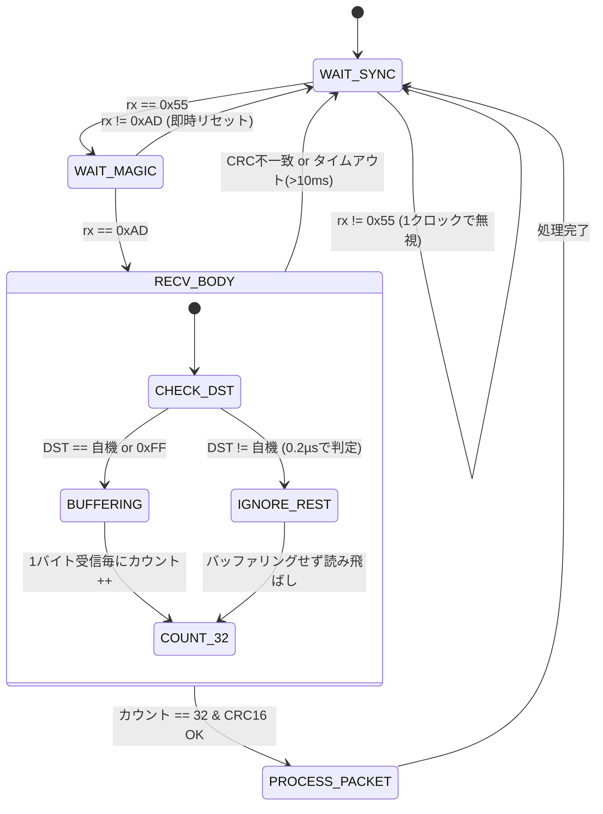
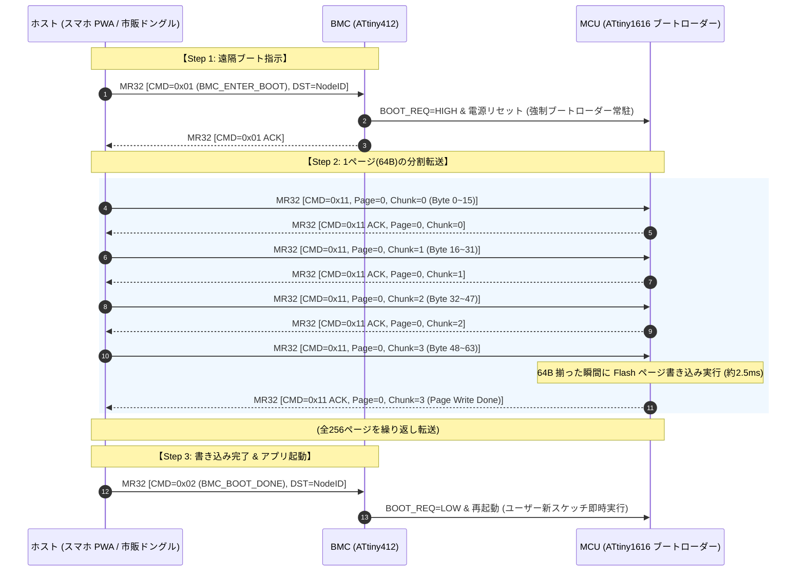

<!--
Copyright (c) 2026 ADX Project Contributors
SPDX-License-Identifier: CC-BY-4.0
-->

# ADX 基幹フィールドネットワーク「MR32」仕様書 (MR32 Specification)
〜 Magic-packet RS-485, 32-byte Fixed-Length Protocol 〜

---

## 1. エグゼクティブ・サマリー（MR32 策定の意義）

### 1.1 命名とコンセプト
**MR32**（エム・アール・サーティーツー）は、**「Magic-packet RS-485, 32-byte Fixed-Length」** の頭文字を冠した、ADXエコシステムの次世代基幹通信規格です。

先行して検討されていた `BR32`（Break RS-485, 32-byte）が抱えていた「市販USBシリアルドングルやスマホOSにおけるBREAK信号生成の不安定性」を、**「マジックパケットによる完全標準UART同期」** へと昇華させ、以下の決定的な進化を遂げました。

```text
┌─────────────────────────────────────────────────────────────────────────────┐
│                      【 MR32 の 4 大コア・バリュー 】                       │
│                                                                             │
│  1. 【完全固定長 32 Bytes】 : ターンアラウンド確定・ゴミパケット超速破棄    │
│  2. 【専用ドングル完全撤廃】: 市販の安物ドングル＋スマホ PWA で即座に直結   │
│  3. 【1,000m 産業現場直結】 : 工場校正内部OSC ＋ 中央サンプリングの絶対安定 │
│  4. 【BMC 連携 OTW 保証】   : 常時監視 BMC による確実な遠隔ブート＆書込     │
└─────────────────────────────────────────────────────────────────────────────┘
```

---

## 2. 物理層仕様（Physical Layer）

### 2.1 電気的仕様と絶縁保護
- **規格**: EIA/TIA-485-A（半二重差動伝送、Balanced 2-Wire: A / B）
- **絶縁耐圧**: **2,500 VDC 完全ガルバニック絶縁**（Mornsun `TDA51S485HC` オンボード内蔵）
  - ホスト側（スマホ・PC）は、市販の非絶縁・安価なUSB-RS485ドングルを直結しても、作業者の端末は100%安全に電気的保護されます。
- **終端抵抗**: バス最遠端ノードの両端に **120 Ω（±1%）** を配置。
- **バスフェイルセーフ**: アイドル時のバス浮遊（Hi-Z）によるノイズ誤読を防ぐため、A/Bラインにフェイルセーフバイアスを確保。

### 2.2 フレーム物理フォーマット
OSや安価なUSB-UARTチップ（CH340G, CP2102, FTDI等）が最も得意とし、一切のジッターを生じさせない標準UARTを採用します。
- **ボーレート**: **115,200 bps**（標準デフォルト）
  - 長距離・極限環境モード: **57,600 bps** / **19,200 bps**（最大 1,000 m）
- **データ長**: 8 bit
- **パリティ**: None（なし）
- **ストップビット**: 1 bit（8N1）
- **ビット順序**: LSB First（最下位ビット先頭）

### 2.3 伝搬遅延と確定タイムスロット（1,000m 決定論的動作）
1,000mの配線において、信号の物理伝搬遅延は片道約 $5\,\mu\mathrm{s}$（往復約 $10\,\mu\mathrm{s}$）です。  
MR32は「32バイト完全固定長」であるため、**バス上の占有時間枠（Time Slot）が数学的に完全に確定**します。

| ボーレート | 1バイト送信時間 | 32B フレーム占有時間 ($T_{slot}$) | ターンアラウンド ガード時間 ($T_{guard}$) |
| :---: | :---: | :---: | :---: |
| **115,200 bps** | $86.8\,\mu\mathrm{s}$ | **$2.78\,\mathrm{ms}$** | $\ge 150\,\mu\mathrm{s}$ |
| **57,600 bps** | $173.6\,\mu\mathrm{s}$ | **$5.56\,\mathrm{ms}$** | $\ge 250\,\mu\mathrm{s}$ |
| **19,200 bps** | $520.8\,\mu\mathrm{s}$ | **$16.67\,\mathrm{ms}$** | $\ge 500\,\mu\mathrm{s}$ |

> [!IMPORTANT]
> 半二重通信の衝突（コリジョン）をゼロにするため、**「送信完了（TXC）から相手の応答開始まで最低 $T_{guard}$ のインターバルを空ける」** ことをプロトコル規約として強制します。

---

## 3. MR32 フレーム構造（32-Byte Fixed-Length Frame）

すべての通信パケットは、例外なく**厳密に「32バイト固定長」**で伝送されます。

```text
 0      1      2        3        4         5       6 ... 29 (24 Bytes)    30    31
┌──────┬──────┬────────┬────────┬─────────┬──────────┬─────────────────────┬─────┬─────┐
│ SYNC │MAGIC │ DST_ID │ SRC_ID │ PKT_CMD │ SEQ_NUM  │       PAYLOAD       │CRC16│CRC16│
│ 0x55 │ 0xAD │ (1B)   │ (1B)   │  (1B)   │   (1B)   │     (24 Bytes)      │(LSB)│(MSB)│
└──────┴──────┴────────┴────────┴─────────┴──────────┴─────────────────────┴─────┴─────┘
 ├── ヘッダー (6 Bytes) ─────────────────────────────┤ ├── データ本体 (24B) ──┤ ├─ CRC (2B) ┤
```

### 3.1 各フィールドの詳細仕様

| オフセット | フィールド名 | サイズ | 設定値 | 役割と動作仕様 |
| :---: | :--- | :---: | :--- | :--- |
| **0** | **`SYNC`** | 1B | `0x55` 固定 | **物理同期バイト（`01010101b`）**。<br>等間隔の方形波によりUARTサンプリング位相を中央に強制ロックし、ラインの過渡状態を安定化。 |
| **1** | **`MAGIC`** | 1B | `0xAD` 固定 | **ADX固有識別子（"ADX" の AD）**。<br>偶発的なノイズや他社パケットを即座に門前払いする。 |
| **2** | **`DST_ID`** | 1B | `0x00`〜`0xFF` | **宛先ノードID**。<br>・`0x00`: ホスト（PC/スマホ）<br>・`0x01`〜`0xFE`: 個別ADXノード（最大254台）<br>・`0xFF`: 全ノード同報（ブロードキャスト） |
| **3** | **`SRC_ID`** | 1B | `0x00`〜`0xFE` | **送信元ノードID**。応答パケットの宛先として使用。 |
| **4** | **`PKT_CMD`** | 1B | `0x00`〜`0xFF` | **コマンドコード**（ブートローダー制御、相互通信など）。 |
| **5** | **`SEQ_NUM`** | 1B | `0x00`〜`0xFF` | **シーケンス番号**。パケットの重複・脱落判定用。 |
| **6〜29** | **`PAYLOAD`** | **24B** | 任意データ | **データペイロード（24バイト固定）**。<br>未使用領域は `0x00` でパディング（埋め草）。 |
| **30〜31** | **`CRC16`** | 2B | `0x0000`〜`0xFFFF` | **CRC-16-CCITT（多項式 `0x1021`, 初期値 `0xFFFF`）**。<br>計算範囲: Byte 2（`DST_ID`）〜 Byte 29（`PAYLOAD`末尾）。 |

---

## 4. 超高速破棄（Fast Reject）ステートマシン

固定長 ＋ `0x55 0xAD` ヘッダーにより、マイコン（ATtiny1616 / ATtiny412）はゴミパケットに対して**数マイクロ秒以内の超高速破棄（Fast Reject）**を実行し、CPU負荷をほぼゼロに保ちます。



### 4.1 ゴミパケットに対する鉄壁の排除性能
1. **第1関門 (`0x55`)**: バス上のノイズが `0x55` でない限り、ステートマシンは1クロックも前進しない。
2. **第2関門 (`0xAD`)**: 偶然 `0x55` を拾っても、次が `0xAD` でなければ即座に `WAIT_SYNC` へリセット（この時点でゴミの **99.6%** を排除）。
3. **第3関門 (`DST_ID`)**: 自機宛てでなければ、以降の29バイトはバッファに書き込まず、単にカウントアップするだけ（CPU負荷 $\le 0.2\%$）。
4. **第4関門 (タイムアウト保護)**: 万一途中で送信が途絶えても、**10ms バスが無音であればカウンタを自動リセット**するため、絶対にハングアップしない。

---

## 5. Flash 64B ページの最適転送設計（16B × 4ブロック方式）

ATtiny1616のFlashメモリは **1ページ ＝ 64バイト** です。  
MR32の24バイトペイロードを活用し、**1ページを「16バイト × 4チャンク」で転送**する極めてシンプルで堅牢なシーケンスを採用します。

### 5.1 なぜ 16バイト × 4 なのか？
- **2のべき乗（16 = $2^4$）の絶対的優位性**:
  - メモリ内オフセット計算が `chunk_idx << 4` のシフト演算1発で完了。
  - マイコン（ブートローダー）のファームウェアサイズを劇的に削減でき、1024バイト上限に余裕で収まります。

### 5.2 Flash書き込みシーケンス（OTW）



- **書き込み所要時間**:
  - 1チャンク送受信: 約 $2.78\,\mathrm{ms} \times 2 + T_{guard} \approx 6.0\,\mathrm{ms}$
  - 1ページ（4チャンク ＋ Flash書込）: 約 $26\,\mathrm{ms}$
  - **16KB（全256ページ）フル書き込み**: **約 6.6 秒 で完了！**

---

## 6. コマンド体系（MR32 Command Space）

MR32の `PKT_CMD`（Byte 4）は、システム制御からユーザー相互通信まで体系的に分類されます。

```text
┌─────────────────────────┬────────────────────────────────────────────────────────┐
│ コマンド領域            │ 用途・役割                                             │
├─────────────────────────┼────────────────────────────────────────────────────────┤
│ 0x00 〜 0x0F (16個)     │ BMC 基板管理・電源制御専用                             │
│ 0x10 〜 0x1F (16個)     │ メイン MCU ブートローダー専用 (Flash 書込・検証)       │
│ 0x20 〜 0x3F (32個)     │ ADX 公式 CARD・周辺機器制御 (Power CARD, DAC, GPIO)    │
│ 0x40 〜 0x7F (64個)     │ 標準メッセージング (Pub/Sub, テレメトリ, ハートビート) │
│ 0x80 〜 0xFF (128個)    │ ユーザー定義スケッチ用自由空間                         │
└─────────────────────────┴────────────────────────────────────────────────────────┘
```

### 主要システムコマンド一覧

| コマンド名 | コード | ペイロード内訳 (24B) | 応答 | 動作仕様 |
| :--- | :---: | :--- | :---: | :--- |
| **`CMD_BMC_ENTER_BOOT`** | `0x01` | 予約 (0x00 パディング) | ACK | BMC宛て。MCUを強制リセットしブートローダー待受へ。 |
| **`CMD_BMC_BOOT_DONE`**  | `0x02` | 予約 (0x00 パディング) | ACK | BMC宛て。書き込み完了を告げMCUを通常起動させる。 |
| **`CMD_BOOT_PING`**      | `0x10` | 予約 (0x00 パディング) | ACK (DeviceInfo) | ブートローダーの生存確認とMCU型番・Flashサイズの取得。 |
| **`CMD_BOOT_WRITE_CHUNK`**| `0x11`| `Page(2B)` + `Chunk(1B)` + `Data(16B)` + `Pad(5B)` | ACK | 指定ページ・チャンク（16B）へのデータ書き込み。 |
| **`CMD_BOOT_CRC_CHECK`** | `0x13` | `StartPage(2B)` + `NumPages(2B)` + `Pad(20B)` | ACK (CRC16) | 指定Flash領域のハードウェアCRC一括照合。 |
| **`CMD_APP_TELEMETRY`**  | `0x40` | `SensorType(1B)` + `FloatValue(4B)` + 任意データ | 任意 | スケッチ間相互通信（センサー値の送信など）。 |

---

## 7. ホスト実装仕様（専用ドングル完全撤廃の実証）

### 7.1 ハードウェア接続（スマホ PWA 直結）
ユーザーは高価な専用ハードウェアを購入する必要はありません。

```text
┌─────────────────────────────────┐
│ スマートフォン (Android PWA)     │
│ Google Chrome (WebSerial/WebUSB)│
└────────────────┬────────────────┘
                 │ USB Type-C ケーブル
                 ▼
┌─────────────────────────────────┐
│ 市販の USB-RS485 ドングル       │  ← Amazon等で300円〜千円の汎用品 (CH340/CP2102等)
└────────────────┬────────────────┘
                 │ 2線式 ツイストペア配線 (A / B) (最大1,000m)
                 ▼
┌─────────────────────────────────┐
│ ADX CORE-A                      │
│ - TDA51S485HC (2500V 完全絶縁)  │  ← ボード側が絶縁を持っているため
│ - ATtiny412 (常時監視 BMC)      │     安物ドングルを使ってもスマホ・PCは100%保護！
│ - ATtiny1616 (メイン MCU)       │
└─────────────────────────────────┘
```

### 7.2 Web Flasher（JavaScript）の送信コード
特殊なポート再オープンやBREAK生成は**一切不要**です。標準の `write` だけで完璧に動作します：

```javascript
// MR32 パケット送出関数 (32バイト完全固定長)
async function sendMr32Packet(port, dstId, cmd, seqNum, payload24) {
  const frame = new Uint8Array(32);

  // ヘッダー部 (6 Bytes)
  frame[0] = 0x55;     // SYNC
  frame[1] = 0xAD;     // MAGIC
  frame[2] = dstId;    // DST_ID
  frame[3] = 0x00;     // SRC_ID (Host=0)
  frame[4] = cmd;      // PKT_CMD
  frame[5] = seqNum;   // SEQ_NUM

  // ペイロード部 (24 Bytes)
  if (payload24) {
    frame.set(payload24.subarray(0, 24), 6);
  }

  // CRC-16-CCITT 算出 (Byte 2 〜 Byte 29 の計 28 Bytes 対象)
  const crc = calculateCRC16(frame.subarray(2, 30));
  frame[30] = crc & 0xFF;        // CRC LSB
  frame[31] = (crc >> 8) & 0xFF; // CRC MSB

  // 送信実行 (アトミック一括送出)
  const writer = port.writable.getWriter();
  await writer.write(frame);
  writer.releaseLock();
}
```

---

## 8. まとめと次のマイルストーン

MR32規格への転換により：
1. **「専用ドングル強制」という最大のマーケティング障壁が完全に崩壊**。
2. **「固定長 32B」による超高速破棄と確定タイムスロットにより、1,000m長距離現場での絶対的安定性を獲得**。
3. **「16B × 4ブロック」の美しいメモリ設計により、ブートローダーの極小化と高速書き換え（約6.6秒）を両立**。

本仕様に基づき、ブートローダーファームウェア（`optiboot_MR32`）およびWeb Flasherの実機検証フェーズへと移行します。
