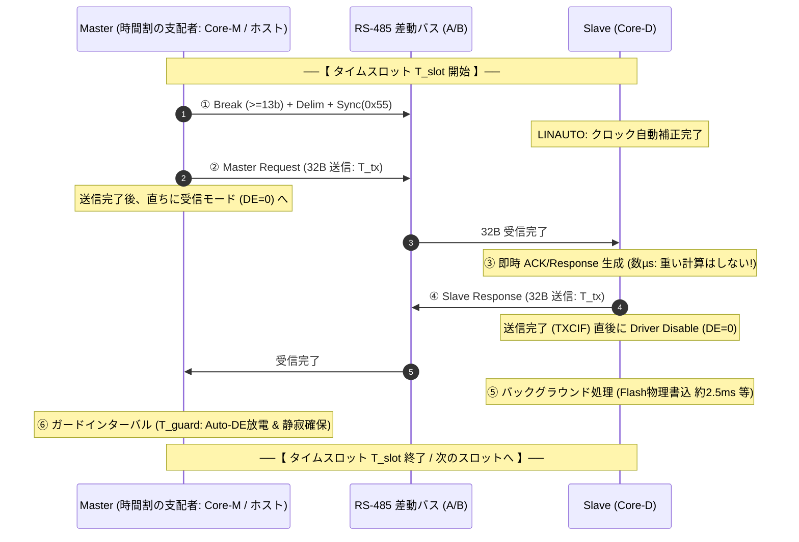
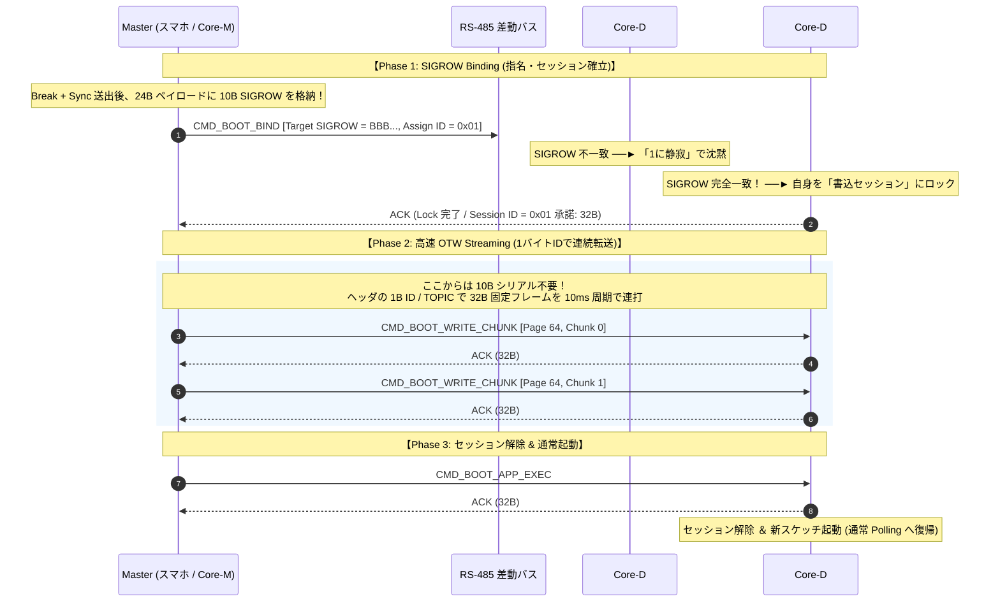

<!--
Copyright (c) 2026 ADX Project Contributors
SPDX-License-Identifier: CC-BY-4.0
-->

# ADX 基幹フィールドネットワーク「LD-32」仕様書 (LD-32 Specification)
〜 LIN-based Master-scheduled, RS-485 Differential Pair, 32-byte Fixed-Length Deterministic Protocol 〜

---

## 1. エグゼクティブ・サマリー（LD-32 策定の意義と背景）

### 1.1 命名とコンセプト
**LD-32**（エルディー・サーティーツー）は、**「LIN-based, Differential pair signal, 32-byte Fixed-Length」** の頭文字を冠した、ADX エコシステムの次世代基幹通信プロトコル規格です。

先行して検討されていた標準 UART ベースの `LM-32`（LIN-inspired Master-scheduled, 32-byte）および `MR32`（Magic-packet RS-485）の実装・検証を経て、**「物理層における Out-of-baud（ボーレート規定外）な BREAK 信号による絶対同期の不可欠性」** が再確認されました。  
これを受け、車載 LIN の物理層限界を RS-485 差動伝送によって打ち破り、**「LIN BREAK 同期 ＋ RS-485 差動伝送 ＋ 32バイト完全固定長フレーム」** を融合した決定版規格として再定義したものが本規格 **LD-32** です。

```text
┌─────────────────────────────────────────────────────────────────────────────┐
│                      【 LD-32 の 5 大コア・バリュー 】                      │
│                                                                             │
│  1. 【LIN BREAK 絶対同期】    : Out-of-baud な 13bit Low でデータ誤認を根絶 │
│  2. 【RS-485 差動・絶縁伝送】 : 115.2 kbps、1,000m、2500V 耐圧の産業堅牢性 │
│  3. 【内蔵 RC 自動校正】      : 0x55 Sync により水晶不要で毎パケット補正    │
│  4. 【完全固定長 32 Bytes】   : タイムスロット確定・10B SIGROW と 16B 同居   │
│  5. 【決定論的時間割】        : 「1に静寂、2に即応」「No retry in a poll」   │
└─────────────────────────────────────────────────────────────────────────────┘
```

---

### 1.2 なぜ In-band (LM-32) から Out-of-baud BREAK (LD-32) へ回帰したのか？

`LM-32` では、市販の安価な USB シリアルドングルやブラウザ（WebSerial）との親和性を最優先し、標準 UART 8N1 バイト列（`0x55 0xAD` マジックパケット）によるインバンド同期を試みました。しかし、過酷な産業現場およびブートローダー運用の精緻な検証の結果、インバンド方式には以下の**工学的・物理的限界**が存在することが明らかとなりました。

#### (1) ホットプラグ・途中復帰時のフレーミング同期外れ（Framing Lockout）
半二重マルチドロップバスにノードが途中挿入（ホットプラグ）された場合や、マイコンがウォッチドッグや電源変動で再起動した場合、バス上に流れる任意データバイト列の「途中」から受信を開始します。  
インバンド方式では、偶然データペイロード内に現れたバイト列をヘッダーと誤認してステートマシンが誤作動し、タイムアウトやパケット破棄を繰り返して正常同期に復帰するまでに致命的な遅延が発生します。

#### (2) 偶発的データ一致とノイズ混同の完全排除
UART 8N1 フォーマット（Start 1b + Data 8b + Stop 1b）の物理的規則上、送信データが `0x00` であってもストップビット（High）が必ず挟まるため、連続した Low（Dominant）は最大でも **9 ビット** しか継続しません。  
したがって、**13 ビット以上の連続 Low（BREAK 信号）は、いかなるデータ列（`0x00`〜`0xFF` のあらゆる組み合わせ）であっても通常の UART 通信では絶対に生成できません**。  
Out-of-baud な BREAK 信号を採用することで、データ値との混同リスクを確率論ではなく**物理層レベルで 100% ゼロ**にできます。

#### (3) マイコン内蔵ハードウェア（LIN Break Detector / LINAUTO）の解放
ADX Core-D に採用されている ATtiny1616 などのモダンなマイコン USART は、ハードウェアとして **LIN モード（LIN Break 検出回路、Wait-For-Break 機能、LINAUTO ボーレート自動計測機能）** を搭載しています。  
Out-of-baud BREAK を使うことで：
- マイコンは無関係なデータ列で一切割り込みを受けず、スリープ（または通常タスク）を維持したまま、BREAK が来た瞬間だけハードウェアで起床可能（CPU 負荷ゼロ）。
- `0x55` Sync バイトのエッジ間隔から、**内蔵 RC 発振器の周波数ズレを毎フレーム自動キャリブレーション（LINAUTO）** でき、外付け水晶振動子なし（$\pm 10\%\sim15\%$ の温度ドリフト環境）でも 115,200 bps の安定通信が保証されます。

---

### 1.3 なぜ 車載 LIN 単線ではなく RS-485 差動伝送なのか？

車載 LIN（Local Interconnect Network）は優れた思想を持つ一方で、その物理層（Layer 1）には産業用フィールドネットワークとして致命的な制約を抱えていました。LD-32 は、この制約を RS-485 差動伝送によって完全に解決します。

| 項目 | 車載 LIN (2.x / ISO 17987) | ADX LD-32 (RS-485 差動) | LD-32 の工学的ブレークスルー |
| :--- | :--- | :--- | :--- |
| **物理層配線** | 12V 単線 ＋ ボディアース | **平衡 2 線差動ツイストペア (A/B)** | 差動伝送により対地電位差の影響を無力化。 |
| **最高ボーレート** | **最大 20 kbps** (EMC 制約) | **115.2 kbps 〜 500 kbps** | 差動相殺により放射電磁ノイズを極小化し、**5〜25倍の高速化**。 |
| **最大伝送距離** | 車内短距離（通常 $\le 40\,\mathrm{m}$） | **最大 1,000 m** (EIA/TIA-485-A) | 大規模工場プラント・屋外配線に完全直結可能。 |
| **絶縁耐圧** | 非絶縁（バッテリー直結） | **2,500 VDC ガルバニック絶縁** | インバータサージ・高圧地絡から作業者・ホストを保護。 |
| **フレーム長** | 1〜8 バイト（PID ごとに固定） | **32 バイト完全固定長** | ファームウェア更新（OTW）とリッチなテレメトリを両立。 |

---

## 2. 物理層仕様（Layer 1: Differential LIN over RS-485）

### 2.1 電気的仕様と絶縁保護
- **規格**: EIA/TIA-485-A（半二重平衡差動伝送、Balanced 2-Wire: A / B）
- **絶縁耐圧**: **2,500 VDC ガルバニック絶縁**（オンボード内蔵 Mornsun `TDA51S485HC` 等）
  - ホスト側（PC、スマホ、親機）は、安価な非絶縁 USB-RS485 ドングルや GPIO 直結でも、現場の高圧サージから 100% 安全に電気的保護されます。
- **終端抵抗**: バス最遠端ノードの両端に **120 Ω（±1%）** を配置。
- **バスフェイルセーフ**: アイドル時のバス浮遊（Hi-Z）によるノイズ誤読を防ぐため、A/B ラインにプルアップ/プルダウンによるフェイルセーフバイアスを確保。

---

### 2.2 RS-485 差動線上における LIN BREAK の物理定義

RS-485 は差動信号（$V_{OD} = V_A - V_B$）で論理を伝送します。  
送信マイコンの UART TXD、RS-485 トランシーバー（SP485EEN 等）、および受信マイコンの UART RXD における信号論理と差動電圧の対応関係を以下のように厳密に定義します。

```text
【 UART TXD 】 ────► [ RS-485 TXD (DI) ] ────► [ 差動バス A/B ] ────► [ RS-485 RXD (RO) ] ────► 【 UART RXD 】
```

| 論理状態 | UART 信号 | RS-485 差動電圧 ($V_A - V_B$) | バス論理 (LIN 相当) | 備考 |
| :---: | :---: | :---: | :---: | :--- |
| **Mark (Idle / Stop)** | **High** | **$V_A - V_B \ge +200\,\mathrm{mV}$** | **Recessive（劣性 / 1）** | アイドル状態、ストップビット、ブレークデリミタ |
| **Space (Break / Start)**| **Low** | **$V_A - V_B \le -200\,\mathrm{mV}$** | **Dominant（優性 / 0）** | スタートビット、データ 0、**LIN BREAK 信号** |

> [!IMPORTANT]
> **RS-485 トランシーバーの極性と BREAK の関係**:  
> トランシーバーの Driver Enable（DE）が High の状態で、UART TXD（DI）を Low に駆動すると、バスライン A は Low、B は High に駆動され（$V_A - V_B < -200\mathrm{mV}$）、受信側の Receiver Output（RO）には正確に **Low（Space）** が出力されます。  
> したがって、RS-485 差動バスを通過しても、受信側マイコンから見れば標準的な LIN トランシーバーと全く同じ **「13ビット以上の Low パルス（BREAK）」** として知覚されます。

---

### 2.3 同期プリアンブル仕様（Break ＋ Delimiter ＋ Sync）

LD-32 の各トランザクションにおいて、マスターは 32 バイト固定フレームの送出に先立ち、必ず以下の **「同期プリアンブル（LIN Header）」** を送出します。

```text
    ◄──────── Break Field ────────►◄─ Delim ─►◄──────── Sync Byte (0x55) ────────►
    ┌──────────────────────────────┐          ┌──┐     ┌──┐     ┌──┐     ┌──┐     ┌──
────┘                              └──────────┘  └─────┘  └─────┘  └─────┘  └─────┘
     Dominant (Low): >= 13 bits     Recessive:   Start D0   D1   D2   D3   D4   D5   D6   D7 Stop
                                    >= 1 bit           ( 5 回の等間隔立ち下がりエッジ )
```

1. **Sync Break Field**:
   - 信号レベル: **Dominant（Low）**
   - 継続時間: **最低 13 ビット時間以上（推奨: 13〜26 ビット時間）**
   - 動作仕様: 受信側マイコンの UART レシーバーにおいて強制的に Framing Error または LIN Break 割り込みをトリガーし、パケット先頭位置を絶対確定させる。
2. **Break Delimiter**:
   - 信号レベル: **Recessive（High）**
   - 継続時間: **最低 1 ビット時間以上（推奨: 1〜4 ビット時間）**
   - 動作仕様: Break（Low）から次の Sync バイト（Start bit: Low）への確実な立ち下がりエッジを形成するための復帰インターバル。
3. **Sync Byte Field**:
   - 送信データ: **`0x55` 固定（バイナリ: `01010101b`）**
   - ボーレート: 当該タイムスロットの公称ボーレート
   - 動作仕様: `0` と `1` が交互に並ぶことで、**5 回の等間隔な立ち下がりエッジ** を生成。

---

### 2.4 内蔵 RC 発振器の自動キャリブレーション（ハードウェア LINAUTO）

ATtiny1616 などの modern AVR マイコンでは、USART の `CTRLB` レジスタで `LINMODE = USART_LINMODE_LINAUTO_gc` を設定することにより、ハードウェアが自律的にボーレートをキャリブレーションします。

```c
// ATtiny1616 LD-32 受信初期化例 (LINAUTO 有効化)
USART0.CTRLB = USART_RXEN_bm | USART_TXEN_bm | USART_LINMODE_LINAUTO_gc;
```

- **ハードウェア動作**:
  1. Break 検出後、マイコンは次の `0x55` の立ち下がりエッジ間隔を内部タイマーで自動計測。
  2. 計測されたエッジ間隔からボーレートレジスタ（`BAUD`）をハードウェアが瞬時に上書き更新。
  3. 続く 32 バイトフレーム本体は、**完全にマスターのクロックに位相同期した状態でサンプリング** される。
- **効果**:
  工場現場や屋外（-40℃〜+85℃）の激しい温度変化や電源電圧変動による内蔵 RC 発振器の周波数ズレ（最大 $\pm 10\%\sim15\%$）を**毎フレーム完全に吸収**。全ノードから水晶振動子を追放し、部品コスト・実装面積を最小化します。

---

### 2.5 ホスト側（PC / スマホ / 親機）における確実な BREAK 送出手法

「市販の USB-RS485 ドングルや PC/スマホからいかにして高精度な BREAK を送出するか」という課題に対し、LD-32 では以下の工学的解法を策定しています。

```text
┌─────────────────────────────────────────────────────────────────────────────┐
│                 【 ホスト側 BREAK 送出の 3 大実装アプローチ 】              │
│                                                                             │
│  アプローチ 1: 【専用マスター Core-M / 親機 PLC】                            │
│               - マイコン（ATtiny / RP2040 / ESP32 / STM32）の UART BREAK 機能│
│               - レジスタ 1 発でハードウェア 13bit Break を完璧に生成 (最推奨)│
│                                                                             │
│  アプローチ 2: 【Android APK / Linux / Windows ネイティブドライバ】         │
│               - `tcsendbreak()` または FTDI / CH34x の Break API を呼び出し │
│               - USB シリアルドライバ層で正確な Break パルスを生成            │
│                                                                             │
│  アプローチ 3: 【Low Baud Rate Switch トリック (汎用 USB ドングル・PWA)】   │
│               - ボーレートを一時的に 1/2 以下（例: 115200 ➔ 9600）に切り替え│
│               - `0x00` を 1 バイト送信 ➔ 115200bps 換算で 10bit 以上の Low  │
│               - 直後に公称ボーレートに戻して `0x55` と 32B フレームを送出    │
└─────────────────────────────────────────────────────────────────────────────┘
```

---

## 3. 階層化アーキテクチャ（Layered Architecture）

LD-32 は、明確に定義された 4 つのレイヤーで構成されます。

```text
+-----------------------------------------------------------------------------+
|                   Layer 4: アプリケーション層 (Application)                  |
|  - スケッチ間 Pub/Sub テレメトリ配信                                        |
|  - OTW ファームウェア更新 (Flash 64B ページ転送 / 16B チャンク)              |
|  - BMC 基板管理・電源リセット・遠隔診断                                     |
+-----------------------------------------------------------------------------+
                                       │
+-----------------------------------------------------------------------------+
|                 Layer 3: LD-32 データリンク層 (Data Link / 32B)             |
|  - 32-Byte 完全固定長フレーム (Header 6B + Payload 24B + CRC16 2B)          |
|  - Master-scheduled 決定論的タイムスロット (Speak Only When Spoken To)       |
|  - 「1に静寂、2に即応」スレーブ応答ステートマシン                           |
|  - 「No retry in a poll」サイクル確定型 ARQ                                 |
+-----------------------------------------------------------------------------+
                                       │
+-----------------------------------------------------------------------------+
|                   Layer 2: LIN 同期層 (LIN Sync / Preamble)                 |
|  - Out-of-baud Break Field (>= 13bit Dominant / Low)                        |
|  - Break Delimiter (>= 1bit Recessive / High)                               |
|  - Sync Byte Field (0x55 / LINAUTO ボーレート自動校正)                      |
+-----------------------------------------------------------------------------+
                                       │ 標準 UART (8N1)
                                       ▼
+─────────────────────────────────────────────────────────────────────────────+
|               Layer 1: 物理層 (Physical / Differential RS-485)              |
|  - EIA/TIA-485-A 半二重 2線式差動伝送 (A / B)                                |
|  - 2,500 VDC ガルバニック絶縁 (Mornsun TDA51S485HC 等)                      |
|  - 120 Ω 終端抵抗 ＋ フェイルセーフバイアス                                 |
+─────────────────────────────────────────────────────────────────────────────+
```

---

## 4. LD-32 フレーム構造（32-Byte Fixed-Length Frame）

### 4.1 バス上のパケットシーケンス（Preamble ＋ 32B Frame）

マスターから送出されるパケットは、物理層同期を司る **「LIN プリアンブル」** と、プロトコルデータを司る **「32バイト完全固定長フレーム」** の 2 つで構成されます。  
スレーブからの返信は、すでにボーレート同期が完了しているため、**「32バイト完全固定長フレーム」のみ** を即座に返信します。

```text
【 Master 送信トランザクション 】
┌──────────────┬───────────┬────────────┬───────────────────────────────────────┐
│ BREAK (LOW)  │ DELIMITER │ SYNC(0x55) │        LD-32 FRAME (32 Bytes 固定)    │
│ (>= 13 bits) │ (>= 1 bit)│   (1 Byte) │ Byte 0 ............................ 31│
└──────────────┴───────────┴────────────┴───────────────────────────────────────┘
 ├── LIN 同期プリアンブル ──────────────┤ ├── フレーム本体 (32 Bytes) ──────────┤

【 Slave 応答トランザクション 】
┌───────────────────────────────────────┐
│        LD-32 FRAME (32 Bytes 固定)    │
│ Byte 0 ............................ 31│
└───────────────────────────────────────┘
 ├── スレーブ応答フレーム (32 Bytes) ───┤
```

---

### 4.2 32バイトフレーム内訳（Header 6B ＋ Payload 24B ＋ CRC16 2B）

フレーム本体は、例外なく **厳密に「32バイト固定長」** です。  
マルチドロップ環境での自律分散傍聴（Pub/Sub）と、マスター＝0番スレーブの対称性を両立するため、**「TOPIC / PUB / SUB」ヘッダーモデル** を採用します。

```text
 0          1          2         3       4 ... 27 (24 Bytes)           28    29    30    31
┌──────────┬──────────┬─────────┬──────────┬─────────────────────────────┬─────┬─────┬─────┬─────┐
│ TOPIC_ID │  PUB_ID  │ SUB_ID  │ SEQ_NUM  │           PAYLOAD           │ RES │ RES │CRC16│CRC16│
│   (1B)   │   (1B)   │  (1B)   │   (1B)   │         (24 Bytes)          │ (1B)│ (1B)│(LSB)│(MSB)│
└──────────┴──────────┴─────────┴──────────┴─────────────────────────────┴─────┴─────┴─────┴─────┘
 ├── ヘッダー (4 Bytes) ────────────────┤ ├── データ本体 (24 Bytes) ───┤ ├── 予約 ─┤ ├─ CRC (2B) ─┤
```

> [!NOTE]
> 予約領域（RES: Byte 28〜29）を含め、将来の拡張時でも `PAYLOAD` は 24 バイトまたは 26 バイトとして極めてクリーンにマッピングできます。本仕様では標準データ長を **24 バイト** とし、残る 2 バイトを将来のセキュリティ/暗号化タグ用予約（`0x00` 固定）とします。

---

### 4.3 各フィールドの詳細仕様

| オフセット | フィールド名 | サイズ | 設定値 | 役割と動作仕様 |
| :---: | :--- | :---: | :--- | :--- |
| **0** | **`TOPIC_ID`** | 1B | `0x00`〜`0xFF` | **メッセージ識別子（Topic / PID 相当）**。「何のデータか」を定義。<br>・`0x00〜0x0F`: BMC 基板管理専用<br>・`0x10〜0x1F`: ブートローダー / OTW 制御<br>・`0x20〜0x3F`: ADX 公式 CARD / 周辺機器制御<br>・`0x40〜0x7F`: 共有テレメトリ（Pub/Sub 傍聴対象）<br>・`0x80〜0xFF`: ユーザー自由トピック |
| **1** | **`PUB_ID`** | 1B | `0x00`〜`0xFE` | **送信元ノードID（Publisher）**。「誰が発言したか」を示す。<br>・`0x00`: ホスト（PC/スマホ Master。データ送信時は 0 番スレーブと等価）<br>・`0x01`〜`0xFE`: 各スレーブノード |
| **2** | **`SUB_ID`** | 1B | `0x00`〜`0xFF` | **受信対象スコープ（Target / Subscriber）**。「誰に向けたか」を示す。<br>・`0xFF`: 全体同報（ブロードキャスト / 全ノード傍聴推奨）<br>・`0x00`: マスター宛て<br>・`0x01`〜`0xFE`: 特定個別ノード宛て（PTP: Point-to-Point） |
| **3** | **`SEQ_NUM`** | 1B | `0x00`〜`0xFF` | **シーケンス番号 ＆ 制御フラグ**。<br>パケットの重複・脱落判定およびリトライ追跡用。 |
| **4〜27** | **`PAYLOAD`** | **24B** | 任意データ | **データペイロード（24バイト固定）**。<br>Flash 書き込みチャンク（16B）、SIGROW（10B）、各種センサー値など。未使用領域は `0x00` パディング。 |
| **28〜29** | **`RESERVED`**| 2B | `0x00, 0x00` | 将来拡張用予約フィールド（暗号署名、拡張フラグ等）。 |
| **30〜31** | **`CRC16`** | 2B | `0x0000`〜`0xFFFF` | **CRC-16-CCITT（多項式 `0x1021`, 初期値 `0xFFFF`）**。<br>計算範囲: Byte 0（`TOPIC_ID`）〜 Byte 29（`RESERVED` 末尾）の計 30 バイト。<br>バイト順: Byte 30 (LSB), Byte 31 (MSB)。 |

---

### 4.4 ノードの受信（傍聴）フィルタ条件

各スレーブノードは、BREAK ＋ `0x55` の受信完了後、フレームの先頭ヘッダー（Byte 0〜2）を評価し、以下の **いずれか** を満たす場合にのみバッファリングと処理を継続します：

1. **個別宛て**: `SUB_ID == 自機ID`（自機に向けられた指示・書き込み）
2. **全体同報**: `SUB_ID == 0xFF`（システム同報・一斉停止・時刻同期）
3. **トピック購読**: 自機が Subscribe 登録している `TOPIC_ID` である（他ノードのセンサー値傍聴）

該当しないパケットの場合、スレーブは後続データを RAM に保存せず、直ちに読み捨て（Fast Reject）を実行して CPU 負荷を最小化します。

---

## 5. 決定論的タイムスロット設計（Deterministic Time Slot）

LD-32 の根幹哲学は、**「ミリ秒待機（`delay`）の場当たり的挿入を完全に排除し、マスター主導の決定論的タイムスロットによってバス静寂とターンアラウンドを構造的に保証する」** 点にあります。

### 5.1 トランザクション基本原則（Speak Only When Spoken To）

1. **スレーブの自発的送信の絶対禁止**:  
   スレーブ（Core-D 等）は、マスターからの明示的な Request パケットを受信しない限り、**1 ビットたりとも自発的に送信してはならない**。
2. **1 トランザクション ＝ 1 タイムスロット**:  
   マスターがプリアンブルと要求フレームを送出し、スレーブが応答し、バスが完全な静寂に戻るまでを **単一のタイムスロット ($T_{slot}$)** として厳密に定義する。



---

### 5.2 時間予算（Time Budget）と市販安価ドングルへの完全適応

市販の安価な USB-RS485 ドングル（CH340 搭載品等）に代表される Auto-DE 回路（RC 積分回路）は、送信完了後に受信モード（DE=0）へ復帰するまでに **約 0.5 ms 〜 1.0 ms の放電遅延** が物理的に発生します。  
LD-32 は、この物理遅延をタイムスロットの時間予算に明示的に組み込むことで、**どのような粗悪なドングルであってもパケット先頭欠落を原理的に生じさせない** 設計となっています。

#### ボーレート別タイムスロット設計値

| 項目 | 記号 | 115,200 bps | 57,600 bps | 19,200 bps | 備考 |
| :--- | :---: | :---: | :---: | :---: | :--- |
| **1ビット伝送時間** | $t_{bit}$ | $8.68\,\mu\mathrm{s}$ | $17.36\,\mu\mathrm{s}$ | $52.08\,\mu\mathrm{s}$ |  |
| **LIN プリアンブル時間** | $T_{pre}$ | $0.22\,\mathrm{ms}$ | $0.43\,\mathrm{ms}$ | $1.30\,\mathrm{ms}$ | Break(14b) + Delim(1b) + Sync(10b) |
| **32B フレーム伝送時間** | $T_{tx}$ | **$2.78\,\mathrm{ms}$** | **$5.56\,\mathrm{ms}$** | **$16.67\,\mathrm{ms}$** | 32 バイト（各 10 bits: 8N1） |
| **スレーブ応答前マージン** | $T_{turn}$ | $0.60\,\mathrm{ms}$ | $1.00\,\mathrm{ms}$ | $2.00\,\mathrm{ms}$ | Auto-DE 放電待ちマージン |
| **Flash ページ書込時間** | $T_{flash}$ | $2.50\,\mathrm{ms}$ | $2.50\,\mathrm{ms}$ | $2.50\,\mathrm{ms}$ | ATtiny1616 内蔵 Flash (末尾で実行) |
| **ガードインターバル** | $T_{guard}$ | $1.00\,\mathrm{ms}$ | $2.00\,\mathrm{ms}$ | $3.00\,\mathrm{ms}$ | スロット末尾の完全静寂時間 |
| **標準タイムスロット周期** | **$T_{slot}$** | **$10.0\,\mathrm{ms}$** | **$18.0\,\mathrm{ms}$** | **$45.0\,\mathrm{ms}$** | **マスターが刻む確定周期** |

---

## 6. スレーブ応答シーケンス規範（「1に静寂、2に即応」の原則）

LD-32 におけるスレーブ（Core-D 等）の通信動作は、**「1に静寂、2に即応（Silence First, Immediate Response Second）」** を絶対的な行動規範とします。

半二重共有バス（RS-485）において、不確定な状態での返信やタイミング外れの返信はバス全体を汚染し、マスターの時間割（タイムスロット）を崩壊させます。そのため、**「疑わしきは徹底して沈黙し、正当なパケットに対してのみジッタなく即座に応答する」** 規範を定めます。

```text
┌─────────────────────────────────────────────────────────────────────────────┐
│                 【 スレーブ応答シーケンス 4 大原則 】                       │
│                                                                             │
│  第1則: BREAK / 同期プリアンブル異常 ──► 【破棄・沈黙】 (返信しない)        │
│  第2則: 32バイト未達 (短データ)       ──► 【破棄・沈黙】 (返信しない)        │
│  第3則: 32バイト超過 (長データ)       ──► 【破棄・沈黙】 (返信しない)        │
│  第4則: 32バイト完備 ＋ CRC検証                                             │
│         ├─ 4-1. CRC 不一致            ──► 【CRC Error 返信】 (即座に再送要求)│
│         └─ 4-2. CRC 一致              ──► 【正常応答 返信】                 │
│                 └─ 4-2-1. 【応答優先の原則 (Response-First)】               │
│                     (計算を実行してから返答してはならない。即応が絶対)      │
└─────────────────────────────────────────────────────────────────────────────┘
```

---

### 6.1 各原則の詳細仕様

#### 第1則: BREAK / 同期プリアンブル異常
- 13 ビット以上の BREAK が正常に検出されなかった場合、あるいは続く `0x55` の立ち下がりエッジ計測で許容誤差を超えるジッタが観測された場合、スレーブは受信状態を即座にリセットし、**一切返信してはならない（破棄・沈黙）**。
- バス上の偶発ノイズや通信ラインのチャタリングに対して沈黙を守り、バスの平穏を保つ。

#### 第2則: 32バイト未達（短データ・時間切れ）
- パケット長が 32 バイトに到達すべき時間枠内に 32 バイト揃わなかった場合、スレーブは受信バッファを破棄し、**一切返信してはならない（破棄・沈黙）**。
- 途絶えた不完全パケットに応答すると、マスター側の次スロット送信とバス上で衝突するため、沈黙を義務付ける。

#### 第3則: 32バイト超過（長データ・ゴミ混入）
- パケット長が 32 バイトを超えて垂れ流されている場合、スレーブはそれ以降のデータを破棄し、**一切返信してはならない（破棄・沈黙）**。
- バス上でバーストノイズや他ノードの暴走が発生していると判断し、バスが静寂に戻るまで沈黙する。

#### 第4則: 32バイト完備時の CRC チェックと応答分岐
32バイトが過不足なく完全に揃った場合のみ、スレーブは CRC-16-CCITT を検証する。

- **4-1. CRC 不一致の場合（CRC Error 返信）**:
  自機宛てパケット形式であるがデータが化けている場合、スレーブは **明示的に「CRC Error レスポンス」を返信する**。
  - *意義*: マスターはタイムアウト（無応答待ち）することなく、ビット化けの発生を即座に認知し、最小の遅延で自動再送（ARQ）を実行できる。
- **4-2. CRC 一致の場合（正常応答返信）**:
  パケットが正常である場合、スレーブは何らかの応答データ（ACK、テレメトリ値、ステータス）を含んだ 32 バイト返信を行う。

---

### 6.2 応答優先の原則（Rule 4-2-1: Response-First Principle）

> [!IMPORTANT]
> **「4-2 の時、返信直前までの間に、すでにあるメモリ等にあったデータをパケットに載せることはできるが、受信したデータからなにか計算を実行してから返答してはならない。」**

これは決定論的リアルタイム通信における最も重要な原則です。

1. **通信ジッタの完全排除**:
   受信したデータをもとに重い計算（Flash 書き込み、浮動小数点演算、暗号化など）を行ってから返答しようとすると、応答時間がデータ内容によって変動し、マスター側のタイムスロット時間予算が崩壊する。
2. **「返信が先、重い処理は後」の徹底**:
   - スレーブは、受信した要求に対して **数マイクロ秒以内（既存メモリ・ステータスの即座コピーのみ）で応答パケットを送出し終えなければならない**。
   - 重い処理（例: Flash ページへの物理書き込み 約 2.5ms）は、**応答パケットの送信完了後（TXCIF 確認後）、スロット末尾のガードインターバル（静寂期間）を利用してバックグラウンドで実行する**。

---

### 6.3 ハードウェア Wait-For-Break (WFB) によるゼロ負荷待機

スレーブマイコンは、返信完了直後に USART の `WFB`（Wait For Break）フラグをセットします。

```c
// 返信完了後の Wait-For-Break セット例
USART0.STATUS = USART_WFB_bm; // 次の BREAK 信号まで全受信バイトをハードウェアが自動無視
```

これにより、マイコンは次の BREAK 信号が来るまで、バス上にいかなるデータが流れていても **ハードウェアが自動的にバイト受信割り込みをマスク** します。マルチドロップバス上で他ノード宛ての膨大なデータが流れていても、スレーブの CPU 負荷は **完全に 0%** に保たれます。

---

## 7. マスターポーリング規範（「No retry in a poll」の原則）

LD-32 におけるマスター（Core-M 親機 / PC / スマホ）は、ネットワーク全体の**「時間割の支配者（Time Lord / Central Scheduler）」**として振る舞います。

マスターの至上命題は、**「ネットワーク全体の確定巡回周期（Cycle Time）を絶対に死守すること」** であり、その中核規範として **「No retry in a poll（同一巡回内での再送禁止の原則）」** を定めます。

```text
┌─────────────────────────────────────────────────────────────────────────────┐
│                 【 マスターポーリング 3 大鉄則 】                           │
│                                                                             │
│  鉄則 1: スロット独立の原則                                                 │
│          各スレーブに与えられる送受信枠は、1回の巡回で厳密に1スロットのみ   │
│  鉄則 2: No retry in a poll (即時再送の禁止)                                │
│          CRCエラーや無応答時、その場でリトライせず、直ちに次スレーブへ移行 │
│  鉄則 3: 次巡回での再送 (Cycle-Level ARQ)                                   │
│          失敗したパケットの再送は、全ノードを一巡した次回の巡回枠で行う     │
└─────────────────────────────────────────────────────────────────────────────┘
```

### 7.1 なぜ「その場でのリトライ」を禁止するのか？

1. **確定巡回周期（Worst-Case Execution Time: WCET）の死守**:
   1 台の不調なスレーブに対してその場でリトライを繰り返すと、ポーリング巡回周期（Cycle Time）が不確定に引き延ばされます。これにより、安全監視や精密制御を担う他の健全なノードへのポーリングが遅延し、システム全体のリアルタイム性が崩壊します。「1スロットで終わらなければ即座に次へ回す」ことで、バス全体の周期は数学的に完全確定します。
2. **バーストノイズ耐性（時間的デコリレーション）**:
   工場現場のインバータや電磁弁によるノイズは、数ミリ秒間継続する「バーストノイズ」の性質を持ちます。異常発生時にその場でミリ秒単位の即時再送を試みても、同一のノイズバーストに巻き込まれて連続失敗する確率が極めて高くなります。他の健全なスレーブを一巡して時間を置く（時間的相関を断ち切る）ことで、ノイズが減衰・通過した後の「次巡回」での成功率が飛躍的に高まります。
3. **1対1 通信（現場ファームウェア更新 / OTW）への演繹適用**:
   スレーブが 1 台しか存在しない 1対1 通信（作業者スマホ $\leftrightarrow$ Core-D）においても、この思想は不変です。スレーブリストが `[Core-D]` 単体の巡回テーブルとして扱われるため、マスター側はメトロノームのように正確な一定周期タイマー（例: 10ms周期）のみで駆動でき、安価な USB-RS485 ドングルの放電遅延や OS のタイマージッタを完全に封じ込めることができます。

---

## 8. 2大通信系統アーキテクチャ（Polling 系 ＆ Streaming 系）

LD-32 は、通信形態を **「Polling（巡回型メッセージング）」** と **「Streaming（専有型データ転送）」** の 2 大系統に明確に大別し、単一の物理フレーム（32B固定長）上で統合運用します。

```text
┌───────────────────────────────────┬─────────────────────────────────────────┐
│    ① Polling 系 (巡回型・分散制御)  │    ② Streaming 系 (専有型・大容量転送)  │
├───────────────────────────────────┼─────────────────────────────────────────┤
│ 【主目的】                        │ 【主目的】                              │
│  - センサーテレメトリ配信 (Pub/Sub)│  - スケッチ/FW の OTW 書込 (12KB Flash) │
│  - アクチュエータ制御指令         │  - オシロ波形・大容量ログの高速吸い出し │
│  - 生存確認 (ハートビート)        │  - キャリブレーション一括更新          │
├───────────────────────────────────┼─────────────────────────────────────────┤
│ 【時間割（スケジュール）】        │ 【時間割（スケジュール）】              │
│  - 全ノードを均等に巡回           │  - 特定ターゲットにスロットを集中配分   │
│    (Node 0 ➔ 1 ➔ 2 ➔ 3 ➔ 0...)    │    (Master ⇄ Target を連続高速反復)     │
├───────────────────────────────────┼─────────────────────────────────────────┤
│ 【ノード特定方法】                │ 【ノード特定方法】                      │
│  - 1B の TOPIC_ID / Node ID       │  - 【Phase 1】 10B の SIGROW でバインド │
│    (高速・軽量・全員が傍聴可能)   │  - 【Phase 2】 一時セッションIDで爆速転送│
├───────────────────────────────────┼─────────────────────────────────────────┤
│ 【再送ルール】                    │ 【再送ルール】                          │
│  - No retry in a poll             │  - スロット周期厳守の ARQ               │
│    (次回の巡回枠まで再送しない)   │    (Slot N 失敗 ➔ 即クローズ ➔ N+1 再送)│
└───────────────────────────────────┴─────────────────────────────────────────┘
```

---

## 9. SIGROW 束縛と OTW 2段階セッション（Binding ＆ Streaming）

マルチドロップ環境において、新品の基板や未設定の Core-D が複数接続されている場合、同一の初期 ID やトピックで呼び出すと全員が一斉に反応してバス衝突・誤書き込みを引き起こします。  
これを防ぐため、LD-32 では ATtiny1616 内蔵の **「10バイト固有シリアル（`SIGROW.SERNUM`）」** を物理アンカーとし、**「Binding（束縛・指名） $\rightarrow$ Streaming（高速転送）」** の 2 段階セッションモデルを採用します。



### 9.1 1対1 通信（作業者スマホ直結）での自動検出（Discovery）
作業者が現場でスマホを単体 Core-D に直結した場合、作業者は相手の SIGROW を知りません。この時は極めて自然な **「Discovery（名乗り出）」** が成立します：
1. スマホが `Target SIGROW = ALL 0xFF`（ワイルドカード / 誰でも）で BIND 要求を送出。
2. 直結された 1 台の Core-D が「私の SIGROW は `[3F 1A 8C ...]`, MCU は ATtiny1616 です」と自身の SIGROW をペイロードに乗せて返信。
3. スマホ画面に **「Core-D (SN: 3F1A8C...) を検出」** と表示され、即座にその個体がロックされて書き込みが開始されます。

---

## 10. Flash 64B メモリ転送モデル（16B × 4ブロック方式）

ATtiny1616 の Flash メモリは **1 ページ ＝ 64 バイト** です。  
LD-32 の 24 バイトペイロードを活かし、**1 ページを「16 バイト × 4 チャンク」で転送** する極めてフットプリントの小さいシーケンスを採用します。

### 10.1 なぜ 16 バイト × 4 なのか？
- **2のべき乗（$16 = 2^4$）の絶対的優位性**:  
  ページ内オフセット計算が `chunk_idx << 4` のビットシフト 1 発で完了します。除算・乗算コードが一切生成されないため、ブートローダーの Flash 消費量を最小化（1KB 以内に収容）できます。

### 10.2 OTW 書き込みトランザクション（WU-4 トラック）

```text
1ページ (64B) の書き込みサイクル:
  Slot 0: [CMD=0x11] Chunk 0 (16B) 送信 ──► ACK 返信 (バッファ前半に展開)
  Slot 1: [CMD=0x11] Chunk 1 (16B) 送信 ──► ACK 返信 (バッファ中盤に展開)
  Slot 2: [CMD=0x11] Chunk 2 (16B) 送信 ──► ACK 返信 (バッファ後半に展開)
  Slot 3: [CMD=0x11] Chunk 3 (16B) 送信 ──► ACK 返信 ──► 物理 Flash 書込 (約2.5ms)
```

- 1 チャンク所要スロット: $10.0\,\mathrm{ms}$（115.2 kbps 時）
- 1 ページ所要時間: $10.0\,\mathrm{ms} \times 4 = 40.0\,\mathrm{ms}$
- **12KB（全192ページ）総書き込み時間**: **約 7.68 秒**（理論値）

---

## 11. トピック＆コマンド体系（LD-32 Topic & Command Space）

LD-32 の `TOPIC_ID`（Byte 0）は、システム管理からユーザー空間まで直感的に分類されます。

```text
┌─────────────────────────┬────────────────────────────────────────────────────────┐
│ トピック領域            │ 用途・役割                                             │
├─────────────────────────┼────────────────────────────────────────────────────────┤
│ 0x00 〜 0x0F (16個)     │ BMC 基板管理・電源制御専用 (Baseboard Management)      │
│ 0x10 〜 0x1F (16個)     │ メイン MCU ブートローダー専用 (Flash 書込・検証・起動) │
│ 0x20 〜 0x3F (32個)     │ ADX 公式 CARD・周辺機器制御 (Power CARD, Relay, DAC)   │
│ 0x40 〜 0x7F (64個)     │ 標準メッセージング (Pub/Sub, テレメトリ, ハートビート) │
│ 0x80 〜 0xFF (128個)    │ ユーザー定義スケッチ用自由空間                         │
└─────────────────────────┴────────────────────────────────────────────────────────┘
```

### 主要システムトピック一覧

| トピックコード | 名称 | ペイロード内訳 (24B) | 応答 | 動作仕様 |
| :---: | :--- | :--- | :---: | :--- |
| **`0x01`** | **`BMC_ENTER_BOOT`** | 予約 (0x00 パディング) | ACK | BMC 宛て。MCU をリセットしブートローダー待受へ。 |
| **`0x02`** | **`BMC_BOOT_DONE`**  | 予約 (0x00 パディング) | ACK | BMC 宛て。書き込み完了を告げ通常動作へ。 |
| **`0x10`** | **`BOOT_BIND`**      | `Target SIGROW(10B)` + `SessionID(1B)` | ACK | 特定個体の指名・セッション固定。 |
| **`0x11`** | **`BOOT_WRITE_CHUNK`**| `Page(2B)` + `Chunk(1B)` + `Data(16B)` + `Pad(5B)` | ACK | 指定ページ・チャンク（16B）へのデータ転送。 |
| **`0x13`** | **`BOOT_CRC_CHECK`** | `StartPage(2B)` + `NumPages(2B)` + `Pad(20B)` | ACK (CRC16) | 書込済み Flash 領域の一括ハードウェア CRC16 照合。 |
| **`0x14`** | **`BOOT_APP_EXEC`**  | 予約 (0x00 パディング) | ACK | アプリケーション領域へジャンプしスケッチ起動。 |
| **`0x40`** | **`APP_TELEMETRY`**  | `SensorType(1B)` + `Value(4B)` + 任意データ | 任意 | スケッチ間相互通信・計測値配信。 |

---

## 12. 規格対比まとめ（BR32 ➔ MR32 ➔ LM-32 ➔ LD-32 の進化系統樹）

ADX フィールドネットワークが辿った技術的試行錯誤と、LD-32 が到達した完成形を以下に対比します。

```text
┌──────────────┐     市販ドングルでの      ┌──────────────┐
│  BR32 (初期) │ ──► BREAK生成課題に直面 ──► │  MR32 / LM-32│
│  (LIN Break  │                            │  (標準 UART  │
│   + RS-485)  │ ◄── フレーミング同期外れ ◄── │   マジック)  │
└──────────────┘     とRC補正の限界を痛感  └──────────────┘
       │
       ▼
┌──────────────────────────────────────────────────────────┐
│              ★ LD-32 仕様 (本規格・決定版)              │
│                                                          │
│  - 物理層: RS-485 差動平衡伝送 (115.2 kbps / 1,000m)     │
│  - 同期層: Out-of-baud LIN BREAK (>=13b) + 0x55 Sync     │
│  - クロック: ハードウェア LINAUTO による毎パケット自動補正│
│  - フレーム: 32 バイト完全固定長 (6B HDR + 24B DATA + CRC)│
│  - 制御思想: 決定論的タイムスロット / 1に静寂2に即応     │
└──────────────────────────────────────────────────────────┘
```

| 設計要素 | BR32 (初期) | MR32 / LM-32 | LD-32 (決定版・本仕様) |
| :--- | :--- | :--- | :--- |
| **物理層** | RS-485 (差動2線) | RS-485 / 抽象UART | **RS-485 差動平衡伝送（2,500V 絶縁）** |
| **同期方式** | LIN BREAK | In-band `0x55 0xAD` | **Out-of-baud LIN BREAK (>=13b) ＋ `0x55`** |
| **データ誤認リスク**| ゼロ（物理層分離） | 確率的に存在 | **ゼロ（物理層で 100% 排除）** |
| **ボーレート補正** | LINAUTO | ソフトウェア/固定 | **ハードウェア LINAUTO（毎パケット自動校正）** |
| **スレーブ待機負荷**| WFB (CPU 0%) | UART 受信割込多発 | **ハードウェア Wait-For-Break（CPU 0%）** |
| **フレーム長** | 32B (SIGROW固定) | 32B (Topic/PubSub) | **32B 完全固定長（Topic/PubSub ＆ SIGROW統合）**|
| **スケジューリング**| バスクロック思想 | 決定論的スロット | **決定論的タイムスロット ＆ No retry in a poll** |

---

## 13. 実装ロードマップと展開

1. **ブートローダーファームウェア (`firmware/bootloader/`)**:
   - ATtiny1616 の `USART_LINMODE_LINAUTO_gc` および `USART_WFB_bm` をフル活用した極小 LD-32 ブートローダーの整備。
   - 1024 バイト上限内に収容し、115,200 bps での Flash 書込（約 7.7 秒）を実現。
2. **ホスト側ツール・ライブラリ (`software/`)**:
   - Android APK（USB-OTG Bridge）および Linux / Windows ツールにおける BREAK 送出ルーチンの確定。
   - Core-M（親機コントローラー）におけるハードウェア BREAK スケジューラーの実装。
3. **ドキュメント・エコシステムの更新**:
   - `memo/LM32_PROTOCOL_SPECIFICATION.md` から `LD-32` への正式移行を明記。
