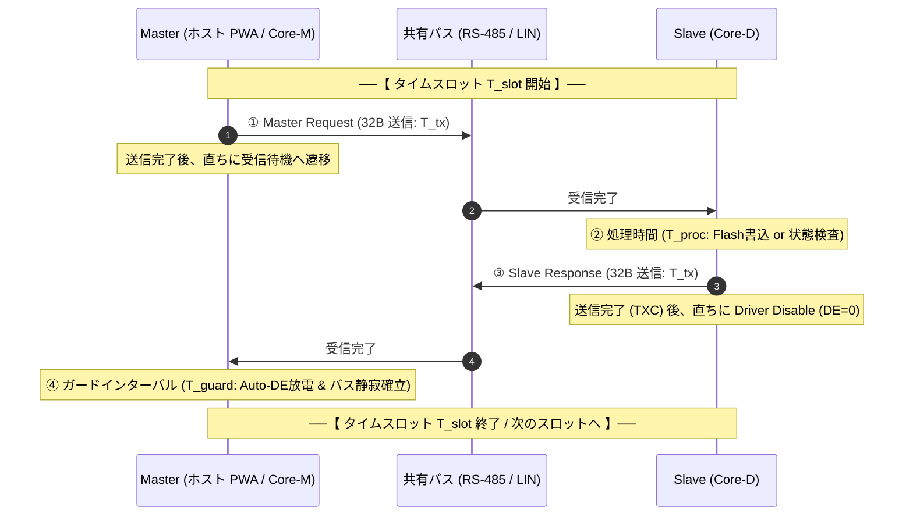
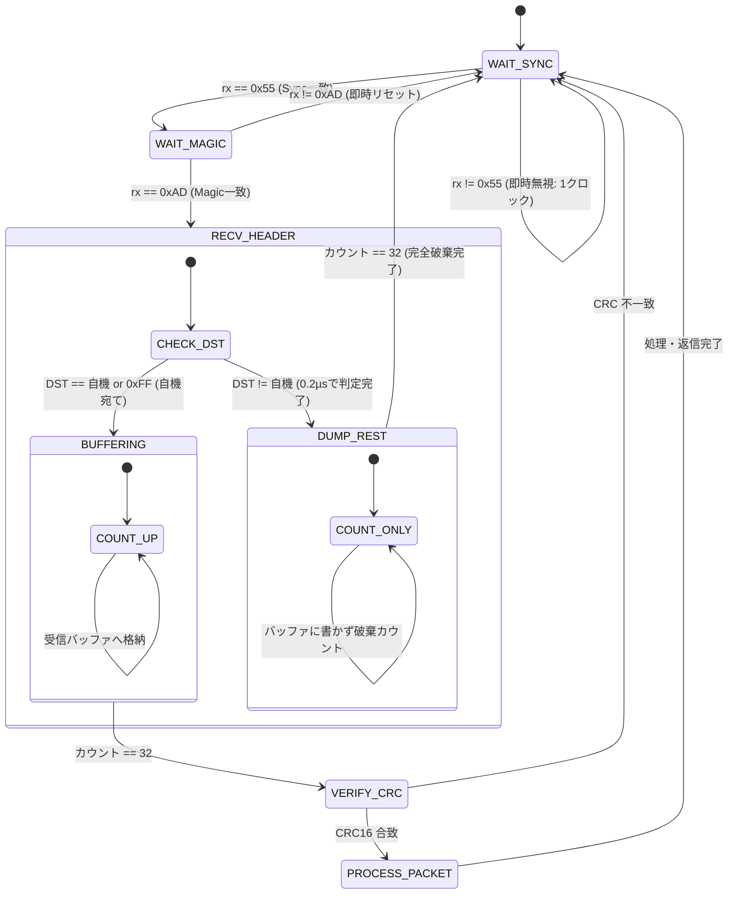

<!--
Copyright (c) 2026 ADX Project Contributors
SPDX-License-Identifier: CC-BY-4.0
-->

# ADX 基幹フィールドネットワーク「LM-32」仕様書 (LM-32 Specification)
〜 LIN-inspired Master-scheduled, 32-byte Fixed-Length Deterministic Protocol 〜

---

## 1. エグゼクティブ・サマリー（LM-32 策定の意義と背景）

### 1.1 命名とコンセプト
**LM-32**（エルエム・サーティーツー）は、**「LIN-inspired Master-scheduled, 32-byte Fixed-Length」** の頭文字を冠した、ADX エコシステムの次世代基幹通信プロトコル規格です。

先行して検討されていた `MR32`（Magic-packet RS-485, 32-byte）をさらに昇華させ、RS-485 という特定の物理層名称から脱却。**「LIN の思想に基づく決定論的マスタースケジューリング」** をプロトコル層（データリンク層）の核として再定義しました。

```text
┌─────────────────────────────────────────────────────────────────────────────┐
│                      【 LM-32 の 5 大コア・バリュー 】                      │
│                                                                             │
│  1. 【LINの思想に準拠】      : 問われた時のみ発言。物理層衝突を原理的にゼロ化 │
│  2. 【プロトコル層の完全抽象】: RS-485、LIN単線、TTL-UART、光絶縁を選ばない   │
│  3. 【完全固定長 32 Bytes】  : タイムスロット確定・ゴミパケット数クロック破棄│
│  4. 【専用ドングル完全撤廃】  : 市販の安価ドングル＋スマホ PWA で即座に直結  │
│  5. 【決定論的時間割】        : 場当たり的なミリ秒待機を排した構造的静寂保証 │
└─────────────────────────────────────────────────────────────────────────────┘
```

---

### 1.2 なぜ CAN ではなく「LIN の思想」なのか（歴史的経緯とコスト構造）

#### (1) ADX の根源的命題
> **「産業用 PLC の信頼性と産業用分散制御を、Arduino クラスの価格にねじ込む」**

この命題において、全ノードに CAN（Controller Area Network）を配備することは、技術的ではなく**「入手性とコスト」**の観点から不可能です。
- **CAN の重い代償**:
  - 非破壊ビット調停（CSMA/CD + AMP）を行うため、高価な CAN コントローラーとトランシーバーが必須。
  - ビット単位の調停クロック同期のため、安価なマイコン内蔵 RC 発振器のジッタを許容できず、高精度水晶振動子が全ノードに必要となる。
- **車載ネットワークが辿った歴史的回答**:
  - 1990年代、自動車業界もドアミラーやパワーウィンドウ等の末端ボディ系 ECU すべてに CAN を配備できずコスト爆発に直面した。
  - その打開策として誕生したのが **LIN（Local Interconnect Network）** である。
  - LIN の天才的割り切りは、**「衝突検出ハードウェアを諦め、安価な UART ＋ 内蔵 RC 発振器で動かす代わりに、時間軸の支配権を唯一のマスターに集中させる」** ことであった。

#### (2) RS-485 の物理的限界と LM-32 の必然性
RS-485 は耐ノイズ性に優れた産業用差動バスですが、CAN のような「優性/劣性ビット調停ハードウェア」を持ちません。したがって、RS-485 上で安価な UART マイコンを使い、衝突をゼロにする唯一の数学的・物理的解は **「LIN の思想（シングルマスター・決定論的スケジューリング）」** です。

LM-32 は、LIN のレガシーな制約（12V単線物理層、20kbps上限、13bitブレーク同期）を取り払い、その**「調停思想」**のみを標準 UART（8N1）上に純粋抽出した規格です。

---

## 2. 階層化アーキテクチャ（Layered Architecture）

LM-32 は純粋なプロトコル層（データリンク層〜トランスポート層）として定義されており、下位の物理層（Layer 1）を完全に隠蔽します。

```text
+-----------------------------------------------------------------------------+
|                     LM-32 プロトコル層 (Layer 2 - Data Link)                 |
|  - LIN思想: Master-driven 決定論的タイムスロット (Speak Only When Spoken To)|
|  - Magic Packet 同期: 0x55 (Sync) + 0xAD (Magic ID)                         |
|  - 32-Byte 完全固定長フレーム (Header 6B + Payload 24B + CRC16 2B)          |
|  - 超高速ノイズ破棄 (Fast Reject) ステートマシン                             |
+-----------------------------------------------------------------------------+
                                      │ 標準 UART (8N1)
                                      ▼
+─────────────────────────────────────────────────────────────────────────────+
|                         物理層 (Layer 1 - Physical)                         |
|                                                                             |
|  [ RS-485 (差動2線式) ]  ── 産業現場標準・最大1,000m・2500V ガルバニック絶縁  |
|  [ LIN (12V単線式) ]     ── 車載・極小配線・超低コストトランシーバー          |
|  [ TTL-UART (3.3V/5V) ]  ── 同一基板内・Raspberry Pi / Core-M 直結          |
|  [ 光アイソレーション ]   ── 高圧インバータ・強電界絶縁伝送                  |
+─────────────────────────────────────────────────────────────────────────────+
```

### 2.1 物理層の独立性と互換性
LM-32 は標準 UART 8N1 バイト列のみで全ての同期・通信を行うため、**極論を言えば LIN の 12V 単線トランシーバー（TJA1021 等）でも、RS-485 差動トランシーバー（SP485 / TDA51S485HC 等）でも、全く同一のマイコンコード・同一のパケット構造で動作します。**

---

## 3. LM-32 フレーム構造（32-Byte Fixed-Length Frame）

すべての通信パケットは、例外なく**厳密に「32バイト完全固定長」**で伝送されます。

```text
 0      1      2        3        4         5       6 ... 29 (24 Bytes)    30    31
┌──────┬──────┬────────┬────────┬─────────┬──────────┬─────────────────────┬─────┬─────┐
│ SYNC │MAGIC │ DST_ID │ SRC_ID │ PKT_CMD │ SEQ_NUM  │       PAYLOAD       │CRC16│CRC16│
│ 0x55 │ 0xAD │ (1B)   │ (1B)   │  (1B)   │   (1B)   │     (24 Bytes)      │(LSB)│(MSB)│
└──────┴──────┴────────┴────────┴─────────┴──────────┴─────────────────────┴─────┴─────┘
 ├── ヘッダー (6 Bytes) ─────────────────────────────┤ ├── データ本体 (24B) ──┤ ├─ CRC (2B) ┤
```

### 3.1 各フィールドの詳細仕様

| オフセット | フィールド名 | サイズ | 設定値 | 役割と動作仕様 |
| :---: | :--- | :---: | :--- | :--- |
| **0** | **`SYNC`** | 1B | `0x55` 固定 | **物理同期バイト（`01010101b`）**。<br>LIN の伝統を継承する交互ビット波形。UART 受信位相を中央に強制ロックし、ボーレート測定の基準クロックとなる。 |
| **1** | **`MAGIC`** | 1B | `0xAD` 固定 | **ADX マジック識別子（"ADX" の AD）**。<br>ブレーク信号を使用せず、標準 UART バイト列のみでパケット開始を確定する。 |
| **2** | **`DST_ID`** | 1B | `0x00`〜`0xFF` | **宛先ノードID**。<br>・`0x00`: ホスト（PC/スマホ Master）<br>・`0x01`〜`0xFE`: 個別 ADX スレーブノード（最大254台）<br>・`0xFF`: 全ノード同報（ブロードキャスト） |
| **3** | **`SRC_ID`** | 1B | `0x00`〜`0xFE` | **送信元ノードID**。レスポンス返信先の指定に使用。 |
| **4** | **`PKT_CMD`** | 1B | `0x00`〜`0xFF` | **コマンドコード**（システム制御、Flash書込、相互通信など）。 |
| **5** | **`SEQ_NUM`** | 1B | `0x00`〜`0xFF` | **シーケンス番号**。タイムスロット単位のパケット重複・脱落判定用。 |
| **6〜29** | **`PAYLOAD`** | **24B** | 任意データ | **データペイロード（24バイト固定）**。<br>未使用バイトは `0x00` でパディング。 |
| **30〜31** | **`CRC16`** | 2B | `0x0000`〜`0xFFFF` | **CRC-16-CCITT（多項式 `0x1021`, 初期値 `0xFFFF`）**。<br>計算範囲: Byte 2（`DST_ID`）〜 Byte 29（`PAYLOAD`末尾）の計 28 バイト。 |

---

## 4. 決定論的タイムスロット設計（Deterministic Time Slot）

LM-32 の最大の特徴は、**「ミリ秒待機（`delay`）の場当たり的挿入」を完全に排除し、マスター主導の決定論的タイムスロットによってバス静寂とターンアラウンドを構造的に保証する** 点にあります。

### 4.1 トランザクション・基本原則（Speak Only When Spoken To）
1. **スレーブの自発的送信の絶対禁止**:
   スレーブ（Core-D 等）は、マスターから自機宛ての Request パケットを受信しない限り、**1ビットたりとも送信してはならない**。
2. **1 トランザクション ＝ 1 タイムスロット**:
   マスターがフレームを送出し、スレーブが応答し、バスが静寂に戻るまでを **単一のタイムスロット ($T_{slot}$)** として定義する。



### 4.2 時間予算（Time Budget）と市販安価ドングルへの完全適応

市販の安価な USB-RS485 ドングル（CH340 搭載品等）は、ハードウェア送信イネーブル（DE）ピンを持たず、TX 信号をコンデンサと抵抗（RC回路）で積分して DE を生成する **Auto-DE 回路** を採用しています。
このため、送信完了後に受信モード（DE=0）へ戻るまでに **約 0.5 ms 〜 1.0 ms の放電遅延** が物理的に発生します。

LM-32 は、この物理遅延をタイムスロットの時間予算に明示的に組み込むことで、**数百円の安価ドングルでも一切のパケット先頭欠落を生じさせない** 設計となっています。

#### ボーレート別タイムスロット設計値

| 項目 | 記号 | 115,200 bps | 57,600 bps | 19,200 bps | 備考 |
| :--- | :---: | :---: | :---: | :---: | :--- |
| **1バイト伝送時間** | $t_{byte}$ | $86.8\,\mu\mathrm{s}$ | $173.6\,\mu\mathrm{s}$ | $520.8\,\mu\mathrm{s}$ | 10 bits (8N1) |
| **32B フレーム伝送時間** | $T_{tx}$ | **$2.78\,\mathrm{ms}$** | **$5.56\,\mathrm{ms}$** | **$16.67\,\mathrm{ms}$** | 32 バイト送信 |
| **スレーブ応答前マージン** | $T_{turn}$ | $0.80\,\mathrm{ms}$ | $1.20\,\mathrm{ms}$ | $2.00\,\mathrm{ms}$ | Auto-DE 放電待ちマージン |
| **Flash ページ書込時間** | $T_{flash}$ | $2.50\,\mathrm{ms}$ | $2.50\,\mathrm{ms}$ | $2.50\,\mathrm{ms}$ | ATtiny1616 内蔵EEPROM/Flash |
| **ガードインターバル** | $T_{guard}$ | $1.00\,\mathrm{ms}$ | $2.00\,\mathrm{ms}$ | $3.00\,\mathrm{ms}$ | スロット末尾の完全静寂時間 |
| **標準タイムスロット周期** | **$T_{slot}$** | **$10.0\,\mathrm{ms}$** | **$18.0\,\mathrm{ms}$** | **$45.0\,\mathrm{ms}$** | **マスターが刻む確定周期** |

> [!TIP]
> マスター（PWA / ホスト）は、スレーブからの返信を非同期に待つのではなく、**「$T_{slot}$ 周期のタイマー」** に従って整然とトランザクションを駆動します。これにより、OS のタイマージッタやドライバ遅延に依存しない堅牢な通信が成立します。

---

## 5. スレーブ応答シーケンス規範（「1に静寂、2に即応」の原則）

LM-32 におけるスレーブ（Core-D 等）の通信動作は、**「1に静寂、2に即応（Silence First, Immediate Response Second）」** を絶対的な思想的骨子とします。

半二重共有バス（RS-485 / LIN）において、不確定な状態での返信やタイミング外れの返信はバス全体を汚染し、マスターの時間割（タイムスロット）を破壊します。そのため、**「疑わしきは徹底して沈黙し、正当なパケットに対してのみジッタなく即座に応答する」** 規範を定めます。

```text
┌─────────────────────────────────────────────────────────────────────────────┐
│                 【 スレーブ応答シーケンス 4 大原則 】                       │
│                                                                             │
│  第1則: マジックパケット異常       ──► 【破棄・沈黙】 (返信しない)          │
│  第2則: 32バイト未達 (短データ)    ──► 【破棄・沈黙】 (返信しない)          │
│  第3則: 32バイト超過 (長データ)    ──► 【破棄・沈黙】 (返信しない)          │
│  第4則: 32バイト完備 ＋ CRC検証                                             │
│         ├─ 4-1. CRC 不一致         ──► 【CRC Error 返信】 (即座に再送要求)  │
│         └─ 4-2. CRC 一致           ──► 【正常応答 返信】                   │
│                 └─ 4-2-1. 【応答優先の原則】                                │
│                     (計算を実行してから返答してはならない。即応が絶対)      │
└─────────────────────────────────────────────────────────────────────────────┘
```

### 5.1 各原則の詳細仕様

#### 第1則: マジックパケット（Sync/Magic）異常
- `SYNC (0x55)` または `MAGIC (0xAD)` の認識がおかしいデータを受信した場合、スレーブは即座に受信状態をリセットし、**一切返信してはならない（破棄・沈黙）**。
- バス上の偶発ノイズや他プロトコルのパケットに対して沈黙を守ることで、バスの平穏を保つ。

#### 第2則: 32バイト未達（短データ・時間切れ）
- パケット長が 32 バイトに到達すべき時間枠内に 32 バイト揃わなかった場合、スレーブは受信バッファを破棄し、**一切返信してはならない（破棄・沈黙）**。
- 途絶えた不完全パケットに応答すると、マスター側の再送パケットとバス上で衝突するため、沈黙を義務付ける。

#### 第3則: 32バイト超過（長データ・ゴミ混入）
- パケット長が 32 バイトを超えて垂れ流されている場合、スレーブはそれ以降のデータを破棄し、**一切返信してはならない（破棄・沈黙）**。
- バス上でバーストノイズやフレーミング異常が発生していると判断し、バスが静寂に戻るまで沈黙する。

#### 第4則: 32バイト完備時の CRC チェックと応答分岐
32バイトが過不足なく完全に揃った場合のみ、スレーブは CRC-16-CCITT を検証する。

- **4-1. CRC 不一致の場合（CRC Error 返信）**:
  パケット形式は正しく自機宛てであるが、データが破損している場合、スレーブは **明示的に「CRC Error レスポンス」を返信する**。
  - *意義*: マスターはタイムアウト（無応答）を待つことなく、パケットがビット化けした事実を即座に認知し、最小の遅延で自動再送（ARQ）を実行できる。
- **4-2. CRC 一致の場合（正常応答返信）**:
  パケットが正常である場合、スレーブは何らかの応答データ（ACK、テレメトリ値、ステータス）を含んだ返信を行う。

---

### 5.2 応答優先の原則（Rule 4-2-1: Response-First Principle）

> [!IMPORTANT]
> **「4-2 の時、返信直前までの間に、すでにあるメモリ等にあったデータをパケットに載せることはできるが、受信したデータからなにか計算を実行してから返答してはならない。」**

これは決定論的リアルタイム通信における最も重要な原則です。

1. **通信ジッタの完全排除**:
   受信したデータをもとに重い計算（Flash 書き込み、浮動小数点演算、暗号化など）を行ってから返答しようとすると、応答時間がデータ内容によって変動し、マスター側のタイムスロット時間予算が崩壊する。
2. **「返信が先、重い処理は後」の徹底**:
   - スレーブは、受信した要求に対して **数マイクロ秒以内（既存メモリ・ステータスの即座コピーのみ）で応答パケットを送出し終えなければならない**。
   - 重い処理（例: Flash ページへの物理書き込み 約 2.5ms）は、**応答パケットの送信完了後（TXC 確認後）、スロット末尾のガードインターバル（静寂期間）を利用してバックグラウンドで実行する**。

#### ブートローダー（Flash 書き込み）での適用例
```text
【従来（非決定論的: ジッタ発生）】
  Chunk 3 受信 ──► Flash 物理書込 (2.5ms 待機) ──► ACK 返信
  (※ Chunk 0〜2 は 0.1ms で返るのに、Chunk 3 だけ 3ms 後に返るため時間割が崩壊)

【LM-32 準拠（決定論的: 完全即応）】
  Chunk 3 受信 ──► 即座に ACK 返信 (0.1ms) ──► Flash 物理書込開始 (2.5ms)
  (※ すべての Chunk の返信タイミングが完全に均一化され、ドングルの放電遅延とも干渉しない)
```

---

## 6. 運用形態の対称性（1対1 と マルチドロップの統一）

LM-32 の LIN 思想により、**「単体ファームウェア更新（1対1）」** と **「現場での複数ノード連結運用（マルチドロップ）」** が、完全に同一のプロトコルスタック・同一のステートマシンで動作します。

```text
【形態 A: 1対1 通信（現場ファームウェア更新 / OTW）】
  [ Android スマホ / PC (PWA) ] ── (USB-RS485) ── [ Core-D (Bootloader) ]
               ▲                                         ▲
            (Master)                                  (Slave)

【形態 B: マルチドロップ通信（通常プラント運用 / テレメトリ）】
  [ Core-M / 親機 PLC ] ──┬── (共有バス RS-485 / LIN) ──┬── [ Core-D #1 ]
            ▲             │                             ├── [ Core-D #2 ]
         (Master)         │                             └── [ Core-D #3 ]
```

### スレーブ側ファームウェアの対称性
Core-D から見れば、通信相手が「作業者の Android スマホ」であれ「Core-M 親機」であれ、自身の振る舞いは全く同一です：
- 「自分宛ての Request（`DST_ID == MyID`）が来たら、処理を行い、Response を 1 回だけ返して受信に戻る」
- この単一ルールのみで動作するため、ブートローダーにも通常スケッチにも、無駄なモード切替や条件分岐が一切不要となります。

---

## 7. 超高速破棄（Fast Reject）ステートマシン

固定長 ＋ `0x55 0xAD` ヘッダーにより、受信マイコンは自機宛てでないパケットやバス上のノイズを**数マイクロ秒以内（数 CPU クロック）で超高速破棄**します。



### ノイズ排除性能
1. **第1関門 (`0x55`)**: バス上のランダムノイズが `0x55` でない限り、ステートマシンは 1 クロックも前進しない。
2. **第2関門 (`0xAD`)**: 偶然 `0x55` を拾っても、次が `0xAD` でなければ即座にリセット（この時点でノイズの **99.6%** を排除）。
3. **第3関門 (`DST_ID`)**: 自機宛てでなければ、以降の 29 バイトを RAM に一切書き込まず読み飛ばすため、マルチドロップ接続時でも他機宛てパケットによるスレーブの CPU 負荷は **0.2% 以下** に抑えられる。

---

## 8. Flash 64B メモリ転送モデル（16B × 4ブロック方式）

ATtiny1616 の Flash メモリは **1 ページ ＝ 64 バイト** です。
LM-32 の 24 バイトペイロードを活かし、**1 ページを「16 バイト × 4 チャンク」で転送** する極めてフットプリントの小さいシーケンスを採用します。

### 7.1 なぜ 16 バイト × 4 なのか？
- **2のべき乗（$16 = 2^4$）の絶対的優位性**:
  ページ内オフセット計算が `chunk_idx << 4` のビットシフト 1 発で完了します。
  除算・乗算コードが一切生成されないため、ブートローダーの Flash 消費量を最小化できます。

### 7.2 OTW 書き込みトランザクション（WU-4 トラック）

```text
1ページ (64B) の書き込みサイクル:
  Slot 0: [CMD=0x11] Chunk 0 (16B) 送信 ──► ACK 返信 (バッファ前半に展開)
  Slot 1: [CMD=0x11] Chunk 1 (16B) 送信 ──► ACK 返信 (バッファ中盤に展開)
  Slot 2: [CMD=0x11] Chunk 2 (16B) 送信 ──► ACK 返信 (バッファ後半に展開)
  Slot 3: [CMD=0x11] Chunk 3 (16B) 送信 ──► 物理 Flash 書込 (約2.5ms) ──► ACK 返信
```

#### 12KB（全192ページ）書き込み時間
- 1 チャンク所要スロット: $10.0\,\mathrm{ms}$（115.2 kbps 時）
- 1 ページ所要時間: $10.0\,\mathrm{ms} \times 4 = 40.0\,\mathrm{ms}$
- **12KB（192 ページ）総書き込み時間**: **約 7.68 秒**（理論値）

---

## 9. コマンド体系（LM-32 Command Space）

LM-32 の `PKT_CMD`（Byte 4）は、システム管理からユーザー空間まで直感的に分類されます。

```text
┌─────────────────────────┬────────────────────────────────────────────────────────┐
│ コマンド領域            │ 用途・役割                                             │
├─────────────────────────┼────────────────────────────────────────────────────────┤
│ 0x00 〜 0x0F (16個)     │ BMC 基板管理・電源制御専用 (Baseboard Management)      │
│ 0x10 〜 0x1F (16個)     │ メイン MCU ブートローダー専用 (Flash 書込・検証・起動) │
│ 0x20 〜 0x3F (32個)     │ ADX 公式 CARD・周辺機器制御 (Power CARD, Relay, DAC)   │
│ 0x40 〜 0x7F (64個)     │ 標準メッセージング (Pub/Sub, テレメトリ, ハートビート) │
│ 0x80 〜 0xFF (128個)    │ ユーザー定義スケッチ用自由空間                         │
└─────────────────────────┴────────────────────────────────────────────────────────┘
```

### 主要システムコマンド一覧

| コマンド名 | コード | ペイロード内訳 (24B) | 応答 | 動作仕様 |
| :--- | :---: | :--- | :---: | :--- |
| **`CMD_BMC_ENTER_BOOT`** | `0x01` | 予約 (0x00 パディング) | ACK | BMC 宛て。MCU をリセットしブートローダー待受へ。 |
| **`CMD_BMC_BOOT_DONE`**  | `0x02` | 予約 (0x00 パディング) | ACK | BMC 宛て。書き込み完了を告げ通常動作へ。 |
| **`CMD_BOOT_PING`**      | `0x10` | 予約 (0x00 パディング) | ACK (DevInfo) | ブートローダーの生存確認および MCU 型番・メモリ構成の取得。 |
| **`CMD_BOOT_WRITE_CHUNK`**| `0x11`| `Page(2B)` + `Chunk(1B)` + `Data(16B)` + `Pad(5B)` | ACK | 指定ページ・チャンク（16B）へのデータ転送。 |
| **`CMD_BOOT_CRC_CHECK`** | `0x13` | `StartPage(2B)` + `NumPages(2B)` + `Pad(20B)` | ACK (CRC16) | 書込済み Flash 領域の一括ハードウェア CRC16 照合。 |
| **`CMD_BOOT_APP_EXEC`**  | `0x14` | 予約 (0x00 パディング) | ACK | アプリケーション領域へジャンプしスケッチ起動。 |
| **`CMD_APP_TELEMETRY`**  | `0x40` | `SensorType(1B)` + `Value(4B)` + 任意データ | 任意 | スケッチ間相互通信・計測値配信。 |

---

## 10. 通信速度自動適応（Auto-Rate Negotiation）

様々な品質の USB-RS485 ドングルや長距離配線に対応するため、マスター主導の安全な速度適応シーケンスを規定します。

```text
[ ステップ 1: 最安全レートで起動 ]
  Master は最も安全な 19,200 bps で CMD_BOOT_PING スロットを発行。
  Core-D からの DevInfo ACK を受信し、基本導通を確立。

[ ステップ 2: 高速レート合意テスト ]
  Master が「115,200 bps 昇格要求」を発行。
  両者がポートを 115,200 bps に切り替え、テスト PING を 1 トランザクション送受。

[ ステップ 3: 確定またはフォールバック ]
  ・成功時: 115,200 bps を維持して高速 OTW 書込へ突入。
  ・失敗時: 57,600 bps または 19,200 bps にフォールバックして確実に書き込み完遂。
```

---

## 11. まとめと今後の実装展開

LM-32 プロトコル仕様の策定により：
1. **「なぜ LIN なのか、なぜ CAN ではないのか」というコストと調停の物理的必然性が完全に言語化・規格化された。**
2. **「RS-485 に縛られないプロトコル層の独立」により、LIN 単線や TTL-UART 等、将来の多様なハードウェア展開への道が拓かれた。**
3. **「決定論的タイムスロット」の導入により、市販安価ドングルの物理遅延を克服し、場当たり的なミリ秒待機を完全に撲滅した。**

本仕様に基づき、ブートローダー（`m4_bootloader.c`）、PWA Web Flasher、および Android APK（Bridge）の実装整合を進めます。
