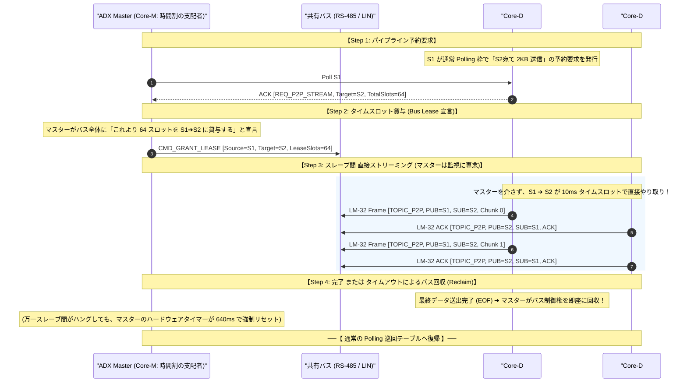

# LM-32 ライブラリ開発構想とアーキテクチャ計画書
〜 The Triad Architecture: `lm32.h` (MCU) ── `LM-32 Protocol` ── `lm32.js` (Web/App) 〜

**文書種別**: ソフトウェア構想設計・ライブラリ開発計画書 (Architecture & Development Plan)  
**作成日**: 2026-10-02  
**ステータス**: PROPOSED / DRAFT  
**対象リポジトリ**: `github/ADX`  
**準拠規格**: [LM-32 プロトコル仕様書 (LM32_PROTOCOL_SPECIFICATION.md)](file:///home/ubuntu/AgentWorkspace/ADX/github/ADX/memo/LM32_PROTOCOL_SPECIFICATION.md)  

---

## 1. エグゼクティブ・サマリー（ライブラリ策定の動機と意義）

### 1.1 背景：プロトコル規格から「生きた実装」へ
[LM32_PROTOCOL_SPECIFICATION.md](file:///home/ubuntu/AgentWorkspace/ADX/github/ADX/memo/LM32_PROTOCOL_SPECIFICATION.md) の策定により、ADX 基幹ネットワークは以下の哲学的・工学的基盤を獲得しました：
1. **LIN 思想の徹底**: 「問われた時のみ発言（Speak Only When Spoken To）」による物理層衝突の原理的排除。
2. **スレーブ規範**: 「1に静寂、2に即応」および「4-2-1 応答優先の原則（計算前返信）」。
3. **マスター規範**: 「確定巡回周期の死守」および「No retry in a poll（同一巡回内再送禁止）」。
4. **2 大通信系統**: 分散制御・Pub/Sub を担う **「Polling 系」** と、12KB Flash 書換を担う **「Streaming 系」**。
5. **物理アンカー**: ATtiny1616 の 10 バイト固有シリアル（`SIGROW.SERNUM`）による安全な束縛（Binding）。

しかし、どれほど美しいプロトコル規格も、**「開発者が直感的かつ安全に扱えるライブラリ群」** が存在しなければ真の普及は果たせません。
現場の開発者が場当たり的な `_delay_ms()` や泥縄式のバッファリングコードを書くのを防ぎ、規格の精神を **「一行の API 呼び出し」** で自動遵守させるためのライブラリエコシステムを構想します。

---

### 1.2 三位一体（The Triad）アーキテクチャ
本構想の中核は、**「組込 MCU（C/C++）」**、**「ブラウザ/スマホ（TypeScript/JS）」**、**「検証・CI（Python）」** の 3 つの実装が、不変の LM-32 プロトコル（32B固定長）を挟んで完全に鏡像関係（ミラー）を成す三位一体アーキテクチャです。

```text
┌─────────────────────────────────────────────────────────────────────────────┐
│                       【 LM-32 三位一体エコシステム 】                      │
├──────────────────────────┬──────────────────────────┬───────────────────────┤
│ ① 組込 MCU スタック      │ ② Web / スマホ スタック │ ③ 検査・運用 CLI      │
│     「 adx-lm32.h 」     │     「 @adx/lm32 」      │     「 lm32-py 」     │
├──────────────────────────┼──────────────────────────┼───────────────────────┤
│ ・Flash < 1KB, RAM < 96B │ ・WebSerial / WebUSB /   │ ・自動回帰テスト      │
│ ・超高速破棄 (0.2µs)     │   Android WebView Bridge │ ・実機ベンチマーク    │
│ ・「1に静寂、2に即応」   │ ・メトロノーム型タイマー │ ・パケットスニファ    │
│ ・SIGROW 自動 Binding    │ ・OTW 連続ストリーマー   │ ・量産 Flash 書込機   │
└──────────────────────────┴──────────────────────────┴───────────────────────┘
                                       │
                    ▼                  ▼                  ▼
┌─────────────────────────────────────────────────────────────────────────────┐
│                 共通核: LM-32 決定論的 32バイト固定長プロトコル              │
│       [SYNC:0x55][MAGIC:0xAD][TOPIC_ID][PUB_ID][SUB_ID][SEQ_NUM][DATA:24B]  │
└─────────────────────────────────────────────────────────────────────────────┘
```

---

## 2. 組込 MCU ライブラリ構想：`adx-lm32.h` / `liblm32`

### 2.1 設計目標と厳しい制約
- **ターゲット MCU**: Microchip ATtiny1616 (Flash 16KB / SRAM 2KB), ATtiny412 (Flash 4KB / SRAM 256B), および将来の ARM (RP2040, STM32, RA4M1 等)。
- **ブートローダー共存制約**: ブートローダー領域（最大 1KB〜2KB）に収まる **極小コア版（`lm32_mini.h`）** を提供すること。
- **動的メモリ確保（malloc）の完全禁止**: すべてのバッファ・状態変数は静的（Static）に確保。

### 2.2 階層構造（Layered Architecture）

```text
+-----------------------------------------------------------------------------+
| Layer 4: アプリケーション・プロファイル (Application Profiles)              |
|  - Telemetry Profile : センサー値の定期 Pub/Sub 配信                        |
|  - Actuator Profile  : 指令受信と即時ステータス応答                         |
|  - OTW Boot Profile  : SIGROW 束縛 & 16B×4 Flash ページストリーミング      |
+-----------------------------------------------------------------------------+
| Layer 3: LM-32 スレーブ・プロトコルエンジン (Protocol Engine)                |
|  - 「1に静寂、2に即応」判定ステートマシン                                   |
|  - 「4-2-1 応答優先の原則」: 最新キャッシュ即答 ➔ 後処理バックグラウンド起動 |
|  - SIGROW 照合 & セッション ID ロック機構                                   |
+-----------------------------------------------------------------------------+
| Layer 2: フレーマー & 超高速破棄 (Framer & Fast Reject)                     |
|  - 0x55 0xAD 同期検出 / SUB_ID・購読トピック合致判定 (0.2µs で破棄)         |
|  - CRC-16-CCITT 高速計算ルーチン                                            |
+-----------------------------------------------------------------------------+
| Layer 1: ハードウェア抽象化 (Hardware Abstraction Layer - HAL)               |
|  - USART0 / USART1 ドライバ (標準 8N1)                                      |
|  - RS-485 DE/!RE ピン制御 (TXC 完了割り込み連動)                            |
|  - Auto-DE ドングル / LIN 単線トランシーバー対応抽象化                      |
+-----------------------------------------------------------------------------+
```

### 2.3 スケッチ側 API デザイン（Arduino / C++ 想定）

利用者は、重い通信制御やタイマー計算を意識する必要はありません。「購読するトピック」と「聞かれた時に返すデータ」を登録するだけで、LM-32 の厳格なプロトコルを 100% 満たすコードが完成します。

```cpp
#include <ADX_LM32.h>

// Core-D の RS-485 ピンアサインでスレーブ初期化
ADX_LM32_Slave bus(USART0, PIN_RS485_DE, PIN_RS485_RE);

// 最新のセンサー値を保持する構造体 (応答優先のため、常に最新値をメモリに準備)
volatile struct {
    float temperature;
    float pressure;
} telemetry_cache;

void setup() {
    // 115,200 bps でバス初期化 (自動で内蔵 SIGROW を読み込みアンカーとする)
    bus.begin(115200);

    // ① Pub/Sub テレメトリの登録: トピック 0x40 (環境計測値) のプロバイダとして登録
    // ※ マスターから「お前の番だ」と振られた瞬間、計算せずメモリのキャッシュを即座に送出！
    bus.onProvide(TOPIC_ENV_TELEMETRY, [](uint8_t *payload24) {
        memcpy(payload24, (const void*)&telemetry_cache, sizeof(telemetry_cache));
    });

    // ② 制御コマンドの購読: トピック 0x20 (バルブ開度指示) を受信した時のコールバック
    // ※ 応答優先原則: ACK はライブラリが即座に返し、コールバックは返信完了後に実行される
    bus.subscribe(TOPIC_VALVE_CMD, [](const uint8_t *payload24) {
        uint8_t target_pos = payload24[0];
        setValvePosition(target_pos);
    });
}

void loop() {
    // センサー計測を行い、キャッシュを更新 (通信とは非同期に実行)
    telemetry_cache.temperature = readTempSensor();
    telemetry_cache.pressure    = readPressureSensor();

    // 通信ステートマシン更新 (数マイクロ秒で抜けるノンブロッキング処理)
    bus.update();
}
```

---

## 3. Web / スマホ クライアントライブラリ構想：`@adx/lm32`

### 3.1 開発目標：専用ソフト・専用ドライバの完全撤廃
- **実行環境**: Google Chrome（PC / Android）、PWA（Progressive Web Apps）、および Android WebView Native Bridge（APK）。
- **通信バックエンドの透過性**:
  ブラウザの `navigator.serial`（WebSerial）でも、Android の `AdxNativeBridge`（USB Host API）でも、全く同一のコードで動作する **I/O アダプタ層** を内蔵。

### 3.2 コアモジュール構成

```text
@adx/lm32
├── io/
│   ├── ISerialPort.ts          # 共通シリアルインターフェース
│   ├── WebSerialAdapter.ts     # ブラウザ WebSerial 実装
│   └── AndroidBridgeAdapter.ts # Android WebView ネイティブ USB 実装
├── protocol/
│   ├── LM32Frame.ts            # 32B 固定長パケットのシリアライズ / パース
│   ├── CRC16.ts                # CRC-16-CCITT 高速テーブル計算
│   └── Constants.ts            # トピック ID、コマンド定義
├── master/
│   ├── LM32Scheduler.ts        # 決定論的メトロノーム・タイマー駆動エンジン
│   ├── PollingQueue.ts         # 「No retry in a poll」ラウンドロビンキュー
│   └── AutoRateDetector.ts     # 19.2k ➔ 115.2k 速度自動交渉エンジン
└── streaming/
    ├── OtwFlasher.ts           # SIGROW 束縛 & 12KB Flash ストリーマー
    └── HexParser.ts            # Intel HEX ➔ 64B Flash ページ展開
```

### 3.3 クライアント側 API デザイン（TypeScript / JavaScript 想定）

#### (1) 通常 Polling（Pub/Sub テレメトリ監視）
```typescript
import { LM32Master, WebSerialAdapter } from '@adx/lm32';

// ポート接続とマスター初期化
const port = await navigator.serial.requestPort();
const bus = new LM32Master(new WebSerialAdapter(port));
await bus.begin({ baudRate: 115200, slotTimeMs: 10 });

// トピック購読 (マルチドロップバス上の特定ノードまたは全員のデータを傍聴)
bus.subscribe(TOPIC_ENV_TELEMETRY, (frame) => {
    const temp = frame.payload.getFloat32(0);
    const pres = frame.payload.getFloat32(4);
    updateDashboardUI(frame.pubId, temp, pres);
});

// スケジュール開始 (メトロノームのように一定周期で巡回ポーリング)
bus.startPolling([NODE_CORE_D1, NODE_CORE_D2, NODE_CORE_D3]);
```

#### (2) 高速 OTW ファームウェア更新（Streaming 系）
```typescript
import { OtwFlasher } from '@adx/lm32';

const flasher = new OtwFlasher(bus);

// 1. 自動検出 (1対1 直結時: SIGROW ワイルドカードによる探索)
const targetDevice = await flasher.discover();
console.log(`検出デバイス: ${targetDevice.mcuType}, SIGROW: ${targetDevice.sigrowHex}`);

// 2. 束縛 & 高速ストリーミング書き込み (12KB / 192ページ)
await flasher.flash(hexFileContent, {
    targetSigrow: targetDevice.sigrow,
    baudRate: 115200,
    onProgress: (current, total) => {
        updateProgressBar(current / total);
    }
});

console.log("書き込み & ハードウェア CRC 検証完了！新スケッチが起動しました。");
```

---

## 4. 2大通信系統の実装ロードマップ

本ライブラリの開発は、現在進行中の実機検証（Core-D 12KB OTW）を直接救済しつつ、段階的にマルチドロップ自律分散環境へとスケールアップする **4 フェーズ構成** で進めます。

| フェーズ | 主要開発タスク | 期間 | 依存関係 |
| :--- | :--- | :---: | :--- |
| **Phase 1: OTW 直結救済 (Streaming)** | ・C極小コア (`lm32_mini.h`) 整備<br>・`m4_bootloader.c` への LM-32 規格適用<br>・Web/Android `OtwFlasher` 実装<br>・12KB 実機 OTW 書き込み完全合格 | 10日 | 最優先着手 |
| **Phase 2: スレーブ標準化 (Polling)** | ・Arduino用 `ADX_LM32_Slave` 開発<br>・「1に静寂、2に即応」自動遵守検証<br>・Pub/Sub テレメトリサンプル作成 | 10日 | Phase 1 完了後 |
| **Phase 3: マスター巡回 (Master Engine)** | ・Core-M 向け C++ スケジューラ開発<br>・「No retry in a poll」確定周期実証<br>・Auto-Rate (速度自動適応) 実装 | 11日 | Phase 2 完了後 |
| **Phase 4: エコシステム完成** | ・Python CLI・解析ツール (`lm32-py`)<br>・WebGOT (ブラウザ版プログラマブル表示器) | 9日 | Phase 3 完了後 |

### Phase 1: OTW 直結救済フェーズ（最優先）
- **ゴール**: 現在の M4 ブートローダーと Android APK / PWA の通信を LM-32 規格に完全準拠させ、市販安価ドングルによる 12KB OTW 書き込みを 100% 成功させる。
- **成果物**:
  1. `firmware/inc/lm32_mini.h`: ブートローダー専用の極小パケットパーサー＆CRCルーチン。
  2. `firmware/sandbox/M_milestones/M4_full_otw/m4_bootloader.c` の LM-32 準拠改修（「4-2-1 応答優先」の実装：ACK 即時返信後の Flash 物理書き込み）。
  3. `software/sandbox/adx-mr32-flasher.apk` 内の JavaScript を `OtwFlasher`（確定タイムスロット駆動）へ刷新。

### Phase 2: スレーブ標準ライブラリ化フェーズ
- **ゴール**: ユーザーが Arduino IDE でスケッチを書く際、`#include <ADX_LM32.h>` とするだけで LM-32 スレーブノードとして動作できるようにする。
- **成果物**:
  1. `libraries/ADX_LM32/`: 公式 Arduino ライブラリ。
  2. 割り込み駆動型 UART バッファリングと超高速破棄（Fast Reject）の実装。

### Phase 3: マスタースケジューラ開発フェーズ
- **ゴール**: 親機ユニット（Core-M や Raspberry Pi、PC）がバス上の全 Core-D を決定論的タイムスロットで巡回・統括できるようにする。
- **成果物**:
  1. `ADX_LM32_Master`: 確定周期タイマー（$T_{slot}$）駆動型スケジューラ。
  2. 「No retry in a poll」によるジッタゼロのラウンドロビンポーリング。
  3. 通信速度自動交渉（Auto-Rate Negotiation: 19.2k ➔ 115.2k）の実装。

### Phase 4: ツール・GUI・エコシステム完成フェーズ
- **ゴール**: 現場でのトラブルシューティング、量産書き込み、およびブラウザ上でのリッチな HMI（WebGOT）の実現。
- **成果物**:
  1. `adx-lm32-cli` (Python): バストラフィックのリアルタイムスニファ＆ヘルスチェックツール。
  2. ブラウザ上でメーターやボタンをノーコード配置できる WebGOT 統合。

---

## 6. 高度分散アーキテクチャ（ADX Master ＆ Slave-to-Slave Streaming）

LM-32 は、PC/スマホとマイコンを繋ぐツールにとどまらず、**「ADX マイコン自身がマスターとなり、自律分散協調する産業用ネットワーク」** を完全サポートします。

```text
┌─────────────────────────────────────────────────────────────────────────────┐
│                 【 ADX 高度分散アーキテクチャの 2 大柱 】                   │
├─────────────────────────────────────┬───────────────────────────────────────┤
│  ① ADX マイコン・マスター (Core-M)  │  ② スレーブ間 P2P ストリーミング      │
├─────────────────────────────────────┼───────────────────────────────────────┤
│ ・OS ジッタ完全ゼロの HW タイマー   │ ・センサ ➔ 演算ノードへの直接大容量伝送│
│ ・夜間自動 OTW ディストリビューター │ ・マスター中継オーバーヘッドの排除    │
│ ・動的スケジュール配分・切替        │ ・タイムスロット貸与 (Bus Lease) 機構 │
└─────────────────────────────────────┴───────────────────────────────────────┘
```

### 6.1 ADX マイコンがマスター（Core-M 親機等）となる場合
マスターが PC やスマホではなく **「ADX マイコン自身（Core-M や代表 Core-D）」** となる場合、通信品質と自律性は究極の領域に到達します。

1. **極限の決定論的タイマー（ジッタ < 0.1 µs）**:
   汎用 OS（Linux/Android/Windows）のスケジューリング遅延から完全に解放されます。MCU 内蔵の 16bit/32bit ハードウェアタイマー（TCB/TCA 等）を直接割り込み駆動することで、水晶振動子精度の **完全無欠な 10.000 ms タイムスロット** を刻み続けます。
2. **自律無人 OTW ディストリビューター**:
   Core-M 親機が SD カードや上位クラウドから新ファームウェア（HEX）を取得し、現場の全 Core-D の SIGROW を走査。作業者が現場に赴くことなく、**夜間に全ノードへの OTW ストリーミング書き込みと整合性検証（CRC）を完全自動実行** します。
3. **動的スケジュールテーブルの切り替え**:
   平常時は全ノード均等の「Polling 巡回テーブル」を回し、ノードから異常・緊急イベントを受信した瞬間に「緊急優先スロット」や「高速診断ストリーミング」へと動的にタイムスロット配分を組み替えます。

---

### 6.2 スレーブ間通信（Slave-to-Slave P2P Streaming）の構造設計

#### (1) 背景と必要性
- 例えば「高速振動センサノード（Core-D #1）」が、取得した大容量の生加速度波形（2KB〜4KB）を「FFT解析・エッジAIノード（Core-D #2）」へ高速転送したいケース。
- これをマスターが受けてから中継すると、**帯域が半減し、レイテンシが倍増し、マスターの RAM バッファを圧迫** します。
- したがって、マスターを介さず **「S1 から S2 へ直接 32B パケットを連続ストリーミングさせる（P2P）」** のが工学的に最適解となります。

#### (2) タイムスロット貸与（Bus Lease）メカニズム
半二重共有バス（RS-485 / LIN）において、スレーブ同士が勝手に通信を始めるとバス衝突や他ノードの飢餓（Starvation）が発生します。  
LM-32 では、**「マスターが時間割の支配権（Lease）を一時的にスレーブ間へ貸し出す」** ことで、完全な秩序と安全性を担保します。



#### (3) P2P ストリーミングの 3 大安全設計
1. **中継オーバーヘッド ゼロ**:
   S1 から S2 へ直接 32 バイト固定フレームが飛ぶため、伝送遅延は最小（$2.78\,\mathrm{ms}$）、スループットは 100% を維持。
2. **マスターによるハードウェア・ウォッチドッグ強制回収（Watchdog Reclaim）**:
   P2P 通信中に S1 や S2 がフリーズしても、**マスター側のハードウェアタイマーが貸与スロット時間（例: 64 スロット ＝ 640ms）を正確に減算カウント** しています。満了した瞬間にマスターが割り込みでバス制御権を強制回収（Reclaim）するため、共有バス全体が道連れで沈黙することが構造的にあり得ません。
3. **フレーム構造の 100% 再利用**:
   P2P ストリーミング中も流れるデータは LM-32 の標準フレームフォーマット（`TOPIC=P2P`, `PUB=S1`, `SUB=S2`）そのものであり、マイコンの受信ドライバは 1 行も変更不要です。

---

## 7. まとめと即時アクション

本ライブラリ構想により：
1. **「規格の厳格さ」と「開発の容易さ」が完全に両立する**。
   ユーザーは「1に静寂、2に即応」や「Auto-DE 放電遅延」などの物理層の苦しみを一切意識することなく、モダンな Pub/Sub API、ワンクリック OTW、そして自律分散 P2P ストリーミングの恩恵を享受できます。
2. **直面している M4 実機課題に対する完全な処方箋となる**。
   「安易な delay 挿入」を排し、ライブラリの `OtwFlasher`（10ms タイムスロット駆動）と `lm32_mini`（応答優先 ACK）によって、Android スマホからの 12KB 書き込みが物理的・数学的必然として成立します。

**次の即時アクション**:
Phase 1 に着手し、まずは `m4_bootloader.c` および PWA / APK 側のスクリプトに適用可能な **LM-32 コアヘッダ（`lm32_core.h`）** の策定・実装へと移行することを推奨いたします。
