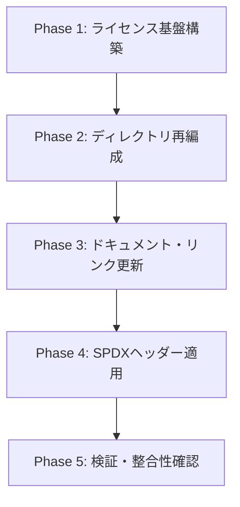

# ADX リポジトリ再編成・ライセンス適用 作業計画書
(ADX Repository Reorganization & REUSE Multi-License Migration Plan)

本ドキュメントは、アプローチ1（**REUSE / SPDX 準拠の3層マルチライセンス方式**）に基づいてADXリポジトリを再編成するための作業計画書です。

---

## 1. 目的と再編成のスコープ

### 1.1 目的
* **3層マルチライセンスの完全適用**:
  * 仕様書・ドキュメント：`CC BY 4.0` (SPDX: `CC-BY-4.0`)
  * ハードウェア設計データ：`CERN-OHL-P-v2` (SPDX: `CERN-OHL-P-2.0`)
  * ファームウェア・ソフトウェア：`MIT` (SPDX: `MIT`)
* **REUSE / SPDX 標準準拠**: 自動ライセンススキャンツールおよびオープンソースコミュニティにおける認知性と法的透明性の向上。
* **ディレクトリ構造の明瞭化**: ハードウェア・ファームウェア・ドキュメントの境界を明確にし、今後の開発・拡張を容易にする。

---

## 2. ディレクトリ構成の変更計画 (Before & After)

### 現状 (Current)
```text
ADX/
├── README.md
├── Project_Snapshot.md
├── dev/                    # ハードウェア開発ファイルが格納されている
│   ├── ADX_Core-D/
│   ├── CARD/
│   └── OLD/
├── docs/                   # 仕様書・多言語ドキュメント
│   ├── en/
│   └── ja/
├── logo/                   # ブランドロゴ
└── memo/                   # 仕様原案・レポート
    └── REPORT/
```

### 再編成後 (Target Structure)
```text
ADX/
├── README.md               # [更新] License セクションの追記、構成図の更新
├── LICENSE.md              # [新規] リポジトリ全体のライセンス宣言・概要・商標条項
├── LICENSES/               # [新規] REUSE準拠の正式ライセンス条文テキスト
│   ├── CC-BY-4.0.txt       # CC BY 4.0 正式条文
│   ├── CERN-OHL-P-2.0.txt   # CERN-OHL-P-v2 正式条文
│   └── MIT.txt             # MIT 正式条文
├── Project_Snapshot.md     # [更新] 最新構成・進捗の反映
├── docs/                   # [維持/SPDX付与] CC BY 4.0
│   ├── en/
│   └── ja/
├── hardware/               # [改名/移行] dev/ から移行し CERN-OHL-P-v2 を適用
│   ├── ADX_Core-D/
│   ├── CARD/
│   └── OLD/
├── firmware/               # [新設] 将来のドライバ・BSP・サンプルコード格納 (MIT)
│   └── README.md           # ファームウェア方針・ライセンス案内 (SPDX: MIT)
├── logo/                   # [維持] 商標保護（All Rights Reserved）
└── memo/                   # [維持] 開発メモ・レポート
    └── REPORT/
```

> [!NOTE]
> **`dev/` から `hardware/` への移行について**:
> リポジトリ構成を「docs / hardware / firmware」の3層に完全一致させるため、現在の `dev/` を `hardware/` に移行することを推奨します（既存の `dev/` 内のサブディレクトリ構造はそのまま保持）。

---

## 3. 詳細作業フェーズとタスク一覧

作業は以下の5つのフェーズに分割して安全に進めます。



---

### Phase 1: ライセンス基盤の構築 (REUSE準拠ファイルの配置)
1. **`LICENSES/` ディレクトリの作成**
   * `LICENSES/CC-BY-4.0.txt` の配置（クリエイティブ・コモンズ公式条文）
   * `LICENSES/CERN-OHL-P-2.0.txt` の配置（CERN-OHL公式条文）
   * `LICENSES/MIT.txt` の配置（MIT公式条文）
2. **ルート `LICENSE.md` の作成**
   * マルチライセンスのマッピング表
   * 各ライセンスの要約と `LICENSES/` への参照
   * ロゴ・商標の保護規定（Trademark Notice）の記載

---

### Phase 2: ディレクトリ構造の再編成
1. **ハードウェアディレクトリの整理**
   * `dev/` を `hardware/` へリネーム（または移行）
2. **ファームウェアディレクトリの新設**
   * `firmware/` ディレクトリを作成
   * `firmware/README.md`（今後の構成方針・MITライセンス宣言）を配置

---

### Phase 3: README および 主要ドキュメントの更新
1. **ルート `README.md` の改訂**
   * `## 4. Repository Structure` を新しい `hardware/`, `firmware/`, `LICENSES/` に更新
   * `## 6. License` セクションを新設し、3層ライセンスを明記
   * 各種リンクパスの更新（`dev/...` → `hardware/...`）
2. **多言語ドキュメント（`docs/en/README.md`, `docs/ja/README.md`）の更新**
   * 末尾に License セクションを追加
   * 各種リンクの整合性を確保
3. **`Project_Snapshot.md` の更新**
   * 最新のリポジトリ構造図とライセンス導入ステータスを反映

---

### Phase 4: ファイル単位での SPDX ライセンスヘッダー適用
各主要ファイルにREUSE/SPDX標準に準拠した識別子を付与します。

1. **ドキュメント (`docs/`, `memo/`)**:
   ```markdown
   <!--
   Copyright (c) 2026 ADX Project Contributors
   SPDX-License-Identifier: CC-BY-4.0
   -->
   ```
2. **ハードウェア仕様・BOM・提案書 (`hardware/`)**:
   * Markdownファイルへのヘッダー追加（`SPDX-License-Identifier: CERN-OHL-P-2.0`）
   * KiCad/CADファイル用READMEや各設計フォルダへのライセンス適用
3. **ファームウェア・コード (`firmware/`)**:
   * 今後追加される `.c`, `.h`, `.py` 向けの標準ヘッダーテンプレート確立（`SPDX-License-Identifier: MIT`）

---

### Phase 5: 検証および整合性チェック
1. **リンク検証**:
   * `README.md` および `docs/` 内の全相対リンクがデッドリンクになっていないか確認。
2. **ライセンス表記検証**:
   * 各ライセンス条文、SPDX識別子の記述形式に誤りがないか確認。
3. **Git 変更差分確認**:
   * 不要なファイルの混入や意図しない変更がないか最終確認。

---

## 4. 承認後の実行手順

本計画の承認後、以下の順序で実行します：

1. **Step 1**: `LICENSES/` および `LICENSE.md` の作成
2. **Step 2**: `hardware/` への移行および `firmware/` の初期化
3. **Step 3**: `README.md`, `docs/`, `Project_Snapshot.md` の更新
4. **Step 4**: SPDXヘッダーの付与
5. **Step 5**: リンク整合性確認と完了報告
