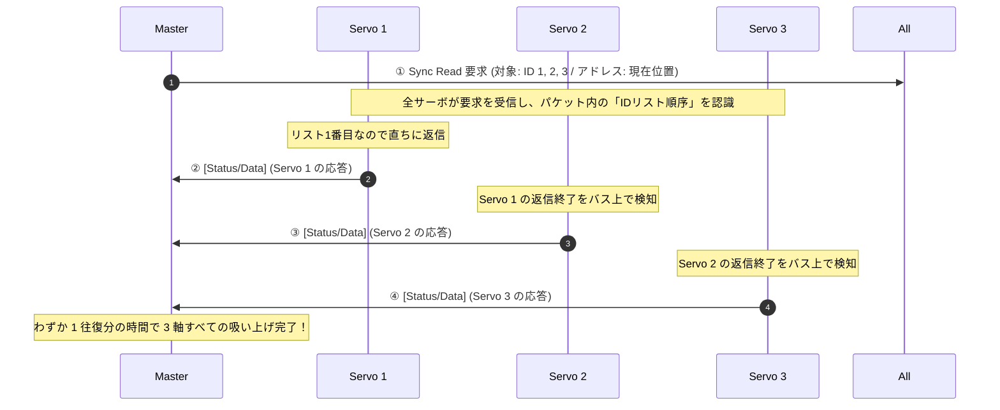

<!--
Copyright (c) 2026 ADX Project Contributors
SPDX-License-Identifier: CC-BY-4.0
-->

# 調査レポート: ROBOTIS Dynamixel Protocol 詳解
〜 多軸ロボットを 1 本のシリアル線で同期駆動する「Sync / Bulk」の超絶技巧 〜

---

## 1. エグゼクティブ・サマリー

**Dynamixel（ダイナミクセル）Protocol** は、韓国のロボット企業 ROBOTIS 社が開発した、高機能スマートアクチュエータ（サーボモータ）専用のシリアル通信プロトコルです。

DARPA Robotics Challenge（米国防総省の災害救助ロボットコンテスト）に出場した人型ロボット、各国の大学・研究所のロボットアーム、四足歩行ロボット、義手・義足に至るまで、**「研究開発・ホビーロボット界における事実上の世界標準（デファクトスタンダード）」** として広く君臨しています。

Dynamixel の最大の見どころは、**「多軸ロボット（20〜30関節）を 1 本の RS-485 / 半二重シリアル線に数珠つなぎ（デイジーチェーン）し、ミリ秒単位で完全に同期させて動かす」** という過酷な要求に対して生み出された、変態的とも言える超高効率コマンド体系 **「Sync（同期）命令」と「Bulk（一括）命令」** にあります。

```text
┌─────────────────────────────────────────────────────────────────────────────┐
│                     【 Dynamixel Protocol 2.0 の 4 大特徴 】                │
│                                                                             │
│  1. 【4バイト・マジックヘッダー】: `0xFF 0xFF 0xFD 0x00` で誤同期を物理的に排除 │
│  2. 【Sync Write (一括同時指示)】: 1 パケットで全軸の目標角度を同時に更新    │
│  3. 【Sync Read (数珠つなぎ返信)】: 1 回の要求で全軸が隙間なく自律的に連鎖返信│
│  4. 【Control Table 統一抽象】  : サーボ内部の全変数をメモリマップ化       │
└─────────────────────────────────────────────────────────────────────────────┘
```

---

## 2. システム構成とロボット特有の課題

Dynamixel システムは、1 台のメインコントローラ（Master）に対し、数十台のスマートサーボ（Slave）が 1 本のバス上に数珠つなぎ（デイジーチェーン）されます。

```text
  [ Master ] (PC / ROS2 / Core-M)
     │
     └──[ Servo 1 ]───[ Servo 2 ]───[ Servo 3 ]─── ... ───[ Servo 20 ]
        (肩ピッチ)     (肩ロール)     (肘ピッチ)            (足首ロール)
```

### 2.1 物理層仕様
- **伝送路**: 
  - **RS-485（差動2線式）**: 4ピンコネクタ（GND, VDD, Data+, Data-）。産業・研究用。
  - **Half-Duplex TTL（1線双方向UART）**: 3ピンコネクタ（GND, VDD, Data）。小型・低コスト用。
- **通信速度**: **57,600 bps 〜 4.5 Mbps**（ハイエンドの PRO シリーズでは最大 10.5 Mbps）。
- **ノード ID**: `0`〜`252`（最大 253 台）、`0xFE`（全体同報ブロードキャスト）。

### 2.2 ロボット制御が直面する「ターンアラウンドの壁」
20 軸の人型ロボットを歩行させる場合、全関節の「目標角度」を送り、かつ全関節の「現在位置・電流（トルク）」を **最低 100 Hz〜1,000 Hz（1ms〜10ms 周期）** で高速にループさせる必要があります。

もし Modbus のような旧来の方式で **「1軸ずつ Request を送り、Response を待つ」** 愚直なポーリングを行うと：
$$
\text{合計時間} = 20 \text{軸} \times (\text{送信時間} + \text{マイコン処理} + \text{返信時間} + \mathbf{DE切替待機})
$$
半二重バスの送受信切り替え（ターンアラウンド遅延）が 20 回も累積し、通信時間が 10ms を平気で突破して**ロボットは足がもつれて倒れてしまいます**。  
この課題を粉砕するために生み出されたのが、後述する Sync / Bulk アーキテクチャです。

---

## 3. Protocol 2.0 パケット構造

初期の Protocol 1.0 ではチェックサムが 8 ビット加算のみで誤り検出が弱く、ヘッダーも `0xFF 0xFF` の 2 バイトだったため、データ部で偶然 `0xFF 0xFF` が並んだ際に誤同期する問題がありました。  
現行の **Protocol 2.0** では、徹底的な堅牢化が図られています。

```text
 0      1      2      3       4      5     6       7      8 ... N-3   N-2    N-1
┌──────┬──────┬──────┬───────┬──────┬─────┬───────┬──────┬───────────┬──────┬──────┐
│ 0xFF │ 0xFF │ 0xFD │ 0x00  │  ID  │ LEN │  LEN  │ INST │ PARAMETER │ CRC  │ CRC  │
│      │      │      │       │ (1B) │(LSB)│ (MSB) │ (1B) │  (N-10 B) │(LSB) │(MSB) │
└──────┴──────┴──────┴───────┴──────┴─────┴───────┴──────┴───────────┴──────┴──────┘
 ├── Header (4 Bytes) ────────┤ ├── 1B ─┤ ├── 2 Bytes ┤ ├──1B─┤           ├── 2 Bytes ──┤
```

### 3.1 各フィールドの詳細

| フィールド | バイト数 | 設定値 | 役割と動作仕様 |
| :--- | :---: | :---: | :--- |
| **Header** | **4B** | `0xFF 0xFF 0xFD 0x00` | **マジックパケット**。<br>パケット先頭を確定する識別子。 |
| **ID** | 1B | `0x00`〜`0xFC`<br>(`0xFE`: 同報) | **宛先ノード ID**。 |
| **Length** | **2B** | 可変 (Little Endian) | **パケット残余長**。<br>`INST` から `CRC` 末尾までの総バイト数（$N - 7$ バイト）。 |
| **Instruction** | 1B | コマンドコード | 実行する命令（Read, Write, Sync, Bulk 等）。<br>スレーブからの応答時は **`0x55` (Status)** になる。 |
| **Parameter** | 可変 | 任意 | コマンド固有の引数（メモリアドレス、データ長、書き込み値）。 |
| **CRC16** | **2B** | 多項式 `0x8005` | **CRC-16-IBM**（初期値 `0x0000`, LSB ファースト）。<br>`Header` から `Parameter` 末尾までの全バイトを検証。 |

### 3.2 バイトスタッフィング（Byte Stuffing）の徹底
もしモーターの角度データや電流データの中に、偶然 **`0xFF 0xFF 0xFD`** という 3 バイトの並びが出現した場合、受信マイコンが「次の新しいパケットのヘッダーが来た！」と誤認してしまいます。

これを完全に防ぐため、Dynamixel 2.0 は **バイトスタッフィング** を行います：
- 送信側: パラメータ中に `0xFF 0xFF 0xFD` が現れたら、直後に強制的に **`0xFD`** を 1 バイト挿入して `0xFF 0xFF 0xFD 0xFD` とする。
- 受信側: `0xFF 0xFF 0xFD 0xFD` を検知したら、余分な `0xFD` を除去して元のデータに復元する。

---

## 4. 奇跡の多軸超効率制御: 「Sync」と「Bulk」

ここが Dynamixel Protocol の最も天才的な部分です。

### 4.1 Sync Write（一括同時書き込み）
「全サーボに、同時にそれぞれの目標位置を指令したい」場合に使用します。

```text
Master 送信 (ID = 0xFE 同報):
[Header] [ID:0xFE] [Len] [SyncWrite] [Addr:目標位置] [DataLen:4B] 
  ├─ [ID 1] [位置データ 4B]
  ├─ [ID 2] [位置データ 4B]
  ├─ [ID 3] [位置データ 4B]
  └─ ...
  [CRC16]
```
- **動作**:
  1. Master がブロードキャスト ID（`0xFE`）で巨大な 1 パケットを一撃送出する。
  2. 各サーボはパケットの中身をスキャンし、**「自分の ID」が書かれた部分の 4 バイトだけを抜き取る**。
  3. 各サーボは応答パケットを一切返さない（衝突防止）。
- **効果**:
  20 軸あっても **パケット送信はたった 1 回**。ターンアラウンド遅延はゼロ。20 個の関節が完全に同一のタイムスタンプで動き始めます。

---

### 4.2 Sync Read（数珠つなぎ自律返信の魔法）
「全サーボから、現在位置と現在負荷を一括で吸い上げたい」場合に使用します。普通なら 20 回ポーリングする必要がありますが、Sync Read は **1 回のリクエスト** で完結します。



- **なぜ衝突しないのか？（驚異の自律調停）**:
  Master は Sync Read パケットの中に **「返信してほしい ID の並び順（ID 1, ID 2, ID 3...）」** を記載します。
  各サーボは自分より前に並んでいるサーボの数とデータ長から **「自分が何マイクロ秒後に発言権を得るか」を内部タイマーで計算**、または **「直前のサーボの返信パケットの末尾（CRC）を傍聴して終了を確認した瞬間」に自分の送信ドライバーを ON** にします。
- **効果**:
  Master が 1 回リクエストを投げただけで、全サーボがまるでバケツリレーのように隙間なくパケットを連射して返信してきます。バス利用効率は理論上の極限に達します。

---

### 4.3 Bulk Read / Bulk Write（異種データ混載）
- `Sync` は「全員が同じアドレス（例: 目標位置のみ）」を読み書きする制約があります。
- 一方 `Bulk` は、**「ID 1 は位置（4B）、ID 2 は温度（1B）、ID 3 は PID ゲイン（6B）」** のように、ノードごとに全く異なるアドレス・異なるデータ長を一括して送受信できます。

---

## 5. コントロールテーブル（Control Table）の思想

Dynamixel は、サーボ内部のすべての機能・設定・センサー値を **「連続したメモリ空間（Control Table）」** として定義しています（Modbus のレジスタ空間のモダン版）。

```text
【 EEPROM 領域 (電源OFFでも保持) 】
  Addr 00 (2B): Model Number (モデル番号: 例 0x0400 = XM430-W350)
  Addr 06 (1B): Firmware Version
  Addr 07 (1B): ID (ノードID)
  Addr 08 (1B): Baud Rate (通信ボーレート設定)
  Addr 09 (1B): Return Delay Time (返信開始遅延時間)
  Addr 11 (1B): Operating Mode (電流制御 / 速度制御 / 位置制御 / 多回転制御)

【 RAM 領域 (電源OFFで揮発・リアルタイム更新) 】
  Addr 64 (1B): Torque Enable (モーター通電ON/OFF)
  Addr 65 (1B): LED (表示LED点灯)
  Addr 84 (2B): Position P/I/D Gain (位置制御ループPIDゲイン)
  Addr 116 (4B): Goal Position (目標位置指令)
  Addr 128 (4B): Present Current (現在電流 / トルク実測値)
  Addr 132 (4B): Present Velocity (現在速度実測値)
  Addr 136 (4B): Present Position (現在位置実測値)
  Addr 144 (2B): Present Input Voltage (供給電圧実測値)
  Addr 146 (1B): Present Temperature (基板/モーター温度)
```

上位のソフトウェア（ROS や Python）は、モータに対して「回れ」という命令を送るのではなく、**「アドレス 116（Goal Position）に `2048` を Write する」** という操作を行うだけで制御が完結します。

---

## 6. Return Delay Time: 現場のターンアラウンド対策

Dynamixel の Control Table のアドレス 9 には、**`Return Delay Time`** という極めて実戦的なパラメータが存在します。

- **設定値**: `0`〜`254`（単位: $2.0\,\mu\mathrm{s}$。デフォルトは通常 250 ＝ 約 $500\,\mu\mathrm{s}$）
- **役割**:
  サーボが命令を受信してから、返信パケットの送信を開始するまでの **「あえて待機する時間」**。
- **なぜこれが必要なのか**:
  高性能な Master（リアルタイム Linux PC 等）は $10\,\mu\mathrm{s}$ で DE ピンを切り替えますが、安価な USB-RS485 変換器や低速なコントローラは送信後に受信モードへ戻るまで数百マイクロ秒かかります。
  スレーブ側の返信遅延をパラメータ化して現場でチューニングできるようにすることで、**「速すぎるスレーブが Master の受信回路復帰前に衝突する事故」** を防いでいます。

---

## 7. LM-32 との対比・フィードバック

Dynamixel Protocol 2.0 の超絶技巧と、ADX の **LM-32** を比較します。

| 比較項目 | Dynamixel Protocol 2.0 | ADX LM-32 | 設計比較と示唆 |
| :--- | :--- | :--- | :--- |
| **マジックパケット** | `0xFF 0xFF 0xFD 0x00` (4B)<br>＋バイトスタッフィング | `0x55` (Sync) ＋ `0xAD` (Magic)<br>(2B) ＋ 固定長破棄 | Dynamixel は可変長なのでバイトスタッフが必須。LM-32 は「32B完全固定長＋シーケンス番号」により、スタッフなしで高速破棄ステートマシンが組める。 |
| **フレーム長** | 可変長 (Length フィールドあり) | **32 バイト完全固定長** | Dynamixel は Sync で数十〜数百バイトの長大パケットになる。LM-32 は 32B 固定のため、極小マイコン（ATtiny）の RAM 制限に完全に適合。 |
| **多ノード収集** | **Sync Read**<br>(1 クエリで全軸が連鎖返信) | **Master-Scheduled 巡回**<br>(1 スロットで 1 ノード) | **【将来の拡張示唆】**<br>LM-32 は安全最優先の 1 スロット 1 ノードだが、高速なセンサー収集や CARD 多軸制御において「1リクエスト連鎖返信」の着想は大いに参考になる。 |
| **ターンアラウンド** | Return Delay Time で個別設定<br>($N \times 2\,\mu\mathrm{s}$ 待機) | **タイムスロット内で構造的予算化**<br>($T_{turn} = 0.8\sim2.0\,\mathrm{ms}$) | Dynamixel はノード個別の設定に依存するが、LM-32 は「タイムスロットという時間割」そのものに組み込んでいるため、より決定論的で設定ミスが起きない。 |
| **デバイス抽象化** | **Control Table (メモリマップ)**<br>EEPROM / RAM 領域 | **TOPIC_ID ＋ PAYLOAD** | Control Table の「設定値（EEPROM）と実測値（RAM）を同一のメモリ空間としてアドレス指定する」モデルは、ADX の CARD やスレーブ仕様に最適。 |

---

## 8. 結論

Dynamixel Protocol 2.0 は、**「半二重共有バスという物理的制約の中で、いかにターンアラウンド遅延を殺し、多軸同期制御の帯域を極限まで絞り出すか」** を突き詰めたエンジニアリングの傑作です。

特に：
1. **Sync Write による「一括同時指示」**
2. **Sync Read による「自律的数珠つなぎ連鎖返信」**
3. **Control Table による「統一されたメモリマップ抽象化」**

の 3 点は、半二重シリアルバスを扱うすべての技術者にとって教科書となる知見です。

ADX において、現在の LM-32 は「1ノードずつ確実に回す決定論的タイムスロット」を核としていますが、将来ロボットアームや多軸ステージのような「ミリ秒未満の完全同期制御」を CARD 間で行う際、この **Sync / Bulk のパケット統合思想** は極めて強力な武器になります。
