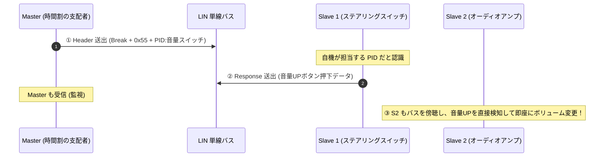

<!--
Copyright (c) 2026 ADX Project Contributors
SPDX-License-Identifier: CC-BY-4.0
-->

# 調査レポート: LIN (Local Interconnect Network) 詳解
〜 「水晶なし・100円マイコン」で車を動かす、泥臭い超低コスト車載ネットワークの原点 〜

---

## 1. エグゼクティブ・サマリー

**LIN (Local Interconnect Network)** は、1990年代末に欧州の自動車メーカー連合（Audi, BMW, DaimlerChrysler, Volvo, Volkswagen）と半導体メーカーが結成した「LIN コンソーシアム」によって策定された車載シリアル通信プロトコル規格です。

現代の自動車には、ドアミラー格納、パワーウィンドウ、シートヒーター、ワイパー、エアコンフラップ、サンルーフ、ステアリングスイッチなど、無数の末端サブシステムが存在します。これらすべてに高価な CAN（Controller Area Network）を配備するとコストと配線重量が爆発するため、**「CAN の 1/5 以下のコストで構築できる究極のローエンド車載バス」** として誕生しました。

LIN の最大の見どころは、**「Out-of-band（UART 規則違反）の Break 信号」** と **「0x55 Sync によるボーレート自動補正」** を組み合わせることで、**「外付け水晶振動子すら不要（内蔵 RC 発振器で動く）」という狂気的なまでの低コスト化** を達成した点にあります。  
ADX の基幹プロトコル **LM-32**（LIN-inspired Master-scheduled, 32-byte）の直接の思想的ルーツがここにあります。

```text
┌─────────────────────────────────────────────────────────────────────────────┐
│                           【 LIN の 4 大特徴 】                             │
│                                                                             │
│  1. 【Out-of-band Break 同期】: 13bit 以上の Low（Framing Error）で絶対同期   │
│  2. 【ボーレート自動補正】    : `0x55` 波形で内蔵 RC 発振器のズレを毎パケット吸収│
│  3. 【ヘッダー駆動型 Pub/Sub】: Master が Header を投げ、対象ノードが即座に応答│
│  4. 【極限の単線 12V 物理層】 : ツイストペア不要、1 本の被覆電線＋ボディアース │
└─────────────────────────────────────────────────────────────────────────────┘
```

---

## 2. 誕生の背景（なぜ CAN ではダメだったのか）

### 2.1 CAN の重い代償
1990年代、自動車の電子化（ECUの急増）に伴い、CAN が急速に普及しました。しかし、ドアミラーやシートポジションのような「末端のアクチュエータ/センサー」にまで CAN を使うには、以下の 2 つの致命的なコスト障壁がありました。

1. **高価なコントローラーとトランシーバー**:
   CAN は非破壊ビット調停を行うため、専用の CAN コントローラー回路と差動トランシーバーが全ノードに必須。
2. **高精度な水晶発振子（セラミック発振子 / 水晶）の強制**:
   CAN はビット単位でバス調停を行うため、全ノードのクロック誤差を $\pm 1.5\%$（場合によっては $\pm 0.5\%$）以内に抑えなければならず、安価なマイコン内蔵 RC 発振器（温度変化で $\pm 15\%$ も狂う）の使用が許されなかった。

### 2.2 LIN の出した天才的回答
> **「衝突検出ハードウェアを諦め、時間軸の支配権を唯一のマスターに集中させる。その代わり、全スレーブは一番安い 8bit マイコンの標準 UART と内蔵 RC 発振器だけで動かせ。」**

この割り切りによって、LIN は世界中で毎年数十億ノードが出荷される巨大なエコシステムを築き上げました。

---

## 3. 物理層（Layer 1）: 12V 単線オープンコレクタ

LIN の物理層は、極限までコストを削ぎ落とした設計になっています。

```text
               +12V バッテリ電源
                     │
                    [R] (Master: 1kΩ / Slave: 30kΩ プルアップ)
                     │
LIN バス線 ──────────┴──────────────────────── (1本の電線)
                     │                 │
                   ┌─┴─┐             ┌─┴─┐
                   │   │ (Master)    │   │ (Slave)
                   └───┘             └───┘
                     │                 │
                    === GND           === GND (車体ボディアース)
```

- **伝送線**: **たった 1 本の被覆電線**（GND は車体の金属ボディを利用）。
- **バス論理**:
  - **Dominant（優性 / 論理 0）**: トランジスタでバスを **GND（0V）** に引き抜く。
  - **Recessive（劣性 / 論理 1）**: プルアップ抵抗によって **バッテリ電圧（12V）** に引き上げる。
- **伝送速度**: **最大 20 kbps**（通常 19,200 bps または 9,600 bps）。
  - ※ 20 kbps に制限されている理由は、1本の電線で矩形波を急峻に立ち上げるとラジオノイズ（EMI/EMC）を撒き散らすため、スルーレート（波形の立ち上がり・立ち下がり時間）を意図的に緩やかに丸めているためです。

---

## 4. Out-of-band 同期の極致: Break と Sync のメカニズム

ここが、ユーザーが着目した **「UART のルールを意図的に破る（Out-of-band）」** 最も美しい技術です。

```text
   ┌──[Break Field: 13ビット以上のLow]──┐  Sync (0x55)       PID
   │                                     │  ┌──┐  ┌──┐  ┌──┐  ┌─────
───┘                                     └──┘  └──┘  └──┘  └──┘
    (Framing Error 発生 ➔ 絶対同期)       (立ち下がり間隔でクロック自動計測)
```

### 4.1 Sync Break Field（物理層・UART 違反による絶対同期）
- **仕様**: **最低 13 ビット長（通常 13〜26 ビット）以上の連続した Low（Dominant）**。
- **なぜこれが「UART 違反」なのか**:
  標準的な UART（8N1）のフレームは、`Start(1b: Low)` ＋ `Data(8b)` ＋ `Stop(1b: High)` の計 10 ビットで構成され、**末尾の 10 ビット目は必ず High でなければなりません**。
  13 ビット以上 Low が継続すると、UART レシーバーはストップビットが見つからず、強制的に **「Framing Error（フレーミングエラー）」** ハードウェア割り込みを発生させます。
- **効果**:
  どんなデータバイト列（`0x00`〜`0xFF`）も、UART の枠内では絶対に 13 ビット連続 Low を作れません。
  したがって、全スレーブは **「Framing Error が発生した＝新しいフレームが始まった合図だ」と 100% 誤認なく即座に検知** できます。

---

### 4.2 Sync Byte Field（`0x55` によるボーレート自動計測）
Break の直後に、マスターは必ず **`0x55`（バイナリ: `01010101b`）** を 1 バイト送出します。

```text
    Start   D0   D1   D2   D3   D4   D5   D6   D7   Stop
      ┌──┐     ┌──┐     ┌──┐     ┌──┐     ┌──┐     ┌──────
──────┘  └─────┘  └─────┘  └─────┘  └─────┘  └─────┘
      │◄──────────────── 8 ビット時間 ────────────────►│
```

- **なぜ `0x55` なのか**:
  `0` と `1` が交互に並ぶため、**立ち下がりエッジが 5 回等間隔で出現します**。
- **内蔵 RC 発振器の自動キャリブレーション**:
  安価なマイコンの内蔵 RC 発振器は、真夏の炎天下（+85℃）や真冬（-30℃）の車内でクロック周波数が $\pm 10\%\sim15\%$ も変動します。普通の UART ならボーレートがズレて通信エラーになります。
  しかし LIN のスレーブは、この `0x55` の立ち下がりエッジ間のタイマーカウントを測ることで、**「現在のマスターのボーレート（1ビットの正確な時間）」を毎フレーム測定し、自分の UART ボーレートレジスタをリアルタイムに自動補正（キャリブレーション）** します。
- **効果**:
  すべてのスレーブから **高価な水晶発振子・セラミック発振子（およびその外付けコンデンサ）を完全に追放** することに成功しました。

---

## 5. ヘッダー駆動型アーキテクチャ（Header / Response 分割）

LIN の通信フレームは、**「Master が送る Header」** と **「誰かが送る Response」** に物理的に分割されています。

```text
 0                      1            2             3 ... N-1                   N
┌──────────────────────┬────────────┬─────────────┬───────────────────────────┬──────────┐
│   Sync Break (Low)   │ Sync Byte  │     PID     │       Data (1〜8 Bytes)   │ Checksum │
│     (>= 13 bits)     │   (0x55)   │ (1B: ID+Par)│                           │   (1B)   │
└──────────────────────┴────────────┴─────────────┴───────────────────────────┴──────────┘
 ├──【 Header 】: 常に Master が送信 ─────────────┤ ├──【 Response 】: スレーブ or Master が送信 ┤
```

### 5.1 PID（Protected Identifier: 1バイト）
ヘッダーの最後にある PID は、**6ビットのフレーム ID（`0`〜`63`）** と **2ビットのパリティ** で構成されます。

ここで決定的に重要なのは、**「PID は特定ノードのアドレスではなく、データの内容（Topic）を表している」** という点です。

### 5.2 LIN の Pub/Sub メカニズム（3つの通信パターン）
LIN は、Master がバスの時間割を管理しながら、極めて柔軟なデータ流通を可能にしています。

#### パターン A: Master ➔ Slave（指示送信）
Master が Header を投げ、続けて **Master 自身が Response（データ）を送出**。対象スレーブが受信する。

#### パターン B: Slave ➔ Master（テレメトリ吸い出し）
Master が Header（例:「室内温度」）を投げる。
該当するスレーブ（温度センサーECU）がそれを検知し、**直後に Response（データ）をバスに送出**。Master が受信する。

#### パターン C: Slave ➔ Slave（スレーブ間直接通信 / 究極の自律分散）
Master が Header（例:「ステアリングスイッチ押下状態」）を投げる。
- 送信スレーブ（ステアリングECU）が直後に **Response を送出（Publish）**。
- 受信スレーブ（オーディオECU）が、Master を経由することなく **その Response を横から傍聴（Subscribe）して音量を上げる**。



---

## 6. 決定論的スケジュールテーブル（Schedule Table）

LIN のバス上には、CAN のような「ノード同士の送信権争い（調停）」は一切存在しません。
Master が内部に持っている **「スケジュールテーブル」** に従って、メトロノームのように正確に Header を連射します。

```text
【 LIN スケジュールテーブル例 (サイクル時間: 50ms) 】
  0.0 ms : [Header: エンジン回転数 (ID 0x10)] ──► Response
 10.0 ms : [Header: ドアミラースイッチ (ID 0x20)] ──► Response
 20.0 ms : [Header: エンジン回転数 (ID 0x10)] ──► Response (※高頻度ノードは2回登場)
 30.0 ms : [Header: 室内温度 (ID 0x30)] ──► Response
 40.0 ms : [Header: 診断・自己テスト (ID 0x3C)] ──► Response
 50.0 ms : (サイクル先頭に戻る)
```

- スレーブは **「Header で自機の PID が呼ばれた時だけ Response を返す」** ため、物理層衝突は原理的にゼロ。
- どのデータが何ミリ秒間隔で更新されるかが数学的に完全確定します。

---

## 7. LM-32 と LIN の比較（何を受け継ぎ、何を捨てたか）

ADX の **LM-32** は、仕様書に「LIN-inspired」と謳っている通り、LIN の優れた思想をダイレクトに継承しています。しかし同時に、**現代の組み込み・Web 環境に合わせて大胆な脱皮** を行っています。

| 設計項目 | 車載 LIN (2.0/2.2A) | ADX LM-32 | LM-32 が下した進化・決断の理由 |
| :--- | :--- | :--- | :--- |
| **物理層** | 12V 単線 (オープンコレクタ) | **RS-485 / TTL-UART / 光絶縁** | 単線12Vは車内短距離専用。LM-32 は長距離（1km）・耐ノイズ性に優れた差動・絶縁物理層へ拡張。 |
| **通信速度** | **最大 20 kbps** (EMC制限) | **115.2 kbps 〜 高速域** | 差動伝送（RS-485）を採用したことで、電磁放射ノイズを抑えつつ 5 倍以上の高速化を達成。 |
| **パケット同期** | **Out-of-band Break (13b Low)**<br>＋ `0x55` Sync | **In-band バイト同期 (`0x55 0xAD`)** | **【最大の分岐点】**<br>PC/スマホ（WebSerial）や安価な USB ドングルでは Break を遅延なく送出・検知できないため、標準 UART バイト列へ純化。 |
| **フレーム長** | 可変長 (1〜8 バイト)<br>※PID ごとに固定長 | **32 バイト完全固定長** | LIN は 8 バイト上限で大容量転送（FW更新）が困難。LM-32 は 32B 固定で OTW とテレメトリを両立。 |
| **調停思想** | Master Schedule ＋<br>Header/Response 分割 | **Master-Scheduled タイムスロット**<br>＋ TOPIC Pub/Sub | LIN の「Master が時間割を支配し、スレーブ同士が傍聴協調する」美しさを 100% 継承。 |
| **誤り検出** | 8bit Enhanced Checksum | **CRC-16-CCITT** | 32 バイトの長大フレームと産業用 PLC 級の安全性を保証するため、8bit チェックサムから CRC16 へ大幅強化。 |

---

## 8. 結論

LIN は、**「最も安い部品（UART ＋ 内蔵 RC 発振器）で、最大の信頼性と決定論を叩き出す」** ために人類が到達した、泥臭くも天才的なプロトコルの金字塔です。

- **Break 信号（UART 規則違反）**: ノイズとデータを 100% 分離する Out-of-band の威力。
- **`0x55` Sync**: 内蔵 RC 発振器の温度ドリフトを毎フレームねじ伏せる自動キャリブレーション。
- **Header 駆動 Pub/Sub**: 中央集権スケジュールでありながら、スレーブ同士が自律協調するアーキテクチャ。

LM-32 は、この LIN の持つ **「中央集権型スケジューリング」と「Pub/Sub 傍聴協調」の思想を骨の髄まで継承** しています。  
一方で、現場の要求が「車載専用 ECU」から **「誰でも買える市販 USB ドングル ＋ WebSerial ブラウザ直結」** へとシフトした現代において、Break 信号を捨てて `0x55 0xAD` バイト同期へと割り切った LM-32 の進化は、まさに LIN の哲学を 21 世紀のオープンハードウェア環境へと正統継承させた姿であると言えます。
