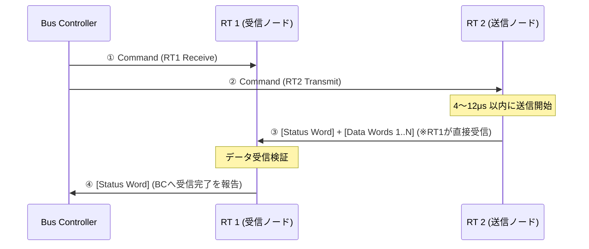

<!--
Copyright (c) 2026 ADX Project Contributors
SPDX-License-Identifier: CC-BY-4.0
-->

# 調査レポート: MIL-STD-1553B 通信プロトコル詳解
〜 戦闘機・宇宙機を支える「絶対決定論・中央集権共有バス」の原点 〜

---

## 1. エグゼクティブ・サマリー

**MIL-STD-1553B** は、1970年代に米国国防総省（DoD）が軍用航空機（アビオニクス）向けに策定したシリアルデータバス規格です。F-16、F/A-18、アパッチ攻撃ヘリなどの戦闘機から、スペースシャトル、国際宇宙ステーション（ISS）、ハッブル宇宙望遠鏡に至るまで、半世紀にわたり**「人命とミッション成否を左右する過酷な環境」**で無事故の実績を誇る、決定論的共有バスの世界的金字塔です。

ADX の基幹プロトコル **LM-32** が志向している「マスタースケジューリング」「Speak Only When Spoken To」「構造的静寂の保証」の思想的ルーツの多くが、すでにこの規格において極限の完成度で実装されています。

```text
┌─────────────────────────────────────────────────────────────────────────────┐
│                   【 MIL-STD-1553B が体現する 4 大設計思想 】               │
│                                                                             │
│  1. 【絶対的専制君主制】: 唯一の Bus Controller のみが時間軸を支配する       │
│  2. 【物理層レベルの同期】: マンチェスタ違反パターンによる 100% 誤認なき同期  │
│  3. 【ステータス常時監視】: スレーブは応答時、必ず自己診断ステータスを返送   │
│  4. 【完全決定論の時間割】: メジャー/マイナーフレームによるミリ秒未満の周期管理│
└─────────────────────────────────────────────────────────────────────────────┘
```

---

## 2. 誕生の歴史的背景（なぜ生まれたのか）

### 2.1 ベトナム戦争の教訓と「配線重量爆発」
1960年代までの軍用機は、レーダー、航法装置、兵装制御、コクピット計器などがすべて**「機器間を1対1のアナログ線や専用シリアル線で個別に結ぶポイント・ツー・ポイント（PTP）配線」**で接続されていました。
- **課題**:
  - 電線ハーネスの総重量が数十〜数百kgに達し、機体重量と燃費を圧迫。
  - コネクタの接点数が数千に膨れ上がり、振動や腐食による断線トラブルが多発。
  - 新しい兵装やアビオニクスを追加するたびに機体配線を全引き直しする天文学的コスト。

### 2.2 F-16「ファイティング・ファルコン」のデジタル統合
1973年、米空軍は軽量戦闘機F-16の開発に合わせ、**「たった1組のシールドツイストペア線で機内全コンピュータを共有接続する」** デジタル多重伝送規格 `MIL-STD-1553` を策定しました（1978年に不備を改定した `1553B` が成立）。

これによって機内配線は激減し、信頼性は飛躍的に向上しました。

---

## 3. システム構成と 3 つの役職（Roles）

MIL-STD-1553B のバスには、厳格に定義された **3 種類の端末（Terminal）** のみが存在します。

```text
       ┌──────────────────────────────────────────────────┐ Bus A (主系)
       │  ┌───────────────────────────────────────────────┼───┐ Bus B (待機系)
       │  │                                               │   │
   ┌───┴──┴───┐       ┌──────────┐       ┌──────────┐   ┌─┴───┴────┐
   │    BC    │       │   RT 1   │       │   RT 2   │   │    BM    │
   │   (司令) │       │(ミサイル)│       │ (レーダー)│   │(レコーダ)│
   └──────────┘       └──────────┘       └──────────┘   └──────────┘
```

| 役職 | 正式名称 | 役割と権限 | LM-32 における対応 |
| :--- | :--- | :--- | :--- |
| **BC** | **Bus Controller**<br>(バス・コントローラ) | **バス上の絶対権力者**。<br>全通信の発議権を独占し、スケジュールを管理。BC の許可なくしてバス上に 1 ビットたりとも信号を流すことは許されない。 | **Master**<br>(Core-M / ホスト PWA) |
| **RT** | **Remote Terminal**<br>(リモート・ターミナル) | **被支配ノード（スレーブ）**。<br>最大 31 台（アドレス 0〜30）。BC から自機宛てのコマンドを受信した時のみ、指定されたデータを送受信する。 | **Slave**<br>(Core-D 各種ノード) |
| **BM** | **Bus Monitor**<br>(バス・モニタ) | **受動的傍聴ノード**。<br>バス上の通信を記録・解析するが、自らは送信回路を持たない（または送信を禁止されている）。フライトレコーダー等。 | **Pub/Sub 傍聴ノード**<br>および sniffer ツール |

---

## 4. 物理層（Layer 1）の異常なまでの堅牢性

MIL-STD-1553B の物理層は、「雷撃」「電磁パルス（EMP）」「被弾による短絡」「極限のノイズ」に耐えうるよう設計されています。

### 4.1 物理仕様一覧

- **伝送速度**: **1.0 Mbps**
- **伝送路**: 78Ω 特性インピーダンスのシールド付きツイストペア（Twinax ケーブル）
- **結合方式**: **トランス結合（Transformer Coupled）** または **直接結合（Direct Coupled）**
  - ノードとバスの間を絶縁トランスで結合し、直流電位差の遮断と 2,500V 級のコモンモードノイズ遮断を達成。
  - 1台のノード内部がショート破壊しても、バス本線はトランスの一次側インピーダンスで保護され、バス全体が道連れ死しない。
- **バス冗長化**: **デュアル冗長（Dual Redundant: Bus A / Bus B）** が標準。通常は Bus A を使い、伝送エラー発生時は瞬時に待機系の Bus B へフォールバック。

### 4.2 マンチェスタ II 符号（Manchester II Bi-phase）
UART のような NRZ（Non-Return-to-Zero）ではなく、**ビットの中央で必ず極性が反転するマンチェスタ符号** を採用しています。
- **メリット 1 (直流成分ゼロ)**: 信号の正負が常に対称になるため、トランスを通しても直流磁気飽和が起きない。
- **メリット 2 (完全な自己クロック復調)**: ビット中央の反転エッジで常に受信クロックを同期できるため、受信側のクロックジッタが蓄積しない。

```text
ビット論理 '1': 前半 High ──► 後半 Low
ビット論理 '0': 前半 Low  ──► 後半 High

      ┌──┐        ┌──┐
'1' : │  │    '0':│  │
   ───┘  └──   ───┘  └──
```

### 4.3 物理層違反による「絶対同期シンク（Sync）」
UART では「`0x55` のような特定ビットパターン」をデータとして送るため、ノイズやデータ途中で偶然同じ値が出現すると誤同期のリスクがあります。

1553B は、**マンチェスタ符号の規則をあえて破る「1.5ビット幅 High ＋ 1.5ビット幅 Low」という違反波形** をワードの先頭（3ビット分）に強制挿入します。
- この波形は **通常のデータ列からは物理的に 100% 発生し得ない** ため、受信ハードウェアはワードの先頭を一切の誤認なく 1 クロックで捕捉できます。

```text
【コマンド/ステータス・シンク波形】: 1.5 ビット幅 High ──► 1.5 ビット幅 Low (通常あり得ない幅)
   ┌─────────┐
   │         │
───┘         └─────────
   ├─ 1.5 b ─┼─ 1.5 b ─┤ = 計 3 ビット分の物理同期
```

---

## 5. ワード構造（20-Bit Fixed Word Architecture）

MIL-STD-1553B の通信は、すべて **厳密に「20ビット完全固定長」のワード** のみで構成されます。  
（20 ビット ＝ 伝送時間 20.0 $\mu\mathrm{s}$）

ワードは以下の **3 種類しか存在しません**。

```text
 0  1  2   3  4  5  6  7   8   9 10 11 12 13 14 15 16 17 18   19
┌────────┬───────────────┬───┬────────────────────────────┬───┐
│  Sync  │  RT Address   │T/R│  Subaddress / Mode Code    │ P │ (Command Word)
│ (3b)   │     (5b)      │1b │           (5b)             │1b │
├────────┼───────────────┴───┴────────────────────────────┼───┤
│  Sync  │               Data (16 Bits)                   │ P │ (Data Word)
│ (3b)   │                                                │1b │
├────────┼───────────────┬────────────────────────────────┼───┤
│  Sync  │  RT Address   │      Status Flags (11b)        │ P │ (Status Word)
│ (3b)   │     (5b)      │ (Error, Busy, ServiceReq, etc) │1b │
└────────┴───────────────┴────────────────────────────────┴───┘
```

### 5.1 各ワードの機能

#### 1. Command Word（BC ➔ RT のみ発行）
- **RT Address (5bit)**: 対象スレーブ番号（`0`〜`30`。`31` は同報ブロードキャスト）。
- **T/R (1bit)**: `0` = RT Receive（RT にデータを受け取らせる）、`1` = RT Transmit（RT にデータを吐かせる）。
- **Subaddress / Mode (5bit)**: RT 内部のメモリ領域/機能区分（`1`〜`30`）。
- **Data Word Count (5bit)**: 転送するデータワード数（`1`〜`32` ワード）。

#### 2. Data Word（BC ➔ RT、または RT ➔ BC / RT ➔ RT）
- **Data (16bit)**: ペイロード本体。最大 32 ワード（512 ビット ＝ 64 バイト）まで連続送出可能。

#### 3. Status Word（RT ➔ BC のみ返送）
スレーブ（RT）が自分の健康状態を BC に報告する最重要ワード。
- **Message Error Bit**: 前回のコマンドや CRC（パリティ）異常を即座に通告。
- **Busy Bit**: RT が処理手一杯でデータを受理できないことを通告。
- **Service Request Bit**: スレーブ側から「自発的な送信要求・割り込み」があることを BC に知らせるフラグ（ポーリング時に BC が検知して個別処理枠を割り当てる）。
- **Subsystem Flag**: RT 配下のセンサーやアクチュエータの物理故障を通告。

---

## 6. 基本トランザクションとタイミング規範

MIL-STD-1553B のトランザクションは、数マイクロ秒単位の時間割で完全に制御されています。

### 6.1 主要な 3 つのメッセージフロー

#### ① BC-to-RT 転送（指令・データ送信）
BC がコマンドとデータを一括で送り出し、RT が検証後にステータスワードを返す。
```text
BC: ──► [Command Word (R)] [Data Word 1] ... [Data Word N]
                                                         │ (4〜12μs 応答時間)
RT:                                                      └──► [Status Word]
```

#### ② RT-to-BC 転送（テレメトリ吸い出し・ポーリング）
BC がコマンドで要求し、RT が即座にステータスとデータを返す。
```text
BC: ──► [Command Word (T)]
                         │ (4〜12μs 応答時間)
RT:                      └──► [Status Word] [Data Word 1] ... [Data Word N]
```

#### ③ RT-to-RT 転送（ノード間直接通信・自律分散の極致）
BC が交通整理を行うことで、**BC を中継することなく RT 1 から RT 2 へ直接データを流し込む**。


---

## 7. 時間管理とスケジューリング（決定論のメカニズム）

### 7.1 レスポスタイム（Response Time）の厳格な縛り
- スレーブ（RT）は、コマンドの最終ビットを受信してから **4.0 $\mu\mathrm{s}$ 〜 12.0 $\mu\mathrm{s}$ の間** にステータスワードの送出を開始しなければならない。
- **14.0 $\mu\mathrm{s}$** を超えても信号が出ない場合、BC はハードウェアタイマーで即座に **「No Response（無応答タイムアウト）」** と判定し、そのスロットを打ち切る。

### 7.2 インターメッセージギャップ（IMG: Intermessage Gap）
トランザクションとトランザクションの間には、必ず最低 **4.0 $\mu\mathrm{s}$（実務上は数〜数十 $\mu\mathrm{s}$）の完全な無信号期間（静寂）** が設けられます。
この静寂により、ライン上の反射波やトランスの残留磁気が完全に消滅し、次の通信への干渉（リンギング）をゼロにします。

### 7.3 メジャーフレーム / マイナーフレーム時間割
BC は、メトロノームのように正確な階層型スケジュールテーブルに従って動作します。

```text
【 1 メジャーフレーム (例: 100ms) 】
├─ マイナーフレーム 1 (20ms): [姿勢制御 RT1 (高頻度)] ──► [IMG] ──► [ラダー RT2]
├─ マイナーフレーム 2 (20ms): [姿勢制御 RT1 (高頻度)] ──► [IMG] ──► [燃料計 RT3]
├─ マイナーフレーム 3 (20ms): [姿勢制御 RT1 (高頻度)] ──► [IMG] ──► [エンジン RT4]
├─ マイナーフレーム 4 (20ms): [姿勢制御 RT1 (高頻度)] ──► [IMG] ──► [GPS RT5]
└─ マイナーフレーム 5 (20ms): [姿勢制御 RT1 (高頻度)] ──► [IMG] ──► [空き・自己診断]
```
- 高速応答が必要なノード（姿勢制御）には毎マイナーフレーム（20ms周期）で枠を配分。
- 低速でよいノード（燃料計など）には数マイナーフレームに1回の枠を配分。
- **バス負荷率は 50% 未満（最大でも 70% 程度）に設計するのが鉄則** とされ、予期せぬ再送やジッタが発生してもシステム全体が破綻しない余裕を持たせます。

---

## 8. LM-32 設計への示唆・取り入れるべき知見

MIL-STD-1553B を精査すると、ADX の **LM-32** が目指しているアーキテクチャの妥当性が極めて高いことが証明されます。同時に、LM-32 の洗練に向けた具体的なヒントが得られます。

| 設計項目 | MIL-STD-1553B の回答 | LM-32 (現行) の状況 | LM-32 へのフィードバック・示唆 |
| :--- | :--- | :--- | :--- |
| **バス調停** | BC による完全集中制御<br>(Speak Only When Spoken To) | 同左 (Master-Scheduled) | **現状の設計思想で完全正解**。<br>半二重共有バスで最も破綻しない解である。 |
| **同期方式** | マンチェスタ符号違反 (3b) | `0x55` + `0xAD` バイト列 | UART では物理違反が作れないため、`0x55`(Sync) + `0xAD`(Magic) の **2バイト判定は現実的かつベストな代替策**。 |
| **フレーム長** | 20bit 固定ワード × 最大32語 | **32バイト完全固定長** | 1553B も「最大32ワード」のブロック転送を基本とする。LM-32 の「32バイト完全固定」はバッファ枯渇と WCET 確定に極めて有利。 |
| **スレーブ状態の把握** | **Status Word を毎回返送**<br>(Busy, エラー, サービス要求) | 正常応答 / CRC Error レスポンス | **【改善提案】**<br>スレーブの応答パケット（Header）に「自機ステータスビット（Busy, エラー, 警告, 割り込み要求）」を数ビット設けると、Master がスレーブの内部状態を能動ポーリングなしで即座に検知可能になる。 |
| **スレーブ発言要求** | Status Word 内の<br>**「Service Request」ビット** | 未定義<br>(定期ポーリング待ち) | スレーブが「緊急発言したい」場合、定期ポーリングの応答ヘッダーで Service Request ビットを立て、Master がそれを見て動的に臨時スロットを与える設計が可能。 |
| **ノード間通信** | **RT-to-RT 転送**<br>(BC 指示でスレーブ間直結) | **TOPIC Pub/Sub 傍聴**<br>(他ノードのパケットを拾う) | LM-32 の Pub/Sub 傍聴モデルは、1553B の RT-to-RT 思想のモダンな進化形。スレーブ同士が直接協調できる。 |
| **静寂の保証** | 最小 4μs の Intermessage Gap | ガードインターバル ($T_{guard}$)<br>＋ ドングル放電遅延マージン | 1553B の「トランザクション終了後は必ずバスを一定時間黙らせる」原則を、Auto-DE ドングルの放電遅延（0.5〜1ms）対策としてそのまま活用できている。 |

---

## 9. 結論

MIL-STD-1553B は、**「複雑な自律調停ハードウェア（CAN や Ethernet）に頼るのではなく、時間軸の支配権を 1 台のマスターに集約し、ミリ秒・マイクロ秒の時間割を確定させることで、絶対的な信頼性を獲得する」** という哲学の極致です。

ADX / LM-32 において：
1. **安価な MCU（ATtiny等）＋標準 UART** という極限の低コスト制約
2. **Auto-DE 等の泥臭い物理遅延** を抱える RS-485 環境
3. **産業用 PLC 並みの高信頼性・決定論** の両立

を目指すアプローチは、まさに「MIL-STD-1553B の航空宇宙思想を、現代のホビー・産業オープンソースの価格帯にダウンサイジングした試み」と言えます。

本調査で得られた **「Status Word（自己診断ビットの常時抱き合わせ返送）」** および **「Service Request（ポーリング応答に乗せる動的スロット要求フラグ）」** は、今後の LM-32 ヘッダー仕様のブラッシュアップにおいて極めて価値の高い知見となります。
