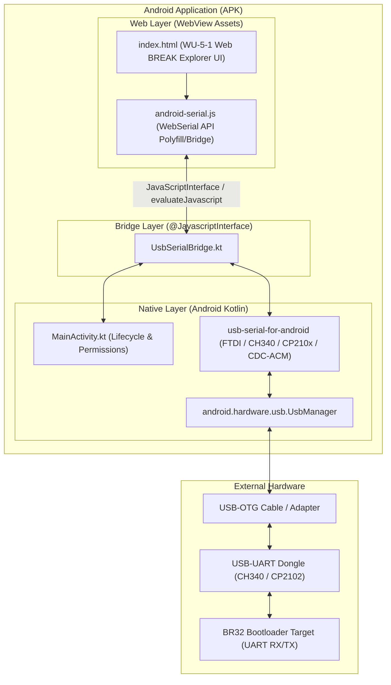
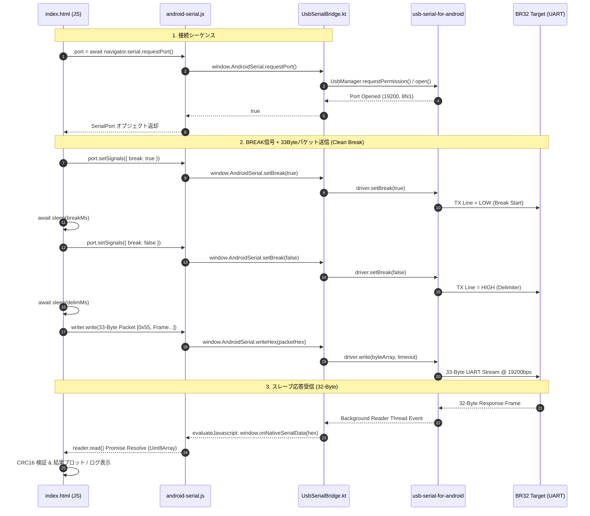

# ADX Android Break Probe 開発計画書

**文書ID**: PLAN-ADX-AND-001  
**対象リポジトリ**: ADX Core-D / software/sandbox  
**作成日**: 2026-09-29  
**ステータス**: 計画策定 (Draft)  
**対象モジュール**: `software/sandbox/adx-break-probe-android`

---

## 1. 背景と開発目的

### 1.1 背景
ADX Core-D における BR32 ブートローダの検証において、現場での取り回しを考慮し「スマートフォン（Android端末）から USB-OTG 有線接続で BREAK プローブツール（`WU5_1_web_break_probe`）を実行したい」という要求が生じた。

しかし、Android 版 Google Chrome における Web Serial API（`navigator.serial`）の仕様調査の結果、以下の制限が判明した：
- **Web Serial の現状仕様**: Android 版 Chrome では Bluetooth RFCOMM（Bluetooth クラシックシリアル）のみが先行サポートされており、**有線 USB シリアルポート（USB-UART 変換チップ）は Android OS の制限により列挙対象外**である。
- **発生する現象**: ブラウザ側で接続要求ダイアログは開くものの、有線接続されたデバイスが検出されず「対応デバイスがみつかりませんでした」と表示される。

### 1.2 目的
このプラットフォーム制限を回避し、Android 端末から有線 USB-OTG 経由で BR32 ブートローダとの通信・BREAK 信号探索を完全に行えるようにするため、**専用の Android アプリケーション（APK）サンプルプロジェクト**を `software/sandbox/` 配下に構築する。

既存の [WU5_1_web_break_probe/index.html](../../firmware/bootloader/PLAN/BR32/WU/WU5_1_web_break_probe/index.html)（約1,500行の完成された UI・パラメータ探索ロジック・コンソールログ）の資産を 100% 活用するため、**WebView + ネイティブ USB ドライバ（`usb-serial-for-android`）によるハイブリッド構成**を採用する。

---

## 2. 開発ホスト環境の事前調査結果

現在の開発ホスト環境（Ubuntu）およびビルド環境の事前調査結果を以下に示す。

### 2.1 ハードウェア・OS環境
| 項目 | 調査結果 | 判定・影響 |
| :--- | :--- | :--- |
| **OS** | Ubuntu 22.04.5 LTS (Jammy Jellyfish) | 良好。長期サポート版で Android ツール群と高い互換性あり。 |
| **Kernel** | Linux 6.8.0-110-generic (x86_64) | 良好。最新の USB/シリアルドライバ機構をサポート。 |
| **CPU** | Intel(R) N150 (x86_64, 4 Cores) | Android CLI ビルド（Gradle）を実行するのに十分な性能。 |
| **メモリ (RAM)** | 16 GB（空き: 4.8 GB, 利用可能: 11 GB） | Gradle デーモンおよび Android ビルドに十分な余裕あり。 |
| **ストレージ** | 284 GB（空き容量: 175 GB） | Android SDK / Gradle キャッシュ（約 5〜10 GB）を十分収容可能。 |
| **特権権限** | `sudo: OK`（パスワードレス sudo 可能） | 必要に応じた JDK・パッケージ導入が即座に可能。 |

### 2.2 開発ツール導入状況
| ツール | 現状 | 対応方針 |
| :--- | :--- | :--- |
| **Java (JDK)** | 未インストール | Android Gradle Plugin 8.x に必須の `openjdk-17-jdk` を apt で導入可能。 |
| **Android SDK** | 未インストール | コマンドラインツール（`cmdline-tools`）経由で導入可能。 |
| **Gradle** | 未インストール | プロジェクト内に Gradle Wrapper（`gradlew`）を含めることでホストへの事前導入は不要。 |
| **Node.js** | v20.20.2 インストール済 | Web アセットのフォーマットや検証に利用可能。 |
| **Python** | Python 3.10.12 インストール済 | ビルド・検証スクリプト等に利用可能。 |

### 2.3 開発・ビルド形態の選択肢
1. **ホスト環境（Ubuntu CLI）での直接ビルド**:
   - `openjdk-17-jdk` と Android SDK `cmdline-tools` をセットアップし、`./gradlew assembleDebug` でサーバー上で直接 APK を生成。
   - 生成した APK を開発者のスマートフォンに転送してインストール。
2. **ローカル PC（Android Studio）での開発・ビルド**:
   - 生成したプロジェクトディレクトリをローカル PC（Windows / Mac / Linux）の Android Studio で開き、GUI 上でビルド・USB 実機デバッグを実施。

> 本計画では、**上記両方の形態（CLI ビルド・Android Studio のどちらでも動作する標準構造）**でプロジェクトを構築する。

---

## 3. システムアーキテクチャ設計

### 3.1 レイヤー構成


### 3.2 通信プロトコル・シーケンス（BREAK制御 & データ送受信）



### 3.3 コアコンポーネント詳細

#### ① `UsbSerialBridge.kt`（ネイティブインターフェース）
- `@JavascriptInterface fun isAndroid(): Boolean`: ネイティブ環境判定。
- `@JavascriptInterface fun open(baudRate: Int): Boolean`: USBポートのオープン。
- `@JavascriptInterface fun close()`: USBポートのクローズ。
- `@JavascriptInterface fun setBreak(enabled: Boolean)`: ハードウェア BREAK 信号（TX強制LOW）の制御。
- `@JavascriptInterface fun setBaudRate(baudRate: Int)`: ボーレートの動的変更（Half-Baud Re-open 代替または動的切り替え用）。
- `@JavascriptInterface fun writeHex(hexData: String)`: バイナリデータの送信。
- 受信データはバックグラウンドスレッドで読み取り、バッファリングして `evaluateJavascript` 経由で JS 側へプッシュ。

#### ② `android-serial.js`（WebSerial 透過アダプタ）
- `window.AndroidSerial` が存在する場合、`navigator.serial` の `requestPort` / `getPorts` / `SerialPort` / `ReadableStream` / `WritableStream` をエミュレート。
- **これにより、既存の `index.html` のソースコード本体に手を加えることなく、そのままネイティブ USB 通信で動作させることが可能になる。**

#### ③ `device_filter.xml`（USB-OTG 自動検出）
主要な USB-シリアル変換チップの Vendor ID (VID) / Product ID (PID) をマニフェストに登録：
- **CH340 / CH341**: VID `0x1A86`
- **FTDI (FT232R, FT231X等)**: VID `0x0403`
- **Silicon Labs (CP2102, CP2104等)**: VID `0x10C4`
- **Prolific (PL2303)**: VID `0x067B`
- **標準 CDC-ACM (Raspberry Pi Pico, Arduino等)**: USB Class `0x02`
> スマホに USB ケーブルを挿入した瞬間に OS がアプリの自動起動・パーミッション確認を行う UX を実現。

---

## 4. プロジェクト構造仕様

```text
software/sandbox/adx-break-probe-android/
├── build.gradle.kts                      # ルート Gradle 設定
├── settings.gradle.kts                   # サブモジュール設定
├── gradle.properties                     # JVM/メモリ設定 (org.gradle.jvmargs=-Xmx2048m)
├── gradlew                               # Linux/macOS 用 Gradle Wrapper スクリプト
├── gradlew.bat                           # Windows 用 Gradle Wrapper スクリプト
├── gradle/
│   └── wrapper/
│       ├── gradle-wrapper.jar
│       └── gradle-wrapper.properties     # Gradle 8.5
├── app/
│   ├── build.gradle.kts                  # アプリモジュール設定 (AGP 8.2.2, usb-serial-for-android)
│   ├── proguard-rules.pro                # 難読化除外設定 (@JavascriptInterface 保持)
│   └── src/
│       └── main/
│           ├── AndroidManifest.xml       # USB パーミッション・インテントフィルタ
│           ├── res/
│           │   ├── xml/
│           │   │   └── device_filter.xml # 対応 USB-UART チップフィルタ
│           │   ├── values/
│           │   │   ├── strings.xml
│           │   │   ├── colors.xml
│           │   │   └── themes.xml
│           │   └── mipmap-*/             # ランチャーアイコン
│           ├── java/org/adx/breakprobe/
│           │   ├── MainActivity.kt       # メインアクティビティ (WebView 設定, ライフサイクル)
│           │   └── UsbSerialBridge.kt    # USB シリアル制御 & JS ブリッジ
│           └── assets/
│               ├── index.html            # WU-5-1 Web BREAK Explorer UI (最新版)
│               └── android-serial-shim.js # WebSerial 互換シム
└── README.md                             # 環境構築・ビルド・実機テストガイド
```

---

## 5. 開発フェーズと実装マイルストーン

### Phase 1: 開発環境構築 & プロジェクト初期化
- [ ] Ubuntu 上で JDK 17 のセットアップ (`openjdk-17-jdk`)
- [ ] Android CLI ビルドツールのセットアップスクリプト作成 (`setup_android_sdk.sh`)
- [ ] `adx-break-probe-android` プロジェクト構造の生成（Gradle スクリプト、マニフェスト、リソース）
- [ ] Gradle Wrapper の構成と初期ビルドテスト

### Phase 2: ネイティブ USB シリアル層の実装
- [ ] `com.github.mik3y:usb-serial-for-android` の組み込み
- [ ] `MainActivity.kt`: USB デバイスのパーミッション要求・インテント処理
- [ ] `UsbSerialBridge.kt`:
  - ポートオープン / クローズ
  - `setBreak(boolean)` のハードウェア制御
  - `setBaudRate(int)` の動的制御
  - 非同期受信スレッド & JS コールバック
  - 送信キュー / バッファ管理

### Phase 3: Web UI アダプタ統合 & デュアル対応
- [ ] `android-serial-shim.js`: `navigator.serial` の Polyfill 実装
- [ ] `index.html` の assets 配置
- [ ] PC Chrome（WebSerial）と Android WebView（ネイティブ USB）のシームレスな自動切り替え確認

### Phase 4: ビルド・実機検証・トラブルシューティング
- [ ] `./gradlew assembleDebug` による APK 生成確認
- [ ] 実機 Android 端末（OTG 接続）へのデプロイ
- [ ] CH340 / CP2102 ドングルを介した BR32 ターゲットとの BREAK 信号疎通テスト
- [ ] スイープ機能（Half-Baud Sweep / Delimiter Sweep / Pulse Sweep）の動作検証

---

## 6. 技術的リスク分析と対策

| リスク | 影響度 | 対策方針 |
| :--- | :--- | :--- |
| **USB パーミッションの喪失** | 中 | ケーブルの抜き差しやアプリのバックグラウンド移行時に接続が切断される。<br>→ `BroadcastReceiver` で USB デタッチイベント（`ACTION_USB_DEVICE_DETACHED`）を監視し、安全にクローズ処理を行って UI 状態を同期する。 |
| **OTG 電源供給能力** | 中 | 一部のスマートフォンは OTG 接続先への給電電流（500mA 等）に制限があり、BR32 ターゲット基板ごと駆動すると電圧降下を起こす。<br>→ ターゲット基板は外部電源（5V / 3.3V）から給電し、GND と RX/TX のみを USB ドングルに接続する推奨配線をマニュアルに明記する。 |
| **BREAK 信号のタイミング精度** | 低 | Android のスレッドスケジューリングにより `sleep(breakMs)` のミリ秒精度がデスクトップと異なる可能性がある。<br>→ Android 側では `SystemClock.sleep()` をバックグラウンドスレッドで実行、または Half-Baud Re-open（ボーレート変更方式）を併用してハードウェア依存度を下げる。 |
| **WebView のセキュリティ制約** | 低 | ローカル assets 内の JS 実行や CORS 制約により通信がブロックされる懸念。<br>→ `WebViewAssetLoader` または適切な `WebSettings`（`allowFileAccess`, `javaScriptEnabled`）を構成してローカルアセットを安全かつ確実に実行する。 |

---

## 7. 結論・次のステップ

本開発計画により、既存の WebSerial 版 [WU5_1_web_break_probe](file:///home/ubuntu/AgentWorkspace/ADX/github/ADX/firmware/bootloader/PLAN/BR32/WU/WU5_1_web_break_probe/index.html) の完成された資産を無駄にすることなく、最短工数で Android 実機対応の APK プロジェクトを構築できる。

準備が整い次第、**Phase 1（Ubuntu ビルド環境の整備およびプロジェクト雛形の配置）**に着手する。
