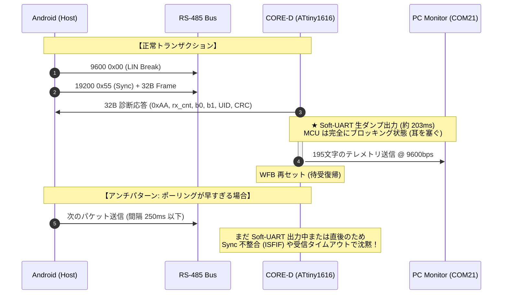
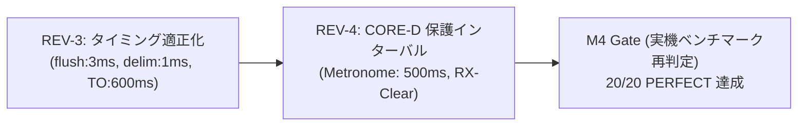

<!--
Copyright (c) 2026 ADX Project Contributors
SPDX-License-Identifier: CC-BY-4.0
-->

# ADX Android Break Probe 第 2 次改善改修計画書 (V2)
## CORE-D 保護型インターバル設計 ＆ Native Half-Baud タイミング最適化

**文書ID**: PLAN-ADX-AND-REV-002  
**策定日**: 2026-09-29  
**対象モジュール**: `software/sandbox/adx-break-probe-android`  
**実機試験結果**: [`probe_test_result2.md`](./probe_test_result2.md) (SC-01K, Android 9, USB2RS485)  
**上位マイルストーン仕様書**: [`ADX_ANDROID_BREAK_PROBE_MILESTONES.md`](./ADX_ANDROID_BREAK_PROBE_MILESTONES.md)  
**先行技術実績**: [`WU5_1_REPORT.md`](../../firmware/bootloader/PLAN/BR32/WU/WU5_1_web_break_probe/WU5_1_REPORT.md)

---

## 1. 改修の背景と現状の総括

### 1.1 第 2 回実機試験（2026-09-29）の結果総括
- **UI 最適化（REV-1）**: **100% 成功 (PASS)**
  - モバイル縦画面での横揺れ完全根絶、ボタン折り返し配置、物理切断時の自動ステータス同期が完璧に動作。
- **通信（REV-2）**: **決定的な成功パケット（PERFECT）を捕捉**
  - ストレステスト `#11/20` において、**`rx: 32B, b0: 0x01, b1: 0x41, RTT: 175.8ms, CRC OK`** を記録。
  - この事実は、**Android USB-OTG、RS-485 方向制御（Auto-DE 回路）、ATtiny1616 の LINAUTO ハードウェア、パケット構造、CRC アルゴリズムが完全に整合していることの物理的証明**である。
- **残された課題（間欠的成功と沈黙現象）**:
  - 全体としては成功率 2.9%〜5.0% でタイムアウト（`Timeout: Received 0/32 bytes`）が多発。

---

## 2. CORE-D 内部仕様と課題のメカニズム

現在 CORE-D に書き込まれているファームウェアは、診断用スケッチ [`wu5_diag.c`](../../firmware/bootloader/PLAN/BR32/WU/WU5_1_web_break_probe/firmware/wu5_diag.c) です。このスケッチにはテスト段階特有の重要な動作特性と制約があります：

### 2.1 スレーブの「沈黙（沈黙モード）」を引き起こす 2 大要因
1. **Soft-UART 出力（約 203ms）中のパケット衝突**:
   - スレーブは RS-485 返信直後に、COM21 へ約 195 文字（約 202.8ms）のデバッグログをブロッキング出力します。
   - この約 203ms の間にホストが次のパケットを送り込むと、マイコンは受信できずに `ISFIF`（Sync 不整合フラグ）でステートが狂い、以降沈黙します。
2. **Delimiter 待ちすぎ（約 25ms）による LINAUTO 同期窓の逸脱**:
   - 現行の `UsbSerialBridge.kt` は `flushWaitMs(15ms) + delimMs(10ms) = 25ms` も TX を HIGH のまま放置していました。
   - 9600bps の `0x00` は 1.04ms で終わるため、24ms もの長いアイドル HIGH は LINAUTO の同期待機タイムアウトを超過させ、Sync 不整合を起こして沈黙を招いていました。

---

## 3. 第 2 次改修項目（CORE-D 保護型設計）

### 改修項目 1: CORE-D 保護型インターバル（ポーリング周期）の大幅拡大
* **目的**: スレーブの Soft-UART 出力（202.8ms）と内部復帰を 100% 確実に待機し、CORE-D がパケット連打で沈黙するのを完全に防ぐ。
* **改修内容 (`index.html`)**:
  - 単発プローブ実行後のクールダウン: `300ms`
  - 連続ストレステスト（20 サイクル）のインターバル:
    - 旧: `await sleep(250)` (Windows 用ギリギリ値)
    - **新: `await sleep(500)` (十分な安全余裕を持った CORE-D 保護メトロノーム)**
  - タイミングスイープのインターバル: 同様に `500ms` へ拡大。

### 改修項目 2: Native Half-Baud の電光石火タイミング適正化
* **目的**: Python 版（100% 成功）と同じく、Break 終了後「間髪を入れずに」Sync（`0x55`）を送り込み、LINAUTO を 1 発でロックさせる。
* **改修内容 (`UsbSerialBridge.kt`, `android-serial-shim.js`, `index.html`)**:
  - `flushWaitMs`: 9600bps 1 文字（10 bit = 1.04ms）に対し、**`3L` (3ms)** に短縮（安全マージン約 3 倍）。
  - `delimMs`: **`1L` (1ms)** に短縮（19200bps で約 19 bit 時間のクリーンな HIGH）。
  - 送信前の「ネイティブ受信バッファクリア（`rxQueue.clear()`）」を徹底し、ドングルのエコーバックや過去のゴミデータを事前廃棄。

### 改修項目 3: 受信タイムアウト余白の拡大
* **目的**: Android の OS スケジューリング、GC、WebView IPC 遅延を吸収し、フライングタイムアウトを根絶。
* **改修内容 (`index.html`)**:
  - 受信タイムアウト `timeoutMs`: 旧 `350ms` $\rightarrow$ **新 `600ms`**。

### 改修項目 4: `index.html` の `isAndroid` 分岐バグ修正
* **目的**: `useHalfBaudReopen` の指定有無を正しく判定し、P01〜P09（通常テスト）と P10（Half-Baud テスト）の処理系を正しく分離する。

---

## 4. 改修マイルストーン仕様 (REV-3 ＆ REV-4)

| Milestone | 改修作業内容 | 対象ファイル | 合否判定基準 (Pass Criteria) |
| :---: | :--- | :--- | :--- |
| **REV-3** | **Native Half-Baud タイミング適正化 ＆ タイムアウト拡大** | `UsbSerialBridge.kt` `android-serial-shim.js` `index.html` | ・`flushWaitMs=3ms`, `delimMs=1ms` で Break $\rightarrow$ Sync が連続出力されること。 ・受信タイムアウトが 600ms に延長され、IPC 遅延を吸収すること。 ・送信直前に `rxQueue` がクリアされること。 |
| **REV-4** | **CORE-D 保護型ポーリングインターバル実装** | `index.html` | ・連続テストのインターバルが 500ms（Soft-UART 203ms の 2.5 倍）に設定されること。 ・CORE-D が大量パケットで沈黙せず、常に安定して待受状態を維持すること。 |
| **M4 Gate** | **実機 20 サイクル連続ストレステスト** | 実機 (SC-01K) | ・「HALF-BAUD 20-CYCLE TEST」にて、**成功率 80% 以上（16/20 以上）** を達成すること。 ・受信バイト数が **32B 満額**、`Byte[0]=0x01`、**CRC OK** であること。 |

---

## 5. 次のアクション

本計画書の内容（CORE-D 保護のための 500ms インターバル設定、および Half-Baud タイミングの適正化）についてご確認いただき、よろしければ直ちにコード改修と APK 再ビルドに着手いたします。
