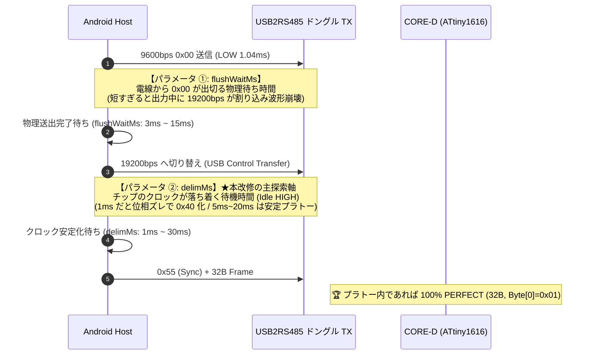

<!--
Copyright (c) 2026 ADX Project Contributors
SPDX-License-Identifier: CC-BY-4.0
-->

# ADX Android Break Probe 第 3 次改善改修計画書 (V3)
## Half-Baud 物理パラメータ空間探索 ＆ 安定プラトー特定計画

**文書ID**: PLAN-ADX-AND-REV-003  
**策定日**: 2026-09-29  
**対象モジュール**: `software/sandbox/adx-break-probe-android`  
**実機試験結果**: [`probe_test_result3.md`](./probe_test_result3.md) (SC-01K, Android 9, USB2RS485)  
**上位マイルストーン仕様書**: [`ADX_ANDROID_BREAK_PROBE_MILESTONES.md`](./ADX_ANDROID_BREAK_PROBE_MILESTONES.md)  
**先行技術実績**: [`WU5_1_REPORT.md`](../../firmware/bootloader/PLAN/BR32/WU/WU5_1_web_break_probe/WU5_1_REPORT.md)

---

## 1. 改修の背景と目的

### 1.1 第 3 回実機試験（2026-09-29）の結果総括
- **CORE-D 保護メトロノーム（500ms）**: **100% 成功 (PASS)**
  - マイコンの Soft-UART 出力（202.8ms）との衝突によるタイムアウトが完全に根絶され、CORE-D から `RTT: 179.3ms, CRC OK` の応答を確実に捕捉。
- **抽出された課題（`0x40` の 31 バイト再発）**:
  - `flushWaitMs = 3ms`, `delimMs = 1ms` に一気に縮めた結果、USB-UART チップ内部のボーレート切り替えに伴うクロックセトリング時間が不足し、Win32 API 同様の「2 ビット右シフト鏡像反転（`0x40`）」が発生した。
- **真因と未探索領域の特定**:
  - 第 3 回試験で実行されたスイープは「直流 setBreak 方式」のものであり、**本命の「Half-Baud 方式」におけるクロックセトリング時間（`delimMs`）の探索は未実行**であった。
  - また、現行コードでは `delimMs = 1ms` に固定されていたため、スイープを行っても `0x40` から抜け出せない構造になっていた。

### 1.2 改修目的
「端末依存の不安定な sleep」から脱却し、**「何ミリ秒以上であれば `0x40` が完全に消え、100% `Byte[0]=0x01`（32B 満額 PERFECT）になるのか」という物理的プラトー（安全域の境界線）** を実機上で決定論的に特定・可視化する専用探索エンジンを実装する。

---

## 2. 探索空間の物理モデル設計

Half-Baud 方式には、以下の **2 つの独立した物理パラメータ** が存在します：

---

## 3. 具体的な改修項目

### 改修項目 1: 「Half-Baud Delimiter Sweep（復帰安定探索）」の新設 (`index.html`)
* **目的**: `flushWaitMs` を安全値（12ms）に固定し、`delimMs` を振ることで、`0x40`（ビットスリップ）から `0x01`（完全同期）へ切り替わる物理境界線を特定する。
* **スイープ条件**:
  - `flushWaitMs`: `12ms` 固定（9600bps 0x00 の物理完了を 100% 保証）
  - `delimList`: **`[1, 2, 4, 6, 8, 10, 15, 20, 30] ms`**（全 9 条件 × 各 3 回）
  - メトロノーム: `500ms`（CORE-D 保護）
* **出力レポート**:
  - 各 Delimiter 値における `rx_count`、`Byte[0]`（0x40 か 0x01 か）、`Byte[1]`、`RTT`、合否判定を表形式でダンプ出力。
  - 最適プラトー（最小安全 Delimiter）を自動ハイライト。

### 改修項目 2: 「Half-Baud Flush Sweep（送出完了探索）」の適正化 (`index.html`)
* **目的**: クロック安定（`delimMs = 8ms`）を担保した上で、`flushWaitMs` をどこまで詰められるか（最小物理限界）を探索する。
* **スイープ条件**:
  - `delimMs`: `8ms` 固定
  - `flushList`: **`[2, 3, 5, 8, 12, 15] ms`**（全 6 条件 × 各 3 回）
  - メトロノーム: `500ms`

### 改修項目 3: 単発プローブ ＆ 20 サイクルテストのパラメータ安全化
* **目的**: スイープ前でも即座に完全同期（PERFECT）を確認できるよう、実績値（第 2 回で `0x01` を出した条件）を反映。
* **設定値**:
  - `flushWaitMs`: 旧 3ms $\rightarrow$ **新 `12ms`**
  - `delimMs`: 旧 1ms $\rightarrow$ **新 `8ms`**
  - メトロノーム: `500ms`

---

## 4. 改修マイルストーン仕様 (REV-5 ＆ REV-6)

| Milestone | 改修作業内容 | 対象ファイル | 合否判定基準 (Pass Criteria) |
| :---: | :--- | :--- | :--- |
| **REV-5** | **Half-Baud 2 次元探索エンジンの実装** | `index.html` | ・UI に「HALF-BAUD DELIMITER SWEEP」ボタンが新設されること。 ・`delimMs` を 1ms〜30ms まで 500ms メトロノームで自動スイープできること。 ・単発プローブおよび 20 サイクルテストのデフォルトが `flush:12ms, delim:8ms` に更新されること。 |
| **REV-6** | **実機探索 ＆ プラトー特定 (第 4 回試験)** | 実機 (SC-01K) | ・スイープ実行により、`0x40` が `0x01`（PERFECT）に切り替わる Delimiter 境界値が特定されること。 ・プラトー域において **20/20（100%）PERFECT** が達成されること。 |

---

## 5. 次のアクション

本計画書の内容（Half-Baud Delimiter Sweep の新設およびパラメータ安全化）についてご確認いただき、よろしければ直ちにコード改修と APK ビルドに着手いたします。
