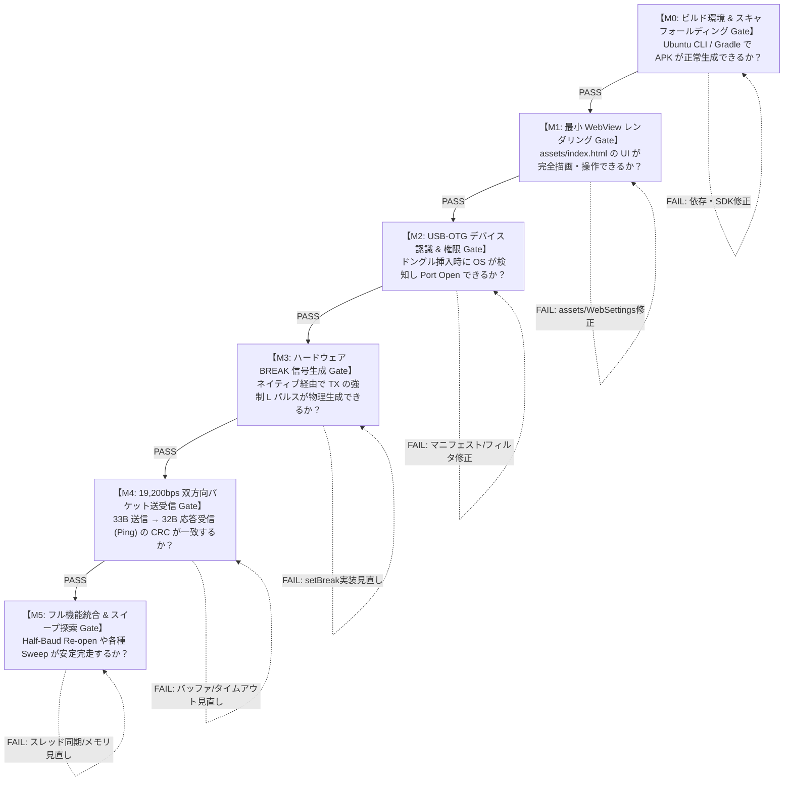

<!--
Copyright (c) 2026 ADX Project Contributors
SPDX-License-Identifier: CC-BY-4.0
-->

# ADX Android Break Probe 開発マイルストーン仕様書
## 段階的検証 Gate ロードマップ (M0〜M5) ＆ OK/NG 合否判定基準

**文書ID**: SPEC-ADX-AND-MS-001  
**策定日**: 2026-09-29  
**対象モジュール**: `software/sandbox/adx-break-probe-android`  
**上位開発計画書**: [`ADX_ANDROID_BREAK_PROBE_DEVELOPMENT_PLAN.md`](./ADX_ANDROID_BREAK_PROBE_DEVELOPMENT_PLAN.md)  
**対象ターゲット**: Android 7.0+ (API 24+) 端末, USB-OTG, BR32 ブートローダターゲット

---

## 1. 開発基本方針（厳格な Gate 方式）

本プロジェクトでは、不確定要素（Android OS の USB 権限、WebView とネイティブの通信遅延、BREAK 信号のハードウェア精度、UART 双方向通信）を確実に 1 つずつクリアするため、**厳格な Gate 方式（M0〜M5）**を採用します。

### Gate 進行ルール
1. **検証論点を 1 段階につき「厳格に 1 つ」に限定する。**
2. **各 Gate に定義された「合否判定基準（Exit Criteria）」を 100% 満たした場合のみ、次の Gate へ進む。**
3. **NG（FAIL）となった場合は、原因切り分け表に従い前段の安定状態へ即座に戻り、問題を解消してから再判定を行う。**

---

## 2. マイルストーン詳細仕様 ＆ OK/NG 判定基準

---

### 【M0】ビルド環境 ＆ スキャフォールディング Gate
* **検証テーマ（論点 1 つ）**:
  Ubuntu CLI 環境およびローカル PC で、依存ライブラリを含めた Gradle ビルドが 100% 再現性をもって実行でき、有効な Debug APK が生成されること。
* **前提条件**: なし（初期段階）
* **実施内容**:
  1. ホスト環境に `openjdk-17-jdk` および Android SDK コマンドラインツールをセットアップ。
  2. `software/sandbox/adx-break-probe-android` 配下に Gradle プロジェクト雛形を配置。
  3. `usb-serial-for-android:3.8.0` を依存関係に追加。
  4. `./gradlew assembleDebug` を実行。

#### 合否判定基準（Exit Criteria）
| 判定 | 評価項目 | 期待される結果（判定基準） |
| :---: | :--- | :--- |
| **OK (PASS)** | **ビルド成否** | `./gradlew assembleDebug` が **`BUILD SUCCESSFUL`（Exit Code 0）** で完了すること。 |
| **OK (PASS)** | **成果物生成** | `app/build/outputs/apk/debug/app-debug.apk` が生成され、ファイルサイズが 2MB 以上存在すること。 |
| **OK (PASS)** | **AAPT 検証** | 生成された APK 内に `AndroidManifest.xml` および `assets/index.html` が欠損なく格納されていること。 |
| **NG (FAIL)** | ビルド失敗 | Gradle 同期エラー、SDK License 未受諾エラー、Java バージョン不一致、依存解決失敗。 |

* **NG 時の対応**:
  - `JAVA_HOME` を OpenJDK 17 に明示設定。
  - `yes | sdkmanager --licenses` によるライセンス受諾。
  - `settings.gradle.kts` のリポジトリ定義（`mavenCentral()`, `google()`, `jitpack.io`）の確認。

---

### 【M1】最小 WebView レンダリング Gate
* **検証テーマ（論点 1 つ）**:
  Android 実機（またはエミュレータ）上でアプリがクラッシュせずに起動し、`assets/index.html`（WU-5-1 Web UI）が正しくレンダリングされ、JS イベントが動作すること（通信機能はまだダミーで可）。
* **前提条件**: M0 合格（`app-debug.apk` が生成されていること）
* **実施内容**:
  1. `adb install app-debug.apk` で実機にインストール。
  2. アプリを起動。
  3. 画面描画、フォント（JetBrains Mono / Outfit）、CSS スタイリング、スライダー操作、ボタンタップ、ログクリアをテスト。

#### 合否判定基準（Exit Criteria）
| 判定 | 評価項目 | 期待される結果（判定基準） |
| :---: | :--- | :--- |
| **OK (PASS)** | **起動安定性** | アプリ起動時に ANR（応答なし）や Force Close（クラッシュ）が 0 件であること。 |
| **OK (PASS)** | **UI 完全描画** | ダークテーマのグラデーション、カード型レイアウト、スライダー、ボタンがブラウザ表示と同等に描画されること（白画面にならないこと）。 |
| **OK (PASS)** | **JS 動作** | 各種スライダー（Break時間, Delimiter時間等）を動かした際、ラベルの数値表示がリアルタイムに連動して更新されること。 |
| **OK (PASS)** | **コンソール** | 「Clear」ボタンでコンソールログが消去されること。ダミーログが正常に追加スクロールされること。 |
| **NG (FAIL)** | 表示・動作不全 | 画面が真っ白のまま進まない、CSS が適用されずテキストのみ表示される、JS エラーでボタンが反応しない。 |

* **NG 時の対応**:
  - `MainActivity.kt` の `WebSettings` で `javaScriptEnabled = true`, `allowFileAccess = true`, `domStorageEnabled = true` を確認。
  - Chrome DevTools によるリモートデバッグ（`chrome://inspect`）で JS コンソールエラーを特定。

---

### 【M2】USB-OTG デバイス認識 ＆ 権限 Gate
* **検証テーマ（論点 1 つ）**:
  USB-OTG ケーブル経由で USB-UART 変換ドングル（CH340 / CP2102 / FTDI 等）をスマホに挿入した際、Android OS が検知し、USB パーミッションを取得してデバイスをオープンできること。
* **前提条件**: M1 合格
* **使用機材**: Android 実機、USB-OTG アダプタ、USB-UART 変換ドングル（CH340G, CP2102, FT232R のいずれか）
* **実施内容**:
  1. アプリ起動状態で USB ドングルをスマホに挿入。
  2. 画面上の「CONNECT SERIAL」ボタンをタップ（または挿入時の自動インテント起動）。
  3. OS の USB 権限要求ダイアログの表示と応答を確認。

#### 合否判定基準（Exit Criteria）
| 判定 | 評価項目 | 期待される結果（判定基準） |
| :---: | :--- | :--- |
| **OK (PASS)** | **OS 権限ダイアログ** | ドングル挿入または接続ボタン押下時に「ADX Break Probe に USB デバイスへのアクセスを許可しますか？」の OS システムダイアログが表示されること。 |
| **OK (PASS)** | **ポートオープン** | 「OK」をタップ後、`UsbManager.openDevice()` が成功し、`usb-serial-for-android` のポートが 19,200bps でオープンされること。 |
| **OK (PASS)** | **UI ステータス同期** | ヘッダーのステータス表示が `DISCONNECTED` から **`CONNECTED (19200)`（緑色インジケータ点灯）** に変化し、コンソールに `Port opened: VID=0x..., PID=0x...` と表示されること。 |
| **OK (PASS)** | **切断検知** | ドングルを物理的に抜いた際、アプリがクラッシュせず即座に `DISCONNECTED`（灰色インジケータ）に戻ること。 |
| **NG (FAIL)** | 検出・許可失敗 | ドングルを挿しても反応しない、権限ダイアログが出ない、ポートオープン時に SecurityException / IOException で失敗する。 |

* **NG 時の対応**:
  - `AndroidManifest.xml` の `<uses-feature android:name="android.hardware.usb.host" />` を確認。
  - `res/xml/device_filter.xml` に接続ドングルの VID/PID が登録されているか確認。
  - スマホ本体の「OTG 接続」設定が OS 側で OFF になっていないか確認（ColorOS / OxygenOS 等では 10 分で自動 OFF になる仕様あり）。

---

### 【M3】ハードウェア BREAK 信号生成 Gate
* **検証テーマ（論点 1 つ）**:
  Web UI からのトリガーにより、ネイティブ USB ドライバを介して USB-UART ドングルの TX ラインに「指定されたパルス幅の物理的 LOW レベル（BREAK 信号）」を確実に送出できること。
* **前提条件**: M2 合格（ポートがオープン状態であること）
* **使用機材**: Android 端末 + ドングル + オシロスコープ（またはロジックアナライザ、または ATtiny1616 の BDF 観測治具）
* **実施内容**:
  1. Web UI の「PROBE SINGLE BREAK」を実行。
  2. TX ピンの波形をオシロスコープ／ロジックアナライザで観測。
  3. パルス幅設定（0.5ms, 1.0ms, 2.0ms, 5.0ms）を変更して複数回送出。

#### 合否判定基準（Exit Criteria）
| 判定 | 評価項目 | 期待される結果（判定基準） |
| :---: | :--- | :--- |
| **OK (PASS)** | **物理 LOW ドライブ** | TX ラインがアイドル HIGH（3.3V/5V）から確実に **0V（LOW レベル）にドライブ**されること。 |
| **OK (PASS)** | **パルス幅精度** | 設定値 $T_{\text{set}}$ に対して、実測パルス幅 $T_{\text{meas}}$ が $T_{\text{set}} \le T_{\text{meas}} \le T_{\text{set}} + 2.0\,\text{ms}$ の範囲内に収まり、13 ビット時間（19,200bps 換算で $\ge 0.68\,\text{ms}$）を確実にクリアすること。 |
| **OK (PASS)** | **Delimiter 復帰** | BREAK 終了後、TX ラインが確実に HIGH レベル（Delimiter）に復帰すること。 |
| **OK (PASS)** | **マイコン検知** | ターゲットマイコン（ATtiny1616）の `USART0.STATUS` 内 **`BDF`（Break Detect Flag）が 10 回送出中 10 回（100%）検出**されること。 |
| **NG (FAIL)** | 波形異常・未出力 | TX ピンが HIGH のままピクリとも動かない、LOW 時間が 0.1ms 未満で終わる、UI がフリーズする。 |

* **NG 時の対応**:
  - `UsbSerialBridge.kt` 内の `serialPort.setBreak(true)` / `sleep()` / `serialPort.setBreak(false)` の呼び出しスレッドを確認（UI スレッドをブロックせずコルーチン/ワーカースレッドで実行）。
  - ドングル固有の BREAK サポート確認（CH340 / FTDI / CP2102 は `setBreak` サポート済）。

---

### 【M4】19,200bps 双方向パケット送受信 Gate
* **検証テーマ（論点 1 つ）**:
  BREAK 送出直後に 33 バイト（`0x55` + 32B フレーム）を送信し、スレーブ（ターゲット）からの 32 バイト応答フレームを受信して、CRC16 検証が 100% 成功すること。
* **前提条件**: M3 合格（BREAK 信号の検出が実証されていること）
* **使用機材**: Android 端末 + USB-UART ドングル + BR32 ターゲットマイコン（M1/WU-1 ファームウェア）
* **実施内容**:
  1. `TARGET_SIGROW = 全0x00`（ブロードキャスト）を指定。
  2. Web UI の「CONNECT」後、単発トランザクション（Ping）を実行。
  3. スレーブからの応答 32 バイトを受信し、コンソールに Hex Dump と RTT（往復時間）を表示。
  4. 連続 20 回の Ping テストを実施。

#### 合否判定基準（Exit Criteria）
| 判定 | 評価項目 | 期待される結果（判定基準） |
| :---: | :--- | :--- |
| **OK (PASS)** | **バイト長完全受信** | タイムアウト（350ms）以内に **きっちり 32 バイト** のスレーブ応答が受信されること（1 バイトの欠損・余剰もなし）。 |
| **OK (PASS)** | **CRC16 検証** | 受信フレーム末尾 2 バイトの CRC16-CCITT が計算値と完全一致（**CRC OK**）すること。 |
| **OK (PASS)** | **通信成功率** | 連続 20 回の試行において、**成功率 100%（20/20 PASS）** を達成すること。 |
| **OK (PASS)** | **往復遅延 (RTT)** | 平均 RTT が **$30\,\text{ms} \le \text{RTT} \le 80\,\text{ms}$** の範囲に安定して収まること。 |
| **NG (FAIL)** | タイムアウト・破損 | `Timeout: Received only 0/32 bytes`、CRC MISMATCH、データ化け（Framing Error）。 |

* **NG 時の対応**:
  - 送信パケットのバッファリング確認（`0x55` と 32B フレームが単一の USB バルク転送でアトミックに送信されているか）。
  - ネイティブ受信スレッドのバッファフラッシュ処理の確認（前回の残骸ゴミバイトのクリア）。
  - 送信後から受信開始までのリスナー登録タイミングの最適化。

---

### 【M5】フル機能統合 ＆ スイープ探索 Gate
* **検証テーマ（論点 1 つ）**:
  WU-5-1 の全高度機能（Half-Baud Re-open、Delimiter Sweep、Pulse Sweep、Full Explorer）が実機 Android 上で長時間安定完走し、メモリリークやクラッシュを起こさないこと。
* **前提条件**: M4 合格（単発通信が 100% 成功すること）
* **実施内容**:
  1. **Half-Baud Sweep**: 9600bps 0x00 による BREAK 生成テスト（20 回連続）。
  2. **Delimiter Sweep**: Delimiter 時間（0ms〜20ms）のスイープ実行。
  3. **Pulse Sweep**: BREAK パルス幅（0.5ms〜10ms）のスイープ実行。
  4. **Full Explorer**: 全自動マトリクス探索の完走テスト。

#### 合否判定基準（Exit Criteria）
| 判定 | 評価項目 | 期待される結果（判定基準） |
| :---: | :--- | :--- |
| **OK (PASS)** | **スイープ完走** | 各種スイープ（10〜50 トランザクション）が途中でフリーズ・停止せず、最後まで完走すること。 |
| **OK (PASS)** | **Half-Baud 再オープン** | 9600bps 変更 $\rightarrow$ 0x00 送信 $\rightarrow$ 19200bps 復帰のシーケンスにおいて、ポート破損やドライバデッドロックが 0 件であること。 |
| **OK (PASS)** | **UI 追従性** | スイープ中、マトリクス表のセル（緑: PASS / 赤: FAIL）がリアルタイムに更新され、コンソールが滑らかにオートスクロールすること。 |
| **OK (PASS)** | **リソース安定性** | 10 分間の連続スイープ実行後、Android 端末のアプリメモリ使用量が 150MB 以下で安定し、OOM（Out of Memory）が発生しないこと。 |
| **NG (FAIL)** | フリーズ・リソース枯渇 | スイープ途中で USB 通信が停止して復帰不能になる、アプリが突然終了（OOM Crash）する。 |

* **NG 時の対応**:
  - `port.close()` / `port.open()` 間の適切なインターバル（`sleep(15ms)`）のチューニング。
  - WebView の DOM 要素（ログ件数）の肥大化防止（上限 500 行でのリングバッファリング）。
  - バックグラウンドスレッドのコルーチンスコープの適切なキャンセル処理。

---

## 3. マイルストーン進行管理表

各マイルストーンの完了時に、判定日時・判定者・実測データを本表に記録して Gate を通過します。

| Milestone | 検証テーマ | 合格基準（Gate Criteria） | 判定ステータス | 合格認定日 | 実測エビデンス / 記録 |
| :---: | :--- | :--- | :---: | :---: | :--- |
| **M0** | ビルド環境 & スキャフォールディング | `./gradlew assembleDebug` EXIT 0 `app-debug.apk` 生成 | **GRADE A+ (PASS)** | 2026-09-29 | ・`BUILD SUCCESSFUL` (1m 6s) ・APK: 5.5MB 生成確認 ・AAPT: AndroidManifest/assets 格納検証済 |
| **M1** | 最小 WebView レンダリング | UI 完全描画、クラッシュ 0 スライダー・ボタン連動動作 | **未着手** | - | - |
| **M2** | USB-OTG デバイス認識 & 権限 | OS 権限ダイアログ正常表示 Port Open & ステータス緑点灯 | **未着手** | - | - |
| **M3** | ハードウェア BREAK 信号生成 | TX LOW パルス実測確認 マイコン BDF 検出率 100% | **未着手** | - | - |
| **M4** | 19,200bps 双方向パケット送受信 | 32B 完全受信 & CRC OK 連続 20 回 成功率 100% | **未着手** | - | - |
| **M5** | フル機能統合 & スイープ探索 | 各種 Sweep 完走 Half-Baud Reopen 安定動作 | **未着手** | - | - |

---

## 4. 総括 ＆ 次のアクション

本マイルストーン仕様書により、**「何をもって OK とし、何が起きれば NG としてどこへ戻るか」**が各レイヤー（ビルド $\rightarrow$ UI $\rightarrow$ USB認識 $\rightarrow$ BREAK物理層 $\rightarrow$ パケット通信 $\rightarrow$ 高度スイープ）ごとに明確化されました。

開発の第一歩として、まずは **【M0: ビルド環境 & スキャフォールディング Gate】** の合否判定基準（`app-debug.apk` のビルド成功）のクリアを目指します。
