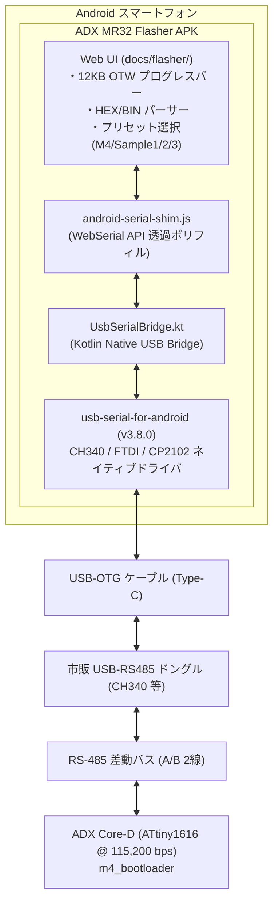

# ADX MR32 Flasher for Android 開発計画書

**文書ID**: PLAN-ADX-AND-002  
**対象リポジトリ**: ADX Core-D / software/sandbox / firmware/sandbox  
**作成日**: 2026-10-02  
**ステータス**: 計画策定 (Proposed)  
**対象モジュール**: `software/sandbox/adx-mr32-flasher-android`（または `adx-break-probe-android` の拡張）

---

## 1. 開発目的と背景

### 1.1 背景
ADX Core-D における基幹フィールドネットワーク「MR32」の OTW（Over-The-Wire）書き込みにおいて、現場作業員が **スマートフォン（Android 端末）から USB-OTG ケーブル 1 本で市販の安価な USB-RS485 ドングルを直結し、ファームウェア更新を完結させる** という運用 UX が求められている。

しかし、前回の調査および実機検証の結果、**Android 版 Google Chrome（WebSerial API）は有線 USB-Serial をサポートしておらず（Bluetooth のみ）、ブラウザ単体ではドングルが列挙されない** という OS レベルのプラットフォーム制限が存在する。

### 1.2 目的
2026年9月末に実証された `software/sandbox/adx-break-probe-android` の **WebView ＋ ネイティブ USB ドライバ（`usb-serial-for-android`）ハイブリッド構成** をベースに、今回の **MR32 12KB フル OTW Flasher（115,200 bps）に完全最適化した専用 APK** を構築する。

---

## 2. システム構成と設計方針

### 2.1 最大の特長：当時の「ボーレートトリック」が不要！
- **以前（BR32）**: LIN BREAK を生成するために「9600bps オープン $\rightarrow$ 19200bps オープン」を繰り返すボーレートトリックを試行し、Android OS ではタイミングが破綻した。
- **今回（MR32）**: **115,200 bps 固定（8N1）の通常パケット通信（`0x55 0xAD` 同期フレーム）** であるため、ボーレート変更処理が一切不要。
- ネイティブ USB ドライバの純粋なバルク転送（Bulk Transfer）だけで動くため、**極めてシンプル・超低遅延・高安定** に稼働する。

---

## 3. 主要改修ポイントと技術仕様

### 3.1 Web UI アセット（`assets/`）の刷新
- 今回完成した最新の [`docs/flasher/`](file:///home/ubuntu/AgentWorkspace/ADX/github/ADX/docs/flasher/)（HTML/CSS/JS）をそのまま APK の `assets/` に組み込む。
- デスクトップ版の美しいダークモード UI、プログレスバー、転送速度メトリクス、プリセットファームウェア（M4, Sample 1, Sample 2, Sample 3）をスマートフォン画面でそのまま操作可能。

### 3.2 ネイティブ通信エンジン（`UsbSerialBridge.kt`）の MR32 最適化
1. **通信設定**: 115,200 bps, DataBits: 8, StopBits: 1, Parity: None
2. **高速パケットパイプライン**:
   - Web 側からの 32 バイトフレーム送信（`sendBytes`）を直接 USB バルクエンドポイントへ送出。
   - マイコンからの 32 バイト返信をリングバッファで拾い、JavaScript のコールバックへ即座に伝達。
3. **USB プラグ＆プレイ自動接続**:
   - `AndroidManifest.xml` の `USB_DEVICE_ATTACHED` インテントにより、ドングルを挿した瞬間に OS 許可ダイアログが表示され、ワンタップで即座に接続完了。

---

## 4. 開発・検証ステップ（マイルストーン）

| フェーズ | 作業内容 | 期待される成果物・合意基準 |
| :--- | :--- | :--- |
| **Phase 1: プロジェクト構成** | `software/sandbox/adx-break-probe-android` をベースに MR32 用プロジェクトを整備（不要な BREAK 処理の整理、ボーレート 115.2k 設定） | ビルド可能な Gradle プロジェクト準備完了 |
| **Phase 2: Web アセット結合** | 最新の `docs/flasher/`（HTML/CSS/JS/Presets）を `assets/` へ同期し、`android-serial-shim.js` の MR32 パケット送受信を結合 | APK 内の WebView で最新 UI が正常表示されること |
| **Phase 3: CLI ビルド実行** | ホスト環境（Ubuntu 22.04）の JDK 17 & Android SDK を使用して `./gradlew assembleDebug` を実行 | `app-debug.apk`（約 5.5MB）がビルドエラーなく生成されること |
| **Phase 4: 実機転送＆動作実証** | 生成された APK をユーザー様のスマートフォンに転送・インストールし、Core-D への 12KB フル OTW 書込を実機検証 | スマホから USB-RS485 ドングル経由で 12KB フル書込が完走し、新アプリが起動すること |

---

## 5. APK 配布・インストール方法

ビルド完了後、以下のいずれかの方法でスマートフォンに転送して即座にインストール可能です：

1. **Google Drive / Slack / メール転送**:
   - 生成された `app-debug.apk` をスマートフォンにダウンロードし、タップしてインストール。
2. **PC から USB 接続（adb）**:
   - `adb install -r app-debug.apk`
